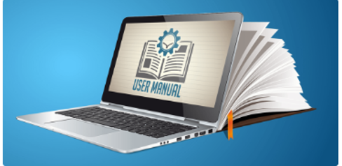

Domyślam się, że skoro czytasz ten post, jesteś Technical Writerem. Co więcej,
zapewne borykasz się z wątpliwościami lub trudnościami związanymi z relacją ze
swoim SME. Brzmi znajomo? Jeśli odpowiedź brzmi ‘tak’ na choćby jedno z tych
założeń, to zachęcam do pozostania tutaj chwilę i zapoznania się z moimi
sugestiami.

<!--truncate-->

#### Kto jest kim?

Zacznijmy od początku i sprawdźmy, kto jest kim w tej technical writerskiej
podróży.

Kim jest **Technical Writer**? Nie chcąc zanudzać nikogo książkowymi
definicjami, w jak najprostszych słowach, jest to osoba, która potrafi wszelkie
zaawansowane technicznie koncepcje zakomunikować docelowym odbiorcom tak
klarownie, czytelnie i zrozumiale jak to tylko możliwe.

Kim jest **SME**? SME, czyli Subject-matter expert. Generalnie, jest to osoba,
która posiada odpowiedzi na pytania dotyczące tematu Twojej pracy. Bez tych
odpowiedzi nie jesteś w stanie dokończyć, a czasem nawet zacząć pracy nad
projektem. Jesteś zatem zależny od swojego SME i z całą pewnością potrzebujecie
mieć dobre relacje, aby móc pracować wydajnie.

#### Ludzie są tylko ludźmi

Tak, ludzie są tylko ludźmi i tak jak banalnie to brzmi to jest to także całkiem
prawdziwe. Pomyśl o SME jak o najzwyklejszym człowieku: może mieć zły albo dobry
humor, tego albo innego dnia; może mieć prywatne problemy, może być
introwertykiem, a także wiele innych czynników może wpływać na jego zachowanie.
Postaw się na jego miejscu. Może jest zawalony robotą w innych projektach, być
może nie jest zadowolony z projektu, który dzielicie? Ty też raczej nie byłbyś
każdego dnia promyczkiem gdybyś był przytłoczony zadaniami albo innymi,
życiowymi problemami, prawda?

Mając to na uwadze, pomyśl przez chwilę, w jaki sposób Ty sam lubisz aby
zwracano się do Ciebie. Jakieś sugestie?

Oto kilka ode mnie, które myślę, że mogą się sprawdzić.

1. **Bądź przyjazny i postaraj się poznać swojego SME**Jak? Nic prostszego.
   Wyskoczcie na kawę, obiad a może piwko, albo dwa 😉 Zostawcie służbowe tematy
   i pogadajcie o swoim hobby albo planach na weekend czy wakacje. O
   netflixowych rekomendacjach można rozmawiać godzinami. Przełamanie lodu na
   pewno zaprocentuje. 
2. **Szanuj czas swojego SME. A przy okazji i swój**Ustalenie dogodnego terminu
   na spotkanie z SME może być wyzwaniem. Więc jeśli udało Ci się, to zrób
   przysługę swojemu SME, a także i sobie i przygotuj się do tego spotkania!
   Zaproponuj agendę i wstępne pytania, po to aby SME też mogł się przygotować.
   Zrób dokładny reaserch, aby nie zadawać oczywistych pytań. Przygotuj
   prospekty. Wyciągnij z tych spotkań najwięcej jak się da!
   
3. **Wykorzystuj dogodne kanały komunikacji**Nie każdy jest ‘people person’ i
   niekoniecznie będzie miał przyjemność w osobistych spotkaniach. W obecnych
   czasach pracujemy też w miedzynarodowych firmach albo zupełnie zdalnie i
   możemy żyć w zupełnie różnych miejscach. Wykorzystujmy więc tak szeroki
   obecnie wybór kanałów komunikacji w taki sposób, by każdy czuł się
   komfortowo. Dowiedz się, co się najlepiej sprawdzi w komunikacji z Twoim SME.
   
4. **Friendly reminder**Nie czekaj w nieskończoność na odpowiedź od SME.
   Pamiętaj, jest zwykłym człowiekiem, któremu może zdarzyć się, że o czymś
   zapomni. Warto przypomnieć o sobie – w przyjazny sposób.Śmieszny mem powinien
   zburzyć wszelkie mury między wami 😉 

Mając na uwadze powyższe sugestie, pomyśl w jakim środowisku Ty chciałbyś
pracować i spróbuj zbudować taką relację z SME na jakiej Tobie by zależało.
Relację opartą na szacunku, zaufaniu i życzliwości. Założę się, że każdy by
takiej współpracy sobie życzył (pod warunkiem, że nie mamy do czynienia z
psychopatą 😉 )

**Long story short: A Happy SME = A Happy Technical Writer**

Miłego pisania!

---

Autorką powyższego tekstu jest Natalia, studentka Komunikacji Technicznej na
Vistuli. Bardzo dziękujemy za chęć podzielenia się nim z nami oraz naszymi
Czytelnikami.

Jeśli temat SME jest dla Was interesujący zapraszamy do artykułów, które
pojawiły się wcześniej na naszych łamach:

[Kim jest Subject Matter Expert (SME) i jak z nim rozmawiać?](../kim-jest-sme/index.md)

[Technical Writer w roli eksperta (SME)](../technical-writer-w-roli-eksperta-sme/index.md)
