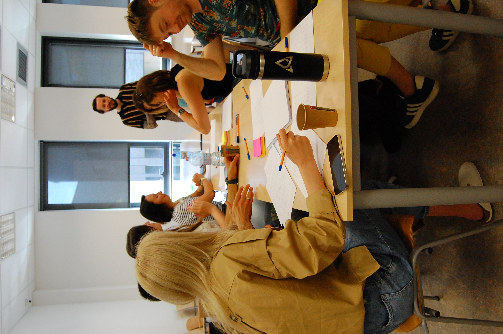
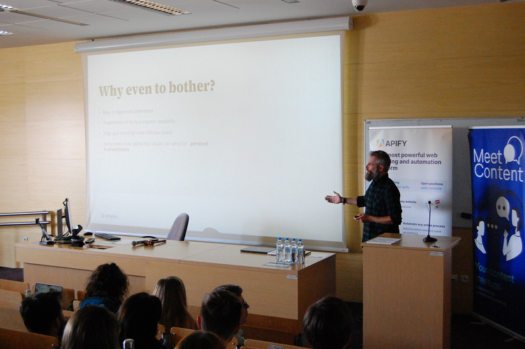
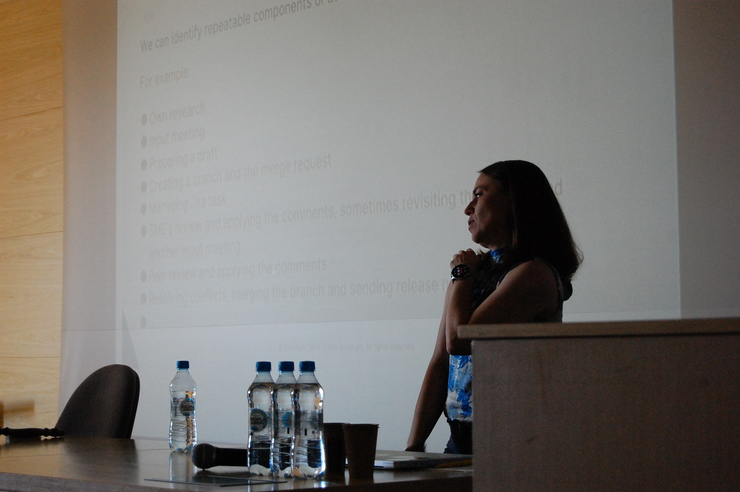
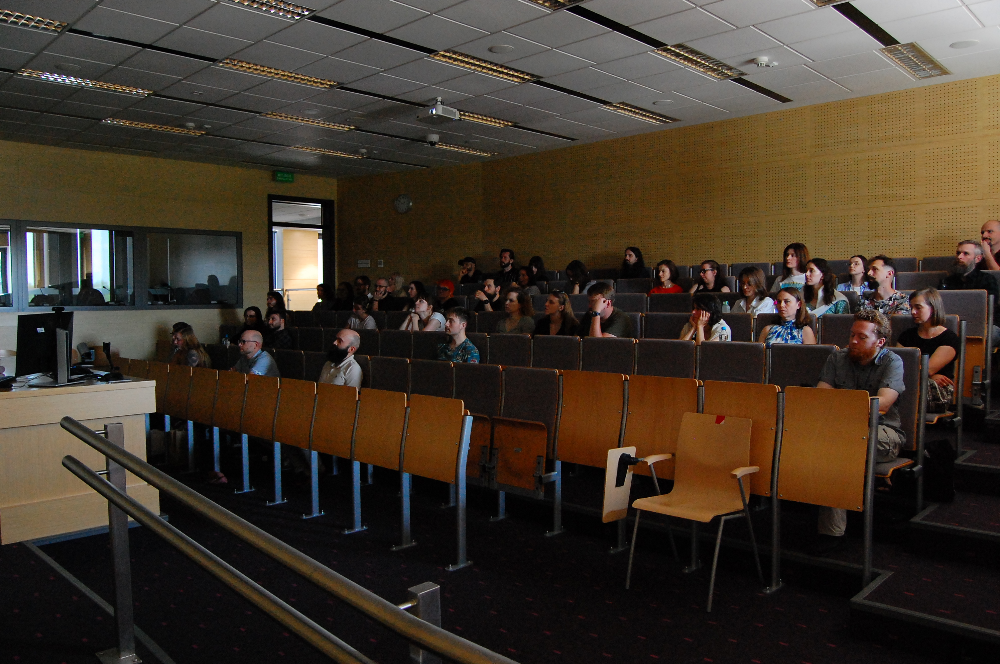
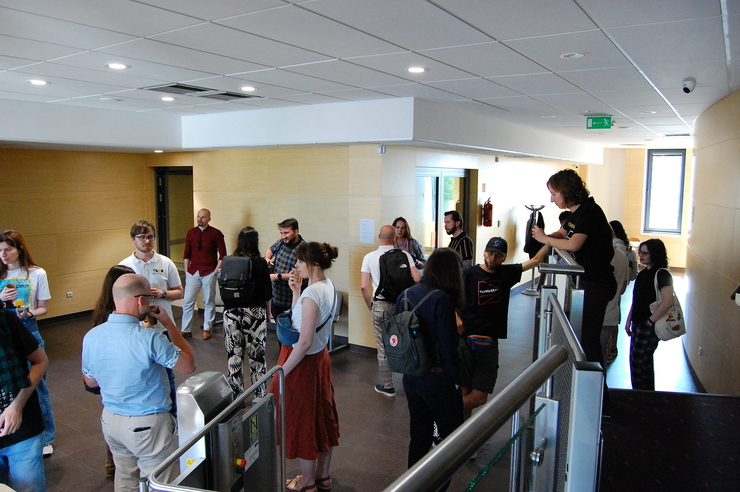
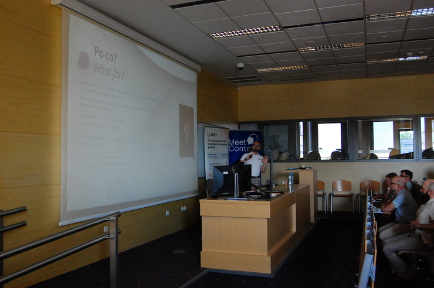
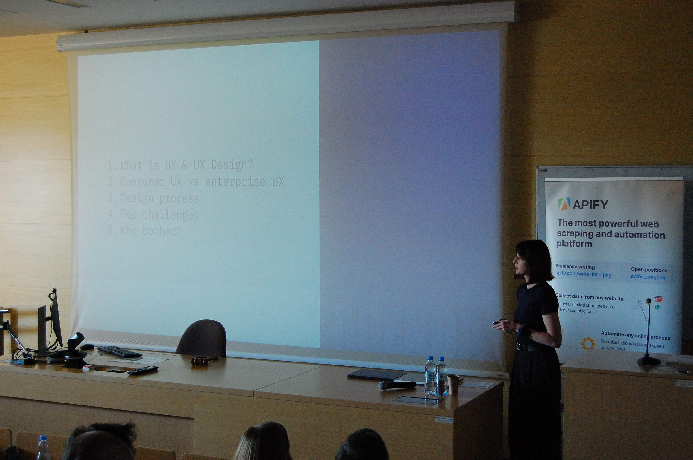

# #ContentDay - Relacja

Pierwszy **#ContentDay** już za nami, czas więc na krótkie podsumowanie 😊
Czerwcowe wydarzenie odwiedziła spora grupa contentowych pasjonatów, a sale
Uniwersytetu Jagiellońskiego pozwoliły nam na przeprowadzenie warsztatów i
prezentacji.

Nie zabrakło również czasu na networking, wymianę doświadczeń i opinii.

<!--truncate-->

## Warsztaty

Dzień rozpoczęliśmy od warsztatów prowadzonych przez dwóch Pawłów.

[**Paweł Kowaluk**](https://www.linkedin.com/in/pawel-kowaluk/) wprowadził nas w
tajniki Design Thinking. Podczas pracy nad projektem o nazwie **Smart Home**,
prowadziliśmy wywiady z użytkownikami oraz stworzyliśmy personę, a całość
zwieńczyliśmy projektem strony z dokumentacją. W trakcie warsztatów poznaliśmy
założenia metody Design Thinking i nauczyliśmy się, jak można wykorzystać je w
swoich projektach.

Z kolei [**Paweł Chłodnicki**](https://www.linkedin.com/in/pawelchlodnicki/)
wykorzystał swoją wiedzę designera i pokazał nam jak zaprojektować aplikację
mobilną. Tworząc swój pierwszy prototyp, mieliśmy szansę zapoznać się z
funkcjonalnościami Figmy.

## Visual design w komunikacji technicznej

Po warsztatach i przerwie nadszedł czas na drugą część programu, czyli
prezentacje.

Rozpoczęliśmy od omówienia roli projektów graficznych w dokumentacji.
[Maciek Chudański](https://www.linkedin.com/in/maciekchudanski/) pokazał nam jak
ważna jest graficzna prezentacja treści, obrazów, rysunków i schematów.

Zasady dotyczące tworzenia grafik Maciek zilustrował wieloma przykładami. Między
innymi, dowiedzieliśmy się jaką rolę elementy wizualne odgrywają w dokumentacji,
jak dobór elementów wiąże się z kontekstem kulturowym, a także jak dokumentacja
którą czytamy na ekranie różni się od tej drukowanej.

Mnóstwo przykładów i porównań zawartych w prezentacji spotkało się z
zainteresowaniem publiczności oraz wieloma pytaniami.

A jeżeli chcesz dowiedzieć się więcej o prezentacji Maćka, zapraszamy na
[relację z wrocławskiego spotkania MeetContent](../meet-content-wro-maj-2024-relacja/index.md#visual-design-w-komunikacji-technicznej)!

## Rola estymacji w zespole tech writerskim

Następna prezentacja również obfitowała w grafiki i diagramy ilustrujące wyniki
projektu [Moniki Mrozek](https://www.linkedin.com/in/monika-mrozek/) i jej
zespołu. Monika opowiedziała nam jak wraz z zespołem przeanalizowała codzienne
zadania, aby oszacować pracę technical writera i prognozować obłożenie
zadaniami.

Dodatkowym benefitem tego projektu było zdobycie argumentów przemawiających za
rozszerzeniem zespołu.

## Stowarzyszenie Autorów i Ilustratorów Technicznych

Po krótkiej przerwie poświęconej networkingowi przy kawie i ciasteczkach
powróciliśmy do sali, żeby posłuchać o **Stowarzyszeniu Autorów i Ilustratorów
Technicznych**.
[Łukasz Rybka](https://www.linkedin.com/in/%C5%82ukasz-rybka-364a81190/)
wystąpił z propozycją utworzenia stowarzyszenia gromadzącego twórców treści i
ilustracji, które miałoby na celu nie tylko stworzenie wspólnych standardów i
najlepszych praktyk w zakresie tworzenia treści, ale także ochronę i promocję
technical writerów i designerów.

Prezentację zakończyliśmy dyskusją na temat założeń stowarzyszenia oraz kroków,
które należy podjąć, żeby wdrożyć je w życie.

Więcej o **SAiIT Polska** możecie przeczytać w
[wywiadzie udzielonym przez Łukasza](../saiit-wywiad/index.md) oraz
[na portalu LinkedIn](https://www.linkedin.com/in/saiit-polska-03a008308/).

## ... a teraz coś z zupełnie innej beczki

**#ContentDay** stawia nie tylko na merytorykę, ale także na humor.

Dlatego też krótkie wystąpienie
[**Jana Sosny**](https://www.linkedin.com/in/jan-sosna/) poświęcone żartom z AI
spotkało się z niezwykle entuzjastycznym przyjęciem.

Janowi wróżymy karierę w stand-upie i czekamy na więcej!

## Enterprise UX. Jak zaprojektować oprogramowanie przydatne użytkownikom w codziennej pracy

Wydarzenie zakończyliśmy patrząc na content z perspektywy UX designerów.

[Dominika Łacheta](https://www.linkedin.com/in/dominikalacheta/) opowiedziała
nam o wyzwaniach, jakie stoją przed UX designerami projektującymi oprogramowanie
przyjazne użytkownikom.

Dominika przybliżyła nam różnice w wykorzystaniu oprogramowania przez
indywidualnych użytkowników i duże przedsiębiorstwa, co przekłada się na proces
projektowania oprogramowania. Następnie przeszliśmy wspólnie przez etapy
projektu od rozpoznania potrzeb użytkownika, aż po dostarczenie rozwiązania. To
pozwoliło nam zrozumieć co dla UX designera może być wyzwaniem oraz jak takim
wyzwaniom sprostać.

Prezentację dodatkowo wzbogaciły liczne memy, bo w końcu:

_Interfejs użytkownika jest jak żart - jeżeli trzeba go tłumaczyć, to znaczy, że
nie jest trafiony_.

## Podziękowania

Wszystkim uczestnikom serdecznie dziękujemy za liczne przybycie! Cieszymy się,
że razem tworzymy wspaniałą contentową społeczność, która poprzez spotkania i
wymianę doświadczeń ma szansę na rozwój i kształtowanie podejścia do tworzenia
treści.

Dziękujemy naszym prezenterom oraz trenerom za poświęcony czas i chęć dzielenia
się swoją wiedzą z uczestnikami. Dziękujemy także doktorowi **Andrzejowi
Kurtyce** z Uniwersytetu Jagiellońskiego za pomoc w organizacji wydarzenia, gdyż
bez niego **#ContentDay** nie doszedłby do skutku.

## Zdjęcia

