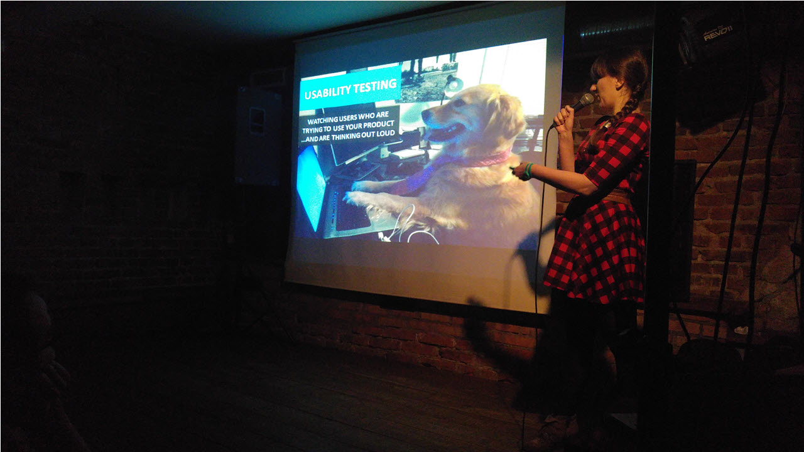

15 marca 2016 odbyło się spotkanie inaugurujące cykl
[**Meet Content**](http://soapconf.com/meet-content/). Zapraszamy na krótką
relację z tego wydarzenia.

Na początku przypomnijmy o co chodzi.
[**Meet Content**](http://soapconf.com/meet-content/) jest cyklem spotkań,
wykładów, warsztatów oraz szkoleń dotyczących treści w branży IT, stworzony
przez organizatorów [konferencji soap!](http://soapconf.com/).

Tematem pierwszego spotkania było testowanie użyteczności
([usability testing](https://en.wikipedia.org/wiki/Usability_testing)). Przed
wypełnioną do ostatniego miejsca salą, prezentację pt. **"Do-It-Yourself
Usability Testing"** poprowadziła **Anna Tutak**, która zajmuje się badaniem
użytkowników (user research) i projektowaniem doświadczeń użytkownika (UX
design). Jak mogliśmy się dowiedzieć z krótkiej opowieści prowadzącej, wcześniej
zajmowała się tworzeniem dokumentacji, jednak wciąż zadawała trudne pytania
dotyczące odbiorców oraz celu instrukcji dostarczanych przez firmę. Ponieważ nie
mogła uzyskać na nie zadowalających odpowiedzi, sama zaczęła zajmować się
badaniem użytkowników i po pewnym czasie stało się to jej pracą.

Celem prezentacji było ogólne przedstawienie zagadnienia testowania
użyteczności, bez wchodzenia w szczegóły dotyczące narzędzi i sposobów
przeprowadzania badań, po to, aby nie przytłoczyć uczestników nadmiarem
informacji. Agenda przedstawiała się następująco:

- [Czym jest testowanie użyteczności?](#agenda1)
- [Dlaczego powinniśmy to robić?](#agenda2)
- [Jak to robić?](#agenda3)

## Czym jest testowanie użyteczności?

Mówiąc prosto, testowanie użyteczności polega na obserwowaniu użytkowników,
którzy starają się używać produktu i myślą przy tym na głos. Abyśmy mogli lepiej
zrozumieć tą definicję, prowadząca pokazała nam obrazek przedstawiający psa,
który wyglądał jakby robił coś na komputerze oraz napis "Nie mam pojęcia co
robię". Krótko, zwięźle i na temat.

## Dlaczego powinniśmy to robić?

Przede wszystkim dlatego, że sami nie jesteśmy użytkownikami i nie myślimy jak
oni, przez co nie jesteśmy w stanie zidentyfikować problemów z jakimi się
spotykają. Pomimo tak mocnego argumentu, często nie testujemy użyteczności z
takich czy innych powodów. Żeby poznać nasze zdanie w tej kwestii prowadząca
podzieliła nas na grupy, w których mieliśmy przeprowadzić krótką dyskusję. Na
końcu przedstawiliśmy swoje wnioski i porównaliśmy z listą najczęstszych
powodów, dla których nie chce przeprowadzać się testów użyteczności. Nie było
zaskoczeniem, że często pojawiającym się wątkiem jest koszt takich testów.
Oprócz tego, problemem jest brak eksperta od UX, przekonanie, że firma posiada
już dużo opinii od klientów, takich jak zgłaszane problemy, oraz to, że produkt
jest w takiej fazie rozwoju, że nie nadaje się do testów. Uczestnicy ze swojej
strony dorzucili też, że takie testy powodują, że klienci będą oczekiwać wzięcia
ich opinii pod uwagę i bezzwłocznego rozwiązania wszystkich zgłoszonych
problemów. Wszystkie te wymówki, prowadząca starała się przezwyciężyć
następującymi argumentami:

- Jeśli dysponujesz budżetem, zatrudnij eksperta, jeśli nie, zrób testy we
  własnym zakresie. Wszystko jest lepsze niż brak testów.
- Logi programu czy opinia klientów są ważne, ale testy dają nam dużo więcej
  informacji.
- Lepiej pokazywać klientom oprogramowanie od początku, bo to oni za nie płacą.
  Jeśli tego nie zrobimy, możemy stworzyć coś bezużytecznego.
- Zatrudnienie armii ekspertów i zakup profesjonalnych narzędzi są kosztowne,
  ale nie jest to konieczne na samym początku. Można zacząć od jakiegoś małego
  projektu, a potem poszerzać zakres testów.

Poza powyższymi wymówkami, pozostaje jeszcze kwestia przekonania przełożonego do
testów użyteczności, co nie zawsze jest łatwe. Większość woli, żeby specjalista
kodował niż testował. Jednak może być to zgubne podejście, ponieważ zmiana
oprogramowania, które jest już dostępne na rynku jest dużo bardziej kosztowna
niż zrobienie tego we wczesnej fazie jego rozwoju.

## Jak to robić?

W ostatniej części prezentacji, prowadząca dała nam kilka wskazówek jak zabrać
się za testowanie użyteczności.

#### Zacznij wcześnie

To nie prawda, że testować można tylko gotowy produkt. Można, a nawet powinno
się, testować też:

- Papierowe makiety interfejsu
- Cyfrowe makiety interfejsu
- Produkt we wczesnej fazie rozwoju

#### Znajdź prawdziwych użytkowników

Niektórzy ludzie będą zadowoleni z tego, że będą mogli pomóc w ulepszeniu
produktu. Szukaj użytkowników również wśród współpracowników - jeśli robisz
produkt dla administratorów, znajdź takich ludzi w swojej firmie i poproś o
pomoc. Pamiętaj też o tym, żeby nie przesadzić z liczbą użytkowników. Eksperci
są zgodni, że jedna runda testów powinna objąć od 3 do 5 użytkowników. To
wystarczy, żeby znaleźć 80% problemów.

#### Stwórz zadania, które mają znaczenie

Przed tym jak użytkownicy przystąpią do ich wykonania, powiedz im co mają robić,
omów cel testów, wyjaśnij, że nie testujesz ich umiejętności, ich doświadczenia,
tylko produkt oraz poproś, żeby mówili na głos o tym co robią. Ważne jest
również, aby upewnić się, że użytkownicy zgadzają się na nagrywanie. Następnie
przeprowadź test, a na końcu podsumuj co się wydarzyło.

#### Dziel radość

Po teście podziel się wynikami oraz, w przypadku małej grupy użytkowników,
zapisz trzy największe problemy, które każdy użytkownik zauważył.

#### Zaplanuj, które problemy naprawisz

Prawda jest taka, że zawsze mamy za mało zasobów, żeby naprawić wszystkie
znalezione problemy. Do tego pojawia się pokusa naprawienia najmniej
czasochłonnych rzeczy, które bardzo często nic tak naprawdę nie wnoszą. Czasem
lepiej naprawić jeden duży problem niż kilka mniejszych.

#### Wprowadź poprawki

Czasami chcielibyśmy przebudować całe oprogramowanie od nowa, jednak nie zawsze
wszystko trzeba wywracać do góry nogami. Pomyśl o małych rzeczach, które mogą
zmienić najwięcej, czasem drobnostki robią dużą różnicę. Spotkanie uważamy za
bardzo udane, pomimo tego, że nie dotyczyło ono bezpośrednio dokumentacji.
Zasady testowania użyteczności, a przynajmniej ich część, można by jednak z
powodzeniem przenieść do świata tech writingu. Na tą chwilę jest to na pewno
mało rozwinięta działka, ale w sieci można już znaleźć materiały dotyczące tego
zagadnienia, choćby
[tą prezentację](http://www.slideshare.net/VidishaB/documentation-usability) czy
[ten artykuł](http://www.hceye.org/UsabilityInsights/?p=96). Po dokładniejszym
zgłębieniu tematu testowania użyteczności dokumentacji może się okazać, że tak
naprawdę ma ono wiele wspólnego z testowaniem użyteczności oprogramowania. W
końcu UX dotyczy także tech writingu. Być może jest to dobry temat na następne
spotkanie z cyklu **Meet Content**. Według nas byłaby to świetna kontynuacja
rozpoczętego wątku. Ktoś chętny? 😊
