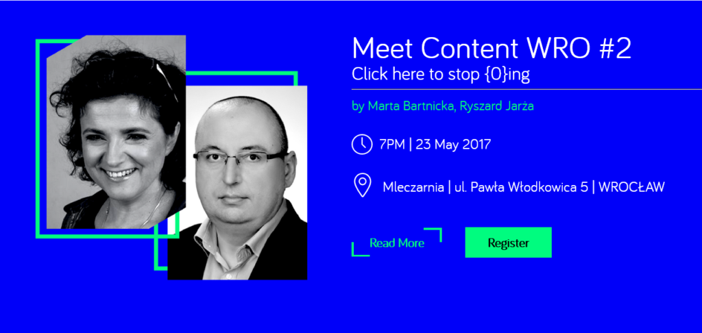
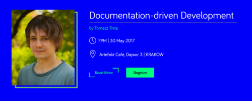

Jest okazja, żeby nauczyć się nowych rzeczy z dziedziny komunikacji
technicznej i spotkać się z kolegami i koleżankami po fachu. W maju 2017 odbędą
się aż dwie edycje [Meet Content](http://meetcontent.org/) - 23 maja we
Wrocławiu i 30 maja w Krakowie.

<!--truncate-->

## Jak narzędzia CAT wpływają na pisanie - Wrocław

Marta Bartnicka i Ryszard Jarża opowiedzą co się dzieje z treścią kiedy trafia
do narzędzi tłumaczeniowych. Podadzą przykłady treści DITA, interfejsu aplikacji
i tekstu na stronie. Ta wiedza powinna wpłynąć na decyzje podejmowane przez
technical writerów podczas pisania, ale ma także znaczenie w doborze i
użytkowaniu narzędzi, oraz przy konstruowaniu procesu pisania pod tłumaczenie.

Wydarzenie odbędzie się **23 maja 2017** w **klubokawiarni** **Mleczarnia** przy
ulicy Pawła Włodkowica 5 we Wrocławiu o godzinie 19:00. Wstęp jest wolny, ale
wymagana jest rejestracja. Więcej szczegółów
[tutaj](http://meetcontent.org/wroclaw2-content/).

## Wpływ technical writera na rozwój produktu - Kraków

Tomasz
Trela, Technical Writer w Dassault Systèmes, opowie o tym jak udawało mu się
wpłynąć na zespół tworzący produkt. Pokaże na przykładach, że Technical Writer
nie musi wcale być na końcu łańcucha pokarmowego.

Wydarzenie odbędzie się **30 maja 2017** w **Artefakt Cafe** przy ulicy Dajwór 3
w Krakowie o godzinie 19:00. Wstęp jest wolny, ale wymagana jest rejestracja.
Więcej szczegółów [tutaj](http://meetcontent.org/tomasz-trela/).
