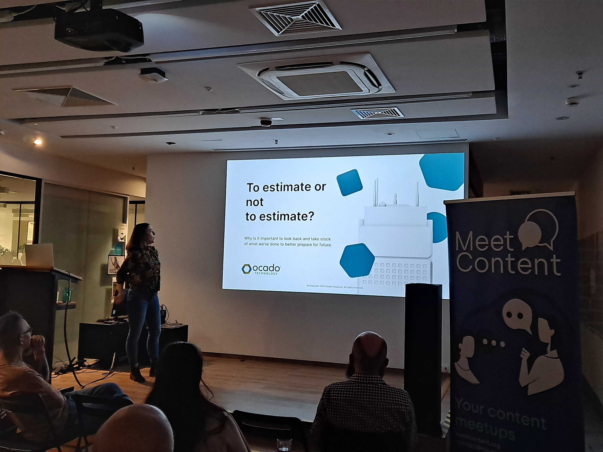
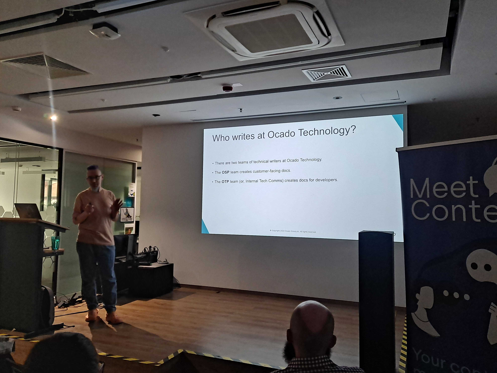
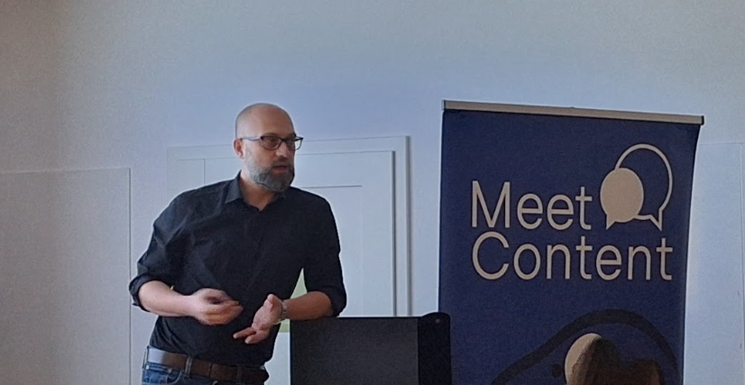

W kwietniu MeetContentWRO gościł w Ocado Technology. W tym nowoczesnym biurze w
centrum Wrocławia spotkaliśmy się już drugi raz.

Na ocadowskiej scenie wystąpiła dwójka pracowników firmy:

<!--truncate-->

- [Monika Mrozek](https://www.linkedin.com/in/monika-mrozek/), Lead Technical
  Writer, z prezentacją _To commit or not to commit: Reflection on estimation_,
  oraz
- [Paweł Martin](https://www.linkedin.com/in/pawel-martin/), Technical Writer, z
  wystąpieniem _Hats, snakes, and portals or: How to DITA without DITA_

## SAiIT

Jednak zanim zaczęły się prezentacje, wystąpił
[Łukasz Rybka](https://www.linkedin.com/in/%C5%82ukasz-rybka-364a81190/) i
zaprezentował inicjatywę utworzenia **Stowarzyszenia Autorów i Ilustratorów
Technicznych**.

Stowarzyszenie ma na celu między innymi rejestrację zawodów z dziedziny
komunikacji technicznej w GUS i ZUS czy też opracowanie założeń, wymagań i
standardów zawodowych.

O rozwoju [SAiIT](https://www.linkedin.com/in/saiit-polska-03a008308/) możecie
już teraz przeczytać na LinkedIn.

Niedługo z pewnością napiszemy więcej o tej inicjatywie na łamach TechWriterPL.

## Estymacja

Monika opowiedziała, jak ona i jej zespół postanowili znaleźć sposób aby
efektywnie mierzyć i prognozować obłożenie pracą.

### Po co?

Brakowało im efektywnego sposobu na śledzenie zmian w obciążeniu Tech Writerów.
Nie mieli metody na porównywanie wielkości zadań. Wierzyli też, że lepsze
planowanie uczyni ich przewidywalnym partnerem dla innych działów w firmie.

W perspektywie, chcieli też mieć czym argumentować ewentualną konieczność
rozbudowania zespołu.

### Jak sie za to zabrali?

Poprzez warsztaty, w które zaangażowany był cały zespół. Wyszli z założenia, że
ich praca obejmuje powtarzalne elementy i czynności, które można zidentyfikować
i wyodrębnić.

Zidentyfikowali więc rodzaje zadań, np. dokumentacja nowego atrybutu w
istniejącym API, czy nowej funkcjonalności w aplikacji mobilnej.

Na każde takie zadanie składają się powtarzalne komponenty, które Monika i jej
zespół zidentyfikowali. Między innymi wyodrębnili: spotkanie z SME, zapoznanie
się z rezultatem tzw. _product discovery_ lub wynikami _user research_, no i
oczywiście - samo pisanie!

Następnie, wspólnie ustalili, jaki czas średnio przeznaczają na każdy z takich
komponentów - w zależności od stopnia skomplikowania zadania. Na przykład,
rozmowa z SME może być wyraźnie dłuższa jeśli do udokumentowania jest
przekrojowa funkcjonalność w porównaniu z drobną aktualizacją istniejącej
funkcjonalności.

### Co z tego wynikło?

Zespół przyjął podział zadań według rozmiarów t-shirtów (XS, S, M, L i XL).

A więc, jeśli każdy rodzaj zadania składa się z określonych komponentów, w
wyniku warsztatu mają one teraz przypisany szacowany czas, jaki zajmie Tech
Writerowi ukończenie tego zadania - w zależności czy mamy do czynienia z
zadaniem ocenionym przez zespół na przykład jako S lub L.

W ramach tego eksperymentu, ocadowscy Tech Writerzy zaczęli też rejestrować czas
poświęcony na peer review.

### Efekt?

Na tamten moment eksperyment trwał zaledwia dwa kwartały ale były już pierwsze
wnioski. Na przykład: poziom obciążenia pracą się zmienia. Ale kiedy zmniejsza
się ilość zadań związanych z rozwojem produktu (_development-related_), zwiększa
się ilość zadań nakierowanych na ulepszanie samej dokumentacji i odwrotnie.

Rejestrowanie godzin poświęconych na wzajemne sprawdzanie swojej pracy,
przyniosło konkretne liczby, które również dają do myślenia. Szczególnie w
kontekście ewentualnych rozmów na temat zaprzęgnięcia narzędzi wykorzystujących
AI.

Eksperyment wciąż trwa, a zespół zgodził się że aktualne podejście będzie
wymagało kalibracji. Jednak już teraz zespół ma większą pewność w określaniu
swoich zobowiązań i ram czasowych na ich wykonanie.

---

## How to DITA without DITA

Następnie Paweł Martin przedstawił, w jaki sposób osiągnąć funkcjonalności znane
z architektury DITA w Markdownie.

Paweł jest częścią zespołu Internal Tech Comms, tworzącego dokumentację dla
deweloperów. Aktualnie tworzą część dokumentacyjną portalu dla deweloperów
opartego na technologii Backstage od Spotify.

Aby zbudować sprawny portal, potrzebowali:

- Wtyczki _kroki_ - do tworzenia diagramów
- Monorepo - czyli repozytorium przechowującego kod wielu projektów
- A gdy już mieli jedno repozytorium - sposobu na powtórne użycie elementów,
  czyli _reuse_

Udało im się znaleźć sposób na odtworzenie funkcji _reuse_ w Markdownie za
pomocą _snippetów_. _Snippet_ to plik Markdownowy, który można osadzić w innym
pliku _.md_.

Umieszcza się go przy pomocy takiego kodu:

`--8<-- "snippet.md"`

W efekcie treść pliku _snippet.md_ jest wyświetlana w dokumencie docelowym.

### Zalety

Do największych należy fakt, że _content reuse_ w ogóle jest możliwy. A więc
treść snippeta aktualizujemy raz, a każde miejsce w dokumentacji, które ten
snippet wykorzystuje pokaże nam już zaktualizowaną wersję.

Snippety można wykorzystywać na przykład do automatyzacji wersjonowania,
zarządzania zmianą nazw produktów czy powielania standardowych, powtarzalnych
elementów dokumentacji.

### Wady

Do wad należą następujące ograniczenia:

- Nie da się umieszczać snippetów w snippetach
- Nagłówki w snippecie nie są kontynuacją nagłówków docelowego dokumentu
- Zamieszczanie ilustracji w snippecie jest... skomplikowane

Zespół Pawła wciąż jednak pracuje nad usprawnieniem tej metody. A już teraz
snippety pozwalają im korzystać z funkcji DITA bez faktycznego używania DITA.

Rzecz jasna meetup zakończył się pizza party 🍕 🍹 🤩

---

## Co dalej?

Wrocławski sezon contentowy zamkniemy już **22 maja**.

Tym razem widzimy się w siedzibie firmy Etteplan.

Żeby solidnie wejść w contentowy sezon ogórkowy 😉, w Etteplan czekają nas
również dwie prezentacje:

- [Basia Kardel-Piątkowska](https://www.linkedin.com/in/barbara-kardel-piatkowska/)
  i Knowledge transfer and retention in a Technical Communication team
- [Maciek Chudański](https://www.linkedin.com/in/maciekchudanski/) i Visual
  Design in Technical Communication

Zapisy w formularzu pod [TYM LINKIEM](https://forms.gle/b6YrWoYG7teRorT38)! 👋

Do zobaczenia!

---

Artykuł powstał przy współpracy z Janem Sosną

  
