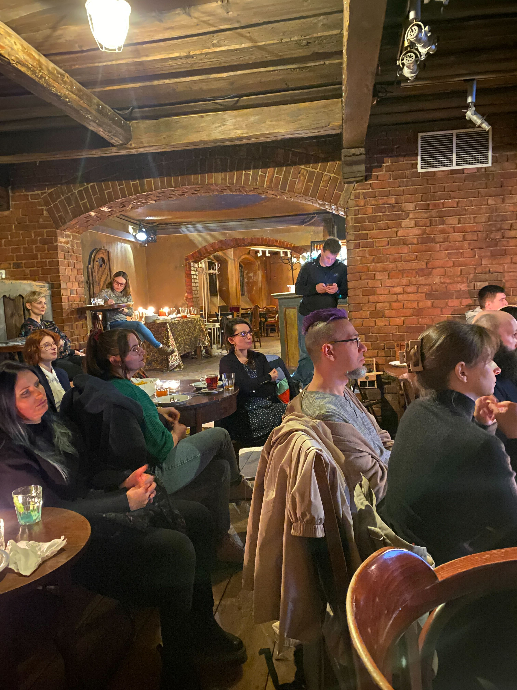
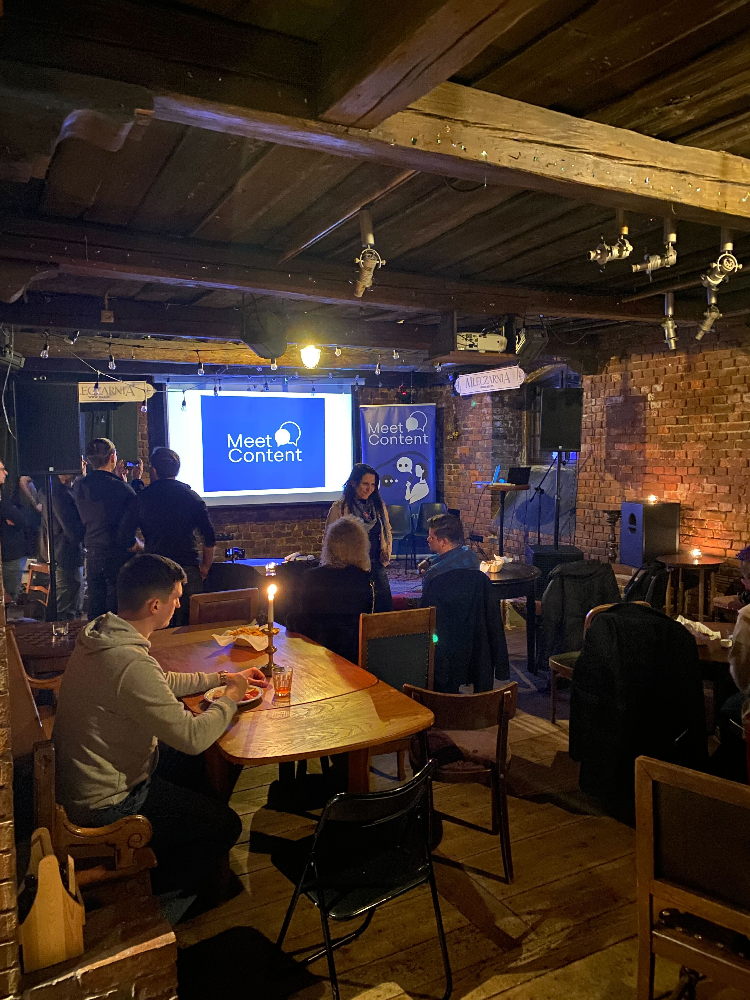

27 lutego spotkaliśmy się niestandardowo - w słynnej wrocławskiej klubokawiarni
Mleczarnia, żeby posłuchać o tym, jak robi się filmiki produktowe.

Naszym gospodarzem tym razem była, skądinąd znana i umiejąca w filmiki, firma z
branży IT - **CodeTwo**.

<!--truncate-->

Prezentację na temat: _Creating product videos - a team challenge_ brawurowo i z
humorem dostarczyli:

- [Michał Królewicz](https://www.linkedin.com/in/mkrolewicz/), który jest
  Technical Marketing Managerem,
- [Kacper Tomaszewski](https://www.linkedin.com/in/kacpertomaszewski/), który
  jest Senior Graphic & UI/UX Designerem, oraz
- [Kamil Glaser](https://www.linkedin.com/in/kamil-glaser-92b91482/), który jest
  Senior Technical Marketing Specialist

## Po co tworzyć filmy produktowe?

Ekipa z CodeTwo zaczęła od podstaw - czyli od _dlaczego_.

Otóż okazuje się, że treści video są wyżej indeksowane przez wyszukiwarki, a
więc mają większą szansę pojawić się w wynikach wyszukiwania niż treści pisane.
Ponadto, wszyscy wiemy, że coraz mniej ludzi chce czytać i jeśli ma do wyboru
filmik lub manual, wybiorą filmik.

Video produktowe pomagają również w marketingu firmy, promocji produktu i danej
funkcjonalności.

### O czym robić filmiki produktowe?

Jak już zdecydujemy, że chcemy je robić, trzeba zastanowić się i wybrać, jakie
funkcjonalności najlepiej w tych filmikach pokazać.

W CodeTwo filmowe scenariusze przychodzą z wielu miejsc - z nowymi wydaniami
programów na czele. Inspiracji dostarcza również zespół Customer Success, będący
najbliżej klientów i dobrze znający ich potrzeby. Swoje sugestie daje też zespół
Technical Marketingu podczas cyklicznych burz mózgów, oraz sam CEO.

## Strona praktyczna

Od czego zacząć realizację filmiku?

### Koncept, skrypt i weryfikacja

Jeśli chcemy, aby nasze video wyglądało profesjonalnie, trzeba się odpowiednio
przygotować. W CodeTwo zaczynają od napisania skryptu, propozycji tytułu i
ustalenia, które elementy UI będą brały udział w instrukcji video.

Następnie przychodzi czas na weryfikację skryptu pod kątem poprawności językowej
i odpowiedniego przygotowania środowiska, czyli dostosowania rozdzielczości i
formatu, ale i stworzenie przykładowych danych i użytkowników. Nie chcemy
przecież pokazywać przypadkowych danych na środowisku testowym w stylu: “jakiś
klient 123” (albo gorzej 😀).

Potem nagrywana jest kopia robocza. Tu padła bardzo praktyczna rada: przed
nagrywaniem akcji na swoim pulpicie, wyłącz notyfikacje 😅

### Planowanie warstwy graficznej

Trzeba też zdecydować, czy chcemy pokazywać osobę mówiącą o produkcie i
funkcjonalności czy tylko interfejs, no i oczywiście w jakiej formie będzie
pokazywany ten interfejs: na dole ekranu, po prawej, etc? Koniecznie trzeba
obliczyć, ile czasu każdy ekran pokazywać, jak długi powinien być narzut
czasowy, żeby użytkownik próbujący odtworzyć akcje na swojej maszynie, mógł się
odnaleźć.

### Nagrywanie

CodeTwo postawiło na zbudowanie małego studia nagrań u siebie w biurze. Ich CEO,
Szymon Szczęśniak, podkłada głos do większości ich filmików, co daje też element
budowania zaufania do marki. Czego nie da się osiągnąć, na przykład, zlecając
nagrania firmie zewnętrznej.

Oczywiście, sama realizacja wymaga sporej liczby powtórzeń, ale według
prelegentów, im lepiej wykonane są czynności przygotowawcze, tym mniejsza jest
liczba prób.

Bardzo ważna jest precyzyjna synchronizacja głosu lektora z tym, co dzieje się
na interfejsie. Trzeba też usunąć wszelkie głębsze wdechy, mlaśnięcia, czy
przejeżdżającą obok karetkę na sygnale 😉

Mając na uwadze różne formaty, w których użytkownicy mogą chcieć odtwarzać
filmiki, warto nagrywać video w wersji poziomej oraz dodatkowo w wersji
pionowej, na potrzeby urządzeń mobilnych i reels na Instagramie i YouTube.
Trzeba też pomyśleć o wybraniu thumbnails, pod kątem korzystności kadru i
spójności z marką i innymi treściami na stronie.

Narzędzi do tworzenia video i nagrywania UI jest wiele. Popularne są np.
Camtasia i Adobe After Effects.

### Montaż filmu i przygotowanie do publikacji

To kolejny krok na długiej drodze do publikacji dwuminutowego video 😉 Filmiki
produktowe w CodeTwo uploadowane są bezpośrednio na YouTube, a następnie są
embedowane na ich własnej stronie.

Na tym etapie dodawane są też napisy, do czego CodeTwo używa Happy Scribe.
Dodawane są również timestamps, które pozwalają odesłać użytkownika do
konkretnego momentu w video.

Jeśli myśleliście, że to już koniec - no to nie tak szybko! 😆

Trzeba jeszcze zbudować flow, tak zwany user journey, czyli jeśli obejrzałeś
filmik A, to teraz logicznie będzie, jeśli zasugerujemy ci filmik B.

Teraz można publikować! 🤩 🥁

## Pytania uczestników

Jak możecie podejrzewać, po prezentacji pojawiło się mnóstwo pytań.

Najbardziej chyba nurtującym problemem było: co zrobić, kiedy pojawiają się
jakieś zmiany w interfejsie i film traci na aktualności?

CodeTwo radzi, aby dzielić filmiki na sekcje i tworzyć playlistę z małych
fragmentów, co pozwala na łatwiejsze podmienianie treści w razie zmian.

Również po prezentacji temat cieszył się ciągłym zainteresowaniem, bo kiedy już
pałaszowaliśmy pyszne bruschetty, padały dodatkowe pytania. Wielu uczestników
wspominało, że w ich pracy też nagrywają lub zamierzają nagrywać filmili
produktowe.

---

Serdecznie dziękujemy zarówno CodeTwo za bycie wspaniałym gospodarzem, jak i
wszystkim uczestnikom 🙌

## Co dalej?

MeetContentWRO zaprasza na kolejne wydarzenie we Wrocławiu: najbliższe już **20
marca** w **Nokia Garage**.

Temat: _Smart search results with Natural Language Understanding (NLU)_.

Więcej o wydarzeniu można poczytać na naszej stronie
[MeetContent](https://meetcontent.github.io/events/wroclaw/2024/26).

Zapisy w formularzu pod [TYM LINKIEM](https://forms.gle/Ehg9dcD6ruex2VRU8)!

Do zobaczenia! 👋

 

