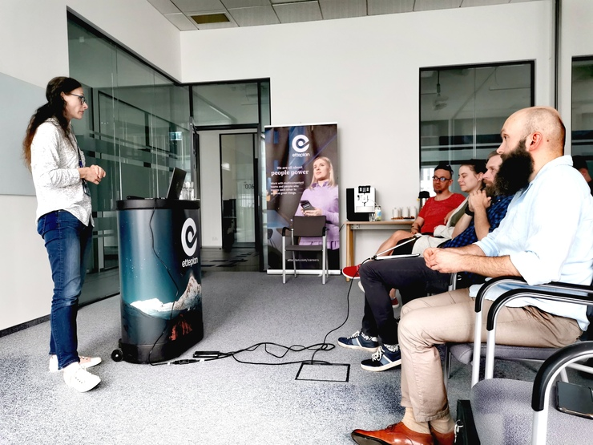
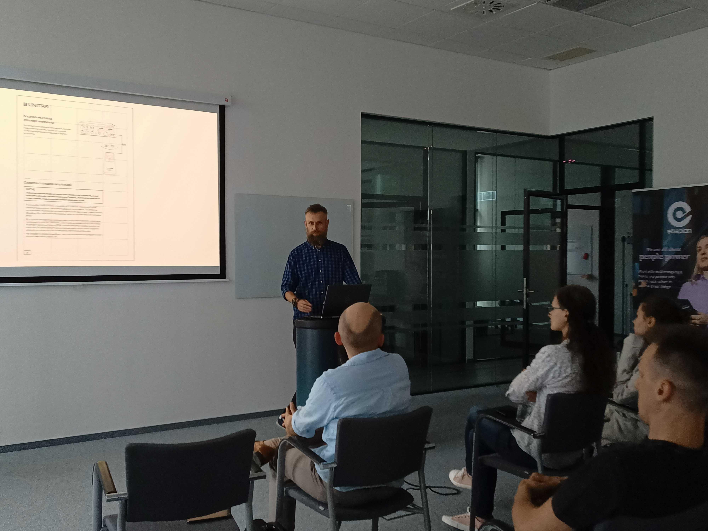
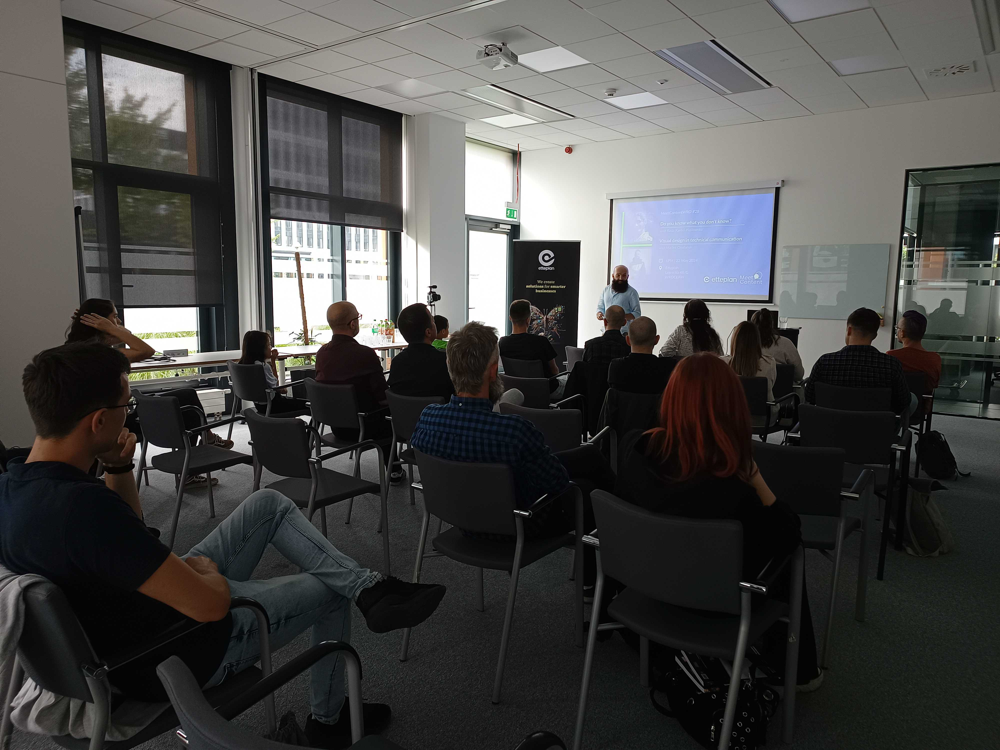

22 maja spotkaliśmy się biurze firmy Etteplan.  #28 MeetContentWRO i tym razem składał się z dwóch prezentacji. 

Na pierwszy ogień poszła [Basia Kardel-Piątkowska](https://www.linkedin.com/in/barbara-kardel-piatkowska/), która opowiedziała nam o transferze i retencji wiedzy w zespole dokumentacyjnym. 

<!--truncate-->

## Transfer i retencja wiedzy

Basia zaczęła od nakreślenia specyficznych warunków, w jakich pracują Tech Writerzy w Etteplan. Firma świadczy usługi dokumentacyjne dla innych firm. Czasem jest to dokumentacja do urządzeń lub maszyn, a czasem do oprogramowania. Specyfika pracy Tech Writerów polega na tym, że są przypisywani do różnych projektów lub produktów. Bywa, że projekty lub produkty zmieniają się dość często. 

Oznacza to, że transfer i retencja wiedzy między dokumentalistami stają się kluczowe. Oczywiście, nietrudno sobie wyobrazić, że zachowanie wiedzy i jej skuteczne przekazywanie są konieczne w każdej organizacji. 

Basia zaczęła od zdefiniowania, czym jest wiedza. Metafora góry lodowej była bardzo pomocna, gdyż wiedza to jedynie jej przysłowiowy „czubek”. 

Najniższa warstwa, zazwyczaj niewidoczna, to **dane** (raw data). Ponad tą warstwą znajdują się **informacje**. Dopiero na samym szczycie jest **wiedza**.

Pozostając przy metaforach, Basia wyjaśniła, że wiedza może mieć różne rodzaje:

* Wiedza jawna (*explicit*) - to przykładowo przepis na pizzę z ogólnodostępnej książki kucharskiej lub internetu
* Wiedza niejawna (*implicit*) - to specjalne sposoby lub sztuczki, które można zastosować żeby ciasto było lepsze
* Wiedza milcząca (*tacit*) -  to tajna receptura na ciasto od babci Francesci 🙃

Na wiedzę zgromadzoną w organizacji czyha wiele niebezpieczeństw. Mogą to być na przykład:

* Utrata - nieoczekiwana choroba lub dłuższa nieobecność pracownika
* Zagarnianie lub gromadzenie - (*knowledge hoarding*) - kiedy jeden pracownik gromadzi wiedzę dla siebie i nie chce się dzielić z innymi
* Utrata produktywności - czyli kiedy wiedza nie jest udostępniania i dochodzi do sytuacji, kiedy zespoły i ich członkowie zaczynają wymyślać koło na nowo

Basia miała kilka rad, jak można zapobiegać tym niebezpieczeństwom, lub przynajmniej ograniczyć ich skutki, jeśli już się wydarzą:  

* Zidentyfikowanie kluczowych lub strategicznych obszarów wiedzy
* Zidentyfikowanie braków w tej wiedzy
* Mapowanie wiedzy, np. w postaci mapy projektu
* Exit plan - czyli ustrukturyzowany plan na uzyskanie wiedzy od odchodzącego pracownika
* Sesje *lessons learned*
* Wspólne lub dzielone repozytorium projektu

Uczestnicy mieli sporo pytań do Basi. Jak nietrudno się domyślić, wielu z nas boryka się z podobnymi problemami w naszych organizacjach. 

Pytania dotyczyły polecanych narzędzi. I tu padło kilka nazw. Jednak po krótkiej dyskusji uczestnicy zgodzili się, że nawet najlepsze narzędzia nie zastąpią kultury pielęgnowania wiedzy i zachowania informacji w organizacji.

## Visual Design w komunikacji technicznej

Druga prezentacja tego wieczoru dotyczyła strony wizualnej dokumentacji. [Maciek Chudański](https://www.linkedin.com/in/maciekchudanski/) opowiedział (i pokazał 😀) nam jak ważna jest graficzna prezentacja treści, obrazów, rysunków i schematów. 

Maciek zdobył publiczność już na samym początku odważną tezą, że projektowanie graficzne kroczy **PRZED** słowem pisanym: otóż pokazał nam malunki naścienne w jaskini, uważane za najstarsze rysunki wykonane przez człowieka. 

Potem było już tylko lepiej 😀

W Etteplan, sekcja visual design nie ma łatwo. Grafikę trzeba dosłownie zsynchronizować z dokumentacją, umieścić ja w kontekście układu strony, wziąć pod uwagę możliwe formaty i przewidzieć warunki, w jakich dokumentacja może być użytkowana.

Graficzna warstwa zwykle przygotowywana jest z myślą o nośniku, czyli trzeba podjąć decyzję, czy projektuje się pod ekran czy papier.

Maciek mówił o podstawowej zasadzie: im oszczędniej z efektami wizualnymi, tym lepiej dla czytelności dokumentacji. Co za tym idzie, wystarczą de facto 4 kolory: czerwony, żółty, niebieski i zielony, żeby stworzyć grafiki do dokumentacji technicznej i przekazać każdy rodzaj komunikatu. 

Podstawowe zasady dobrej grafiki w dokumentacji technicznej to duży kontrast, który zwiększa dostępność i ułatwia odbiór tekstu. 
Lepiej również używać przeciwstawnych barw, niż pochodzących z tej samej palety.

Jednak kolory bywają zależne od kontekstu kulturowego. Przykładowo, niebieski w kręgu kultury zachodniej wzbudza zaufanie, podczas gdy czerwony ogólnie odbierany jest jako odpowiedni do zakomunikowania zagrożenia. Tak już jednak nie jest na przykład w kulturze azjatyckiej, co dodaje kompleksowości w różnorodnych projektach realizowanych w Etteplan.

Jak się jednak okazuje, wszystkie zasady, którym powinna podlegać dobra dokumentacja papierowa tracą swoją moc, jeśli zmienimy nośnik. 
W przypadku dokumentacji przeznaczonej na ekran, prawdziwym game changerem okazuje się RUCH. Obiekty w ruchu zawsze wygrywają walkę o uwagę użytkownika. 

Maciek opowiedział nam też o projektowaniu graficznym opartym o siatkę, gdzie każdy element ma swoje miejsce. Tego typu podejście sprawia, że dokumentacja jest bardziej ustrukturyzowana, czytelna i przewidywalna dla użytkownika. 

Prezentacja, jak nietrudno się domyślić, obfitowała w wizualne przykłady idealnie obrazując różnice między czytelne - nieczytelne. 

****

Tym samym wrocławski MeetContent zakończył sezon 😀

Powracamy już we wrześniu z nową porcją wiedzy, praktyki i doświadczeń! 

Dziękujemy Wam za uczestnictwo i do zobaczenia po wakacjach! 🌴 👋

  

