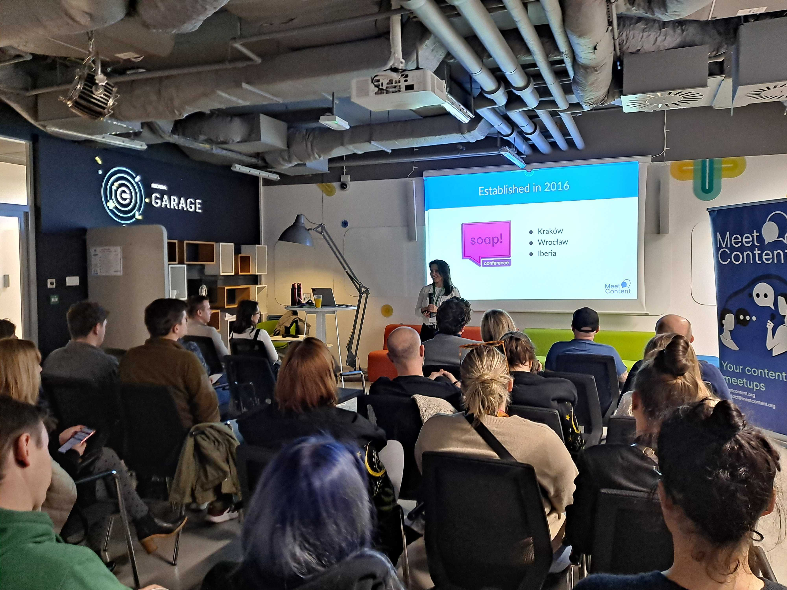
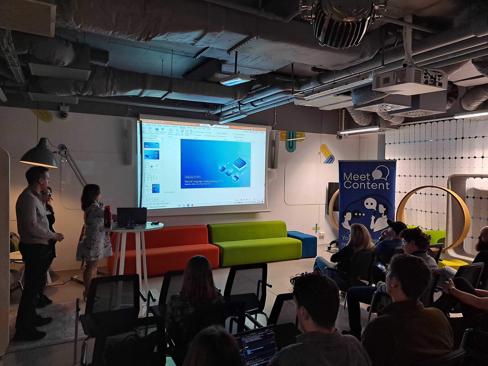

20 marca MeetContentWRO ponownie gościł w inspirującym wnętrzu przy Szybowcowej
2, czyli w Nokia Garage.

Prezentację pod tytułem _"Smart search results with Natural Language
Understanding (NLU)"_ dostarczyło wspólnie trzech prelegentów z Nokii:

<!--truncate-->

- Magdalena Jałówko, Product Owner
- [Adam Kąkol](https://www.linkedin.com/in/adam-kakol-14753b135/), Manager
  obszaru AI-Driven Knowledge Solutions
- [Natalia Rusin](https://www.linkedin.com/in/natalia-rusin-237930221/), UX/UI
  Designer

## Język naturalny - cel i perspektywa

Nokia zajmuje się tworzeniem urządzeń do komunikacji, na przykład różnych
urządzeń radiowych czy nadajników. W związku z tym potrzebuje udokumentować
swoje produkty w sposób ustandaryzowany i umożliwiający tysiącom pracowników,
klientów i użytkowników rozeznanie się w ogromie sprzętu.

NLU, czyli Natural Language Understanding, to obszar sztucznej inteligencji
odpowiedzialny za interakcję między człowiekiem a komputerem, w szczególności za
rozumienie i przetwarzanie języka naturalnego.

Nic dziwnego, że potrzebne było zaangażowanie nie-ludzkich 😉 zasobów, żeby to
wszystko ogarnąć i uczynić ‘przyjaznym’ dla użytkownika.

Zespół Adama określił cel i przyjął pewne założenia.

Określono dwie istotne perspektywy rozumienia języka naturalnego:

- Użytkownika
- Twórcy treści technicznych

Cel z kolei był jasny: Poprawa wyników wyszukiwania w portalu dokumentacyjnym.

## Intencje

Za każdym pytaniem (search query) czai się jakaś potrzeba użytkownika, tak zwana
intencja.

Żeby tę intencję zidentyfikować, zespół Adama:

- Zorganizował serię wywiadów z użytkownikami
- Przeanalizował wyszukiwane terminy

Swoje odkrycia przetłumaczyli na strukturę grafową, zidentyfikowali tak zwane
‘named entities’ oraz relacje między nimi, a następnie stworzyli grafową bazę
danych.

Czym zatem jest intencja? Okazuje się, że nieważne jak zadajemy nasze pytania,
informacje, których tak naprawdę potrzebujemy da się sprowadzić do pewnych
powtarzalnych kategorii.

Prosty przykład użyty przez naszych prelegentów to:

- Czy jutro będzie padać?
- Czy jutro pogoda będzie dobra na piknik?
- Temperatura jutro we Wrocławiu

Wszystkie te zapytania dotyczą prognozy pogody. I to ona staje się intencją,
która je łączy.

Każda intencja ma swoje parametry. Kontynuując przykład prognozy pogody, możemy
wyodrębnić takie parametry jak lokalizacja czy data.

W Nokii zidentyfikowano 10 kluczowych intencji, które stały za zapytaniami
użytkowników. Przykładowo, jeśli ktoś szukał informacji o wadze jakiegoś
sprzętu, jego zapytanie było klasyfikowane jako intencja WYMIARY.

Często też użytkownicy chcieli porównać podobne sprzęty. Te zapytania były z
kolei klasyfikowane jako PORÓWNANIE.

## Grafowe bazy danych

Proste wyszukiwanie po tak zwanych słowach kluczowych nie radzi sobie z dużymi
zestawami danych. Poza tym potrzebuje ścisłej i przewidywalnej struktury danych.
Takie wymagania sprawiają, że wyszukiwanie staje się niewydajne i często nie
generuje właściwych rezultatów.

Grafowe bazy danych przekładają dane na tak zwane wierzchołki (entities lub
nodes). Wierzchołki mają swoje atrybuty (properties), które z kolei niosą
kolejne informacje. Każdy wierzchołek może łączyć się z innym wierzchołkiem za
pomocą relacji.

## Semantic search - o co chodzi?

Semantyczny czyli znaczeniowy, a więc ‘semantic search’ to nic innego jak
wyszukiwanie znaczeń, zamiast klasycznego dopasowania słów kluczowych. Dlaczego
jest bardziej efektywne? Bo bierze pod uwagę kontekst i znaczenie słów.

## Semantyczna grafowa baza danych

W Nokii dokonano obróbki dokumentacji produktowej w taki sposób, że każdy
dokument został zaanotowany tagami XML. To pozwoliło na sprzęgnięcie wszystkich
elementów: zidentyfikowanie wierzchołków, ich atrybutów i wartości oraz relacji.

Powstała baza danych, która pozwala użytkownikom precyzyjnie przeszukiwać zasoby
i sprawniej manipulować danymi, zgodnie z intencją zapytania.

## I wtedy wchodzi UX...

Jak się domyślacie, trzeba było ten skomplikowany kłębek połączeń przedstawić
użytkownikowi w sposób zrozumiały i przejrzysty. Znowu potrzebne były wywiady z
użytkownikami a rezultat to przyjazny interfejs, który w prosty sposób pozwala
nawigować poprzez kompleksowość produktów Nokii. Czego byliśmy świadkami podczas
demo 🤩

## Pytania od uczestników

Po prezentacji, uczestnicy mieli kilka pytań.

Szczególnie interesowała ich kwestia aktualizowania bazy danych. Okazuje się, że
w grafowej bazie danych informacje są zawsze aktualne, bo są powiązane
bezpośrednio ze źródłem. Jeśli źródło zostało zaktualizowane, ten stan będzie
odzwierciedlony w wynikach wyszukiwania.

Kolejną kwestią był dostęp do treści, czyli kto powinien widzieć co i jak tym
sterować?

Otóż grafowe bazy danych umożliwiają różne poziomy dostępu. Po otrzymaniu
zapytania, baza danych identyfikuje poziom dostępu pytającego i pokazuje mu
TYLKO te wierzchołki, do których pytający ma dostęp.

---

Serdecznie dziękujemy marcowym prelegentom oraz naszym niezawodnym uczestnikom
🙌

Jednocześnie zapraszamy na kolejne wydarzenia MeetContent we Wrocławiu.
Najbliższe już **24 kwietnia** w **Ocado**.

Będziemy mieli dla Was aż dwie prezentacje:

- [Monika Mrozek](https://www.linkedin.com/in/monika-mrozek/) opowie o estymacji
  w zespole Tech Writerskim
- [Paweł Martin](https://www.linkedin.com/in/pawel-martin/) nakreśli temat
  tworzenia wewnętrznego portalu developerskiego

Zapisy w formularzu pod [TYM LINKIEM](https://forms.gle/EdBRk7avUJ8QHjre7)! 👋

Do zobaczenia!

  
