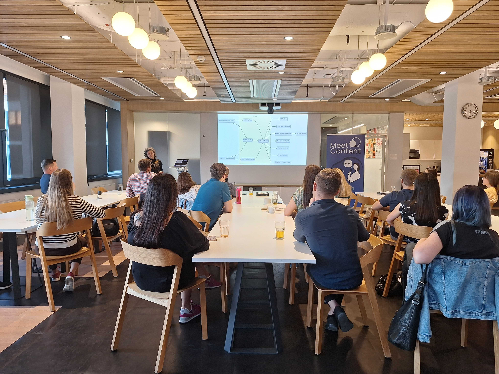
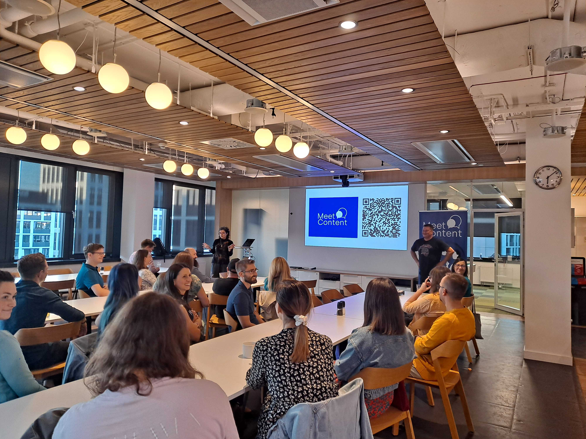

Po wakacyjnej przerwie wrocławscy contentowcy licznie przybyli posłuchać o sztucznej inteligencji 😉

Ale zanim o tym co było, jak zwykle, zaczniemy od tego co przed nami.

<!--truncate-->

### Październik - Text (poprzednio LiveChat)

Październikowy MeetContentWRO odbędzie się w siedzibie firmy LiveChat, która całkiem niedawno przeszła rebranding i teraz nazywa się **Text**. 
I tym razem będziemy rozmawiać o możliwościach jakie oferuje AI w obszarze tworzenia treści 🤩

Nasz październikowy prelegent, [**Paweł Hałabuda**](https://www.linkedin.com/in/pawelhalabuda/), pracuje jako *Head of Communication* w **Text** oraz odpowiada za Content Marketing Strategy. Paweł opowie nam o doświadczeniach swoich i jego zespołu contentowego w prezentacji pod tytułem: *Unlocking the Text Framework: How we use ChatGPT to scale our content*.

Prezentacja Pawła to swego rodzaju *case study*: porównamy różne narzędzia, między innymi, ChatGPT, SurferSEO i Jasper i to jak ich używanie wraz z nowym procesem tworzenia contentu w sposób zautomatyzowany przekłada się na statystyki strony, ilość wyświetleń, wzrost ruchu, SEO a nawet efektywność pracy. 

#### **GDZIE I KIEDY**

25 października 2023 godzina 18:00 

Text (poprzednio LiveChat), ul. Zwycięska 47

[Formularz zgłoszeniowy](https://forms.gle/b8LBpt7J4seyLw5W9)

### Wrzesień - Dolby

Tym razem spotkaliśmy się w **Dolby Labratories**, a meetup odbył się pod hasłem: *AI/ML/NLP exploration at Dolby Technical Communications*. Wrześniowa prelegentka, [**Marta Bartnicka**](https://www.linkedin.com/in/marta-bartnicka-713969/), która w Dolby pracuje jako *Staff Engineer* w obszarze Publishing and Localization, opowiadała o rzeczach, o których można śmiało powiedzieć - nie śniło się tech writerom! 😉

Marta zaczęła z dużą dawką humoru, robiąc przegląd ostatnich virali i memów z obszaru AI. Potem było już tylko lepiej 😁

Dowiedzieliśmy się o kontekście, w jakim powstaje dokumentacja w Dolby, o specyficznych standardach, ograniczeniach i wymaganiach, według których należy ją tworzyć i utrzymywać. Większość dokumentacji nie jest publicznie dostępna i opisuje technologie stanowiące własność intelektualną firmy. 

#### AI

W kolejnej części Marta wyjaśniła pojęcie sieci neuronowej oraz podkreśliła fakt, że sztuczna inteligencja jedynie przetwarza informacje, którymi ją ‘nakarmiono’. Innymi słowy, *no input, no output*. 

Dowiedzieliśmy się, że Komisja Europejska opracowuje [Artificial Intelligence Act](https://artificialintelligenceact.com/), który ma na celu między innymi zwiększenie transparentności danych używanych do szkolenia AI. Rozważane jest również nałożenie obowiązku oznaczania treści wygenerowanych przez AI.

#### AI i Tech Comms

Marta zaprezentowała zgromadzonym wtyczkę dostępną w Oxygen CMS, [AI Positron](https://blog.oxygenxml.com/topics/ai_positron.html), której możliwości zelektryzowały zgromadzonych. AI Positron działa - póki co - na bazie ChatGPT 3.5. Oto tylko niektóre z możliwości, które oferuje:
* Opcja *Continue writing* umożliwiająca generowanie tekstu rozwijającego myśl, którą zapisaliśmy
* Generowanie pytań do danego fragmentu tekstu czy artykułu
* Sugestie językowe i stylistyczne oraz podnoszące wskaźnik czytelności tekstu 
* Opcja zmiany paragrafu w instrukcję, jeśli zawiera elementy procedury 

Jednak uzbrojeni w kontekst specyficzny dla Dolby, który Marta opisała na początku, wiedzieliśmy że narzędzie to nie sprawdzi się w każdej firmie, choć AI Positron ma niedługo umożliwiać wybór różnych AI, np. [ChatGPT Enterprise](https://openai.com/blog/introducing-chatgpt-enterprise), w którym podobno dane wsadowe nie będą używane do dalszego szkolenia algorytmu.

W Dolby jednak wybrano inną ścieżkę…

#### AI i NLP

Marta opowiedziała nam o kilku wewnętrznych projektach, które bazują na innej platformie AI, i o bardziej klasycznych rozwiązaniach przetwarzania języka naturalnego (NLP). Te eksperymentalne projekty mają na celu między innymi:
* Znalezienie optymalnego sposobu pozyskiwania poprawnych odpowiedzi z zasobów wiedzy zgromadzonych w Dolby
* Identyfikowanie zduplikowanych lub bardzo podobnych treści poprzez analizę istniejącej dokumentacji
* Wsparcie twórców treści poprzez wykrywanie typowych błędów stylistycznych i sugerowanie zmian 

Dolby tworzy wewnętrzny ekosystem, w którym pracownicy mogą się szkolić w prompt engineeringu, a narzędzia AI będą oceniane i rozwijane na podstawie  informacji zwrotnej: *prawda - fałsz*. A wszystko to bez wychodzenia poza domenę Dolby. 

Prezentacja Marty zdecydowanie była mocnym wejściem w kolejny sezon MeetContentWRO! 💪

Dziękujemy za udział i widzimy się **25 października** w **Text**! 

