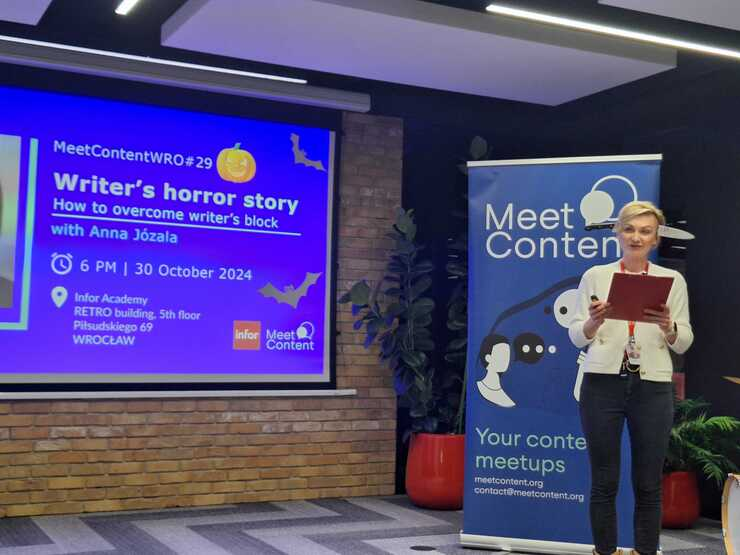
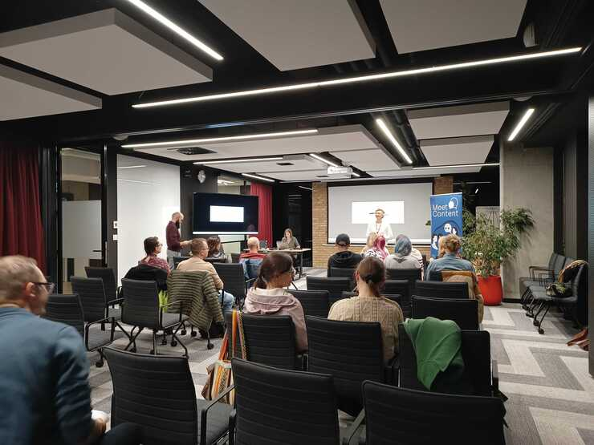
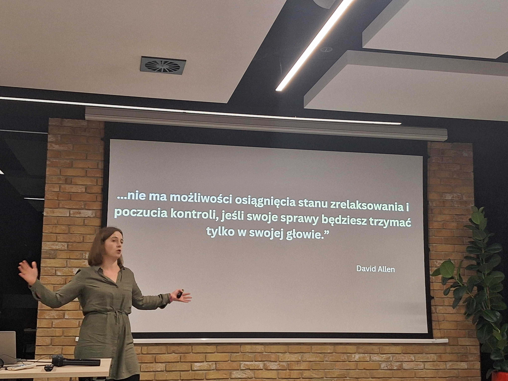
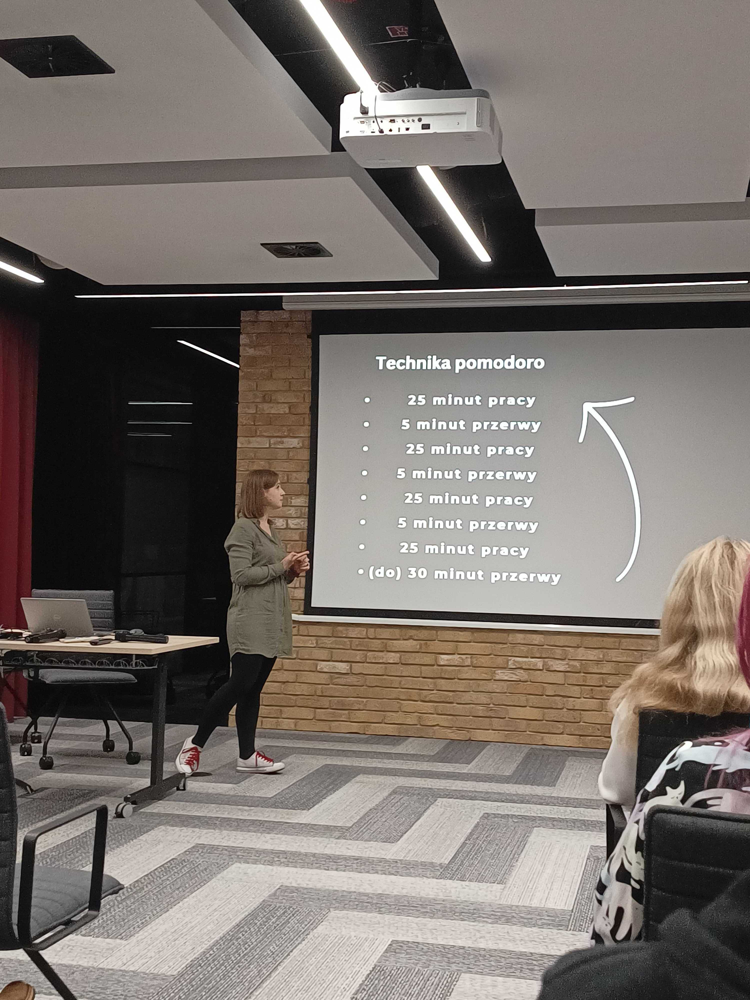

30 października wrocławska społeczność rzemieślników i artystów tworzenia treści technicznych spotkała się w Infor Academy, korzystając z uprzejmości firmy Infor, już po raz trzeci! 🙏 

<!--truncate-->

W historii meetupów naszej społeczności tematyka jest dość różnorodna. Mamy tematy ściśle pisarskie, czasem prelegenci opowiadają też o ciekawym przypadku użycia lub chcą zainspirować do zmiany innych po tym jak wdrożyli pewnie rozwiązania u siebie. 

Tym razem jednak temat był niezwykle praktyczny i śmiało można powiedzieć, że dotyczył każdego, kto nie tylko zajmuje się pisaniem (lub ogólniej: tworzeniem) ale też każdego, kto ma coś do zrobienia - czyli zasadniczo naprawdę KAŻDEGO 😀 

Nasza prelegentka [Ania Józala](https://www.linkedin.com/in/anna-j%C3%B3zala-5008a453/) z wielkim wdziękiem zaprezentowała słuchaczom przegląd najbardziej efektywnych form organizacji i pracy. 

Ania wyszła od tezy, iż pomimo, że podstawowym biznesem każdego pisarza (technicznego również) jest pisanie, to mamy jednocześnie ogrom zadań nie związanych z pisaniem. Przykłady? Tworzenie i aktualizowanie zadań w Jirze, spotkania z zespołem, powiadomienia ze Slacka czy Teamsów, które domagają się naszej uwagi już teraz - można je mnożyć!

## Odzyskaj kontrolę nad wydarzeniami

Ale jak? Ania podała kilka praktycznych sposobów: zacznij od zrzucenia wszystkich zadań w jedno miejsce, może to być kartka papieru lub excel. Ale musisz wyrzucić z głowy naprawdę wszystko, tak, żeby te zadania przestały Cię dręczyć i można było je rozpracować. 

## Kategoryzuj

Kolejny krok to przejrzenie i skategoryzowanie zadań. Tu prelegentka wspomniała o 5 pytaniach, które mogą okazać się pomocne przy kategoryzacji:
* Tematyka lub przynależność danego zadania do konkretnego projektu. 
* Termin - czy jest jakiś czas, w którym dane zadanie musi być wykonane?
* *2 minute rule* - czy mogę zrobić to zadanie w czasi dwóch minut? Zadania typu: przeskanowanie i otagowanie mail w skrzynce, zaakceptowanie wniosków urlopowych, i temu podobne.
* Czy mogę to zadanie przekazać komuś innemu? - posiadanie takiej kategorii przydaje się szczególnie gdy przy wielkim nawale pracy przychodzi współpracownik i pyta czy może Ci jakoś pomóc.
* Czy to jest priorytet? 

### Priorytety, priorytety...

Ania przypomniała nam o macierzy Eisenhowera, która posługuje się osią *ważne - pilne*. Przy szczególnym nacisku na ćwiartkę: *nieważne - pilne* jako wyjątkowo wdzięczny rezerwuar zadań nadających się do oddelegowania. 

## Kalendarz

Okazuje się, że stare dobre narzędzie jakim jest kalendarz może nas bardzo wesprzeć w planowaniu i organizacji pracy. Ania wspomniała o metodach: *time boxingu* i *pracy w blokach* jako tych, które sprawnie minimalizują efekty przełączania kontekstów, tym samym zwiększając nasze skupienie i produktywność. 

*Time boxing* polega na blokowaniu przedziałów czasowych na pracę głęboką, przykładowo od 8:00 do 12:00. Natomiast praca w blokach to ustalanie bloków czasowych, które chcemy poświęcić na konkretne zadania, czyli na przykład: 

* 8:00-10:00 - przygotowywanie prezentacji 
* 10:00-12:00 - zbieranie materiałów do wykonania zadania XYZ 

Oczywiście nawet najbardziej zadbany i rozplanowany kalendarz nie gwarantuje sukcesu póki my sami nie zechcemy się go ściśle trzymać 😉 

Tu z pomocą może przyjść kolejna opcja: praca w trybie samolotowym. 
A żeby mieć już całkiem czyste sumienie, można też ustawić sobie opis na Slacku informujący współpracowników że nadal pracujesz tyle, że w stanie skupienia 😀

## Ale jak zacząć?

Ania przypomniała o starej i dobrej technice *pomodoro*. Ustaw pracę na 25 minut i przez ten czas faktycznie zajmij się pracą, bez rozproszeń. Potem niech zadzwoni twój nowy minutnik kuchenny w kształcie pomidora 🍅 (albo kurczaka, albo czego tam chcesz). Potem robisz 5 minut przerwy, w trakcie której faktycznie wstaniesz od biurka i pójdziesz zrobić sobie coś do picia albo chwilkę się rozciągasz. Potem kolejne 25 minut i tak na zmianę. Po jakimś czasie podobno wpada się we flow i już nie potrzeba minutnika bo pędzisz jak szalony! 💨

### Słoń i żaba

Są czasem takie zadania, które nas zwyczajnie przytłaczają. Są ogromne i nie bardzo wiadomo jak je ugryźć. 

Tu podobno sprawdza się jedzenie tego słonia po kawałku, czyli rozdzielenie mega zadania, na mniejsze, które mogą stanowić pewne oddzielne i niezależne działania, które można nawet wyestymować czasowo. Prawda, że już raźniej? 😀

A żaba? No cóż, jeśli na liście zadań na dziś jest jakieś, które wyjątkowo ci nie leży, czyli ta przysłowiowa żaba - zjedz ją na początku dnia, wtedy, jak mówi klasyk, Mark Twain, już nic gorszego cię nie spotka. Czyli zasadniczo - już będzie z górki. 

## A co jeśli ‘Nie i koniec!’

A co jeśli napotkamy blokadę twórczą? 

Ania wspomniała o zjawisku tak zwanej *fiksacji kognitywnej*, czyli sytuacji, w której masz wrażenie, że nic już nie wymyślisz i nie robisz postępów w pracy. Wtedy podobno pomaga zmiana kontekstu, czyli można przełączyć się na inne zadanie kreatywne, pójść na spacer (ale nie brać zafiksowanego problemu ze sobą) lub… iść pod prysznic! 

## Jesteś zwycięzcą! 

Po całym dniu efektywnej pracy, nie może zabraknąć również przestrzeni na nagradzanie się za postępy i wytrwałość. 

To jest chyba naszym wyjątkowo słabym punktem i można prześmiewczo podejść do sprawy, ale małe, lecz systematyczne postępy potrafią zaprowadzić nas bardzo daleko! 🛣️

*** 
Jestem absolutnie pewna, że najbliższy poniedziałek po meetupie z Anią w roli głównej wszyscy obecni spędzili na spisywaniu i kategoryzowaniu zadań oraz przemeblowaniu kalendarza! 

Wstąpiły w nas nowe organizacyjne siły! 💪

   