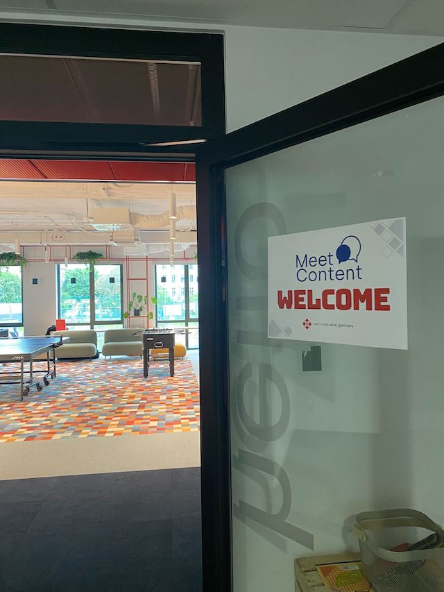
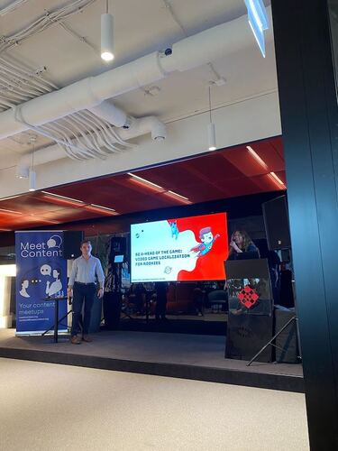
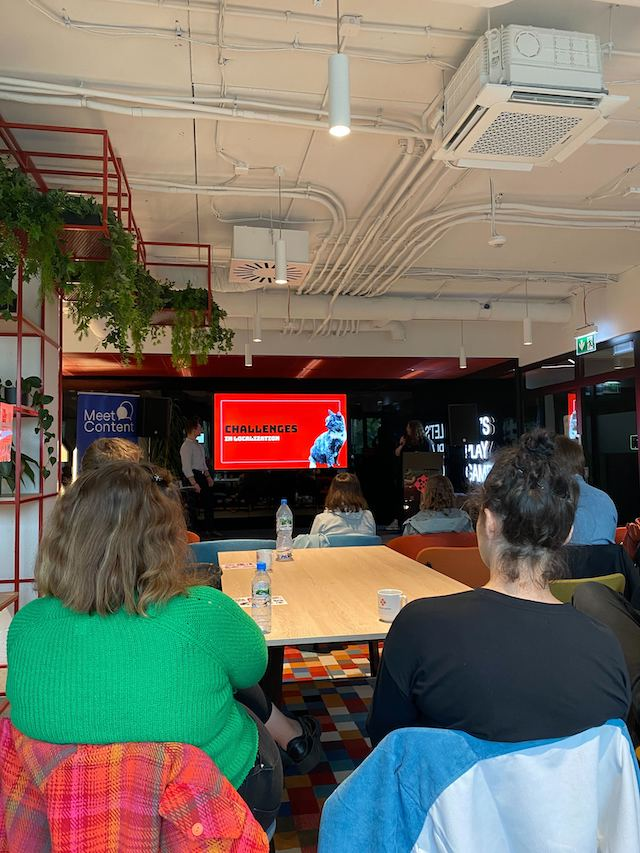

Dziś mam dla Was zapowiedź ostatniego przed wakacjami meetupu zorganizowanego
przez społeczność MeetContent Wrocław. Poniżej znajdziecie też podsumowanie
tego, co działo się podczas majowego spotkania. Zapraszam!

W maju spotkaliśmy się w siedzibie firmy **Ten Square Games**. Temat był
arcyciekawy, bo dotyczył lokalizacji gier komputerowych.

Zaczniemy jednak od tego co przed nami. Po udanym ‘Soapie’ rejon wrocławski
ogłasza sezon ogórkowy. Wracamy we wrześniu z nowymi tematami 🙂 Ale zanim
wszyscy ruszymy na zasłużone wakacje - zapraszamy Was na luźne rozmowy przy
drinku z parasolką - czyli co nas czeka w czerwcu?

## **Czerwiec - Meet the content**

Jak wiadomo, Wrocław słynie z plaż 😉 Dlatego też czerwcowy MeetContent odbędzie
się  w Beach Barze **Prosto z mostu** przy **Mostach Warszawskich** 🌴⛱️

Nie ma konkretnego tematu, nie będzie ustrukturyzowanej prezentacji. Planujemy
spontaniczną integrację. Być może wykorzystamy tę okazję, żeby zrobić
podsumowanie i przedyskutować tematy poruszane na konferencji? Być może wspólnie
przeanalizujemy sobie jakiś konkretny wątek? Może pogadamy o tym, o czym
chcielibyście posłuchać w kolejnych edycjach MeetContentWRO? Albo po prostu
będziemy leniwe kontemplować odrzańską toń, podczas gdy od czasu do czasu ktoś
ponarzeka na mało responsywnych SMEs. Zobaczymy! 😀

Jeśli chcesz do nas dołączyć, wypełnij
[formularz zgłoszeniowy](https://forms.gle/MFsyUiERzhdr8W9q9). Pozwoli nam to
zaplanować rezerwację i lepiej się przygotować.

### **Kiedy i gdzie**

**21 czerwca 2023**, godzina **18:00**

**Beach bar Prosto z mostu** (przy Mostach Warszawskich) ul. Pasterska 1,
Wrocław.

## **Maj - Ten Square Games**

W maju gościliśmy w firmie **Ten Square Games**, gdzie
[Zuzanna Widz](https://www.linkedin.com/in/zuzanna-widz-846459230/),
_Localization & UX Writing Specialist_ oraz
[Bartłomiej Piątkiewicz](https://www.linkedin.com/in/barlomiej-piatkiewicz/),
_Senior Localization & Translation Specialist_ zaprezentowali nam wyzwania jakie
wiążą się z lokalizowaniem produktów. Oboje prelegenci pracują w Ten Square
Games, więc mieliśmy okazję zajrzeć w świat lokalizacji gier komputerowych _od
kuchni_.

Zuza i Bartek nakreślili temat lokalizacji w prezentacji pełnej humoru i
naszpikowanej przykładami, które zostaną nam w pamięci na długo.

### Podstawy lokalizacji

Na pierwszy ogień poszło wyjaśnienie różnicy pomiędzy lokalizacją a translacją.
Usłyszeliśmy też o _globalizacji_ i _internacjonalizacji_.

Aby móc udostępnić produkt na rynku międzynarodowym, należy najpierw rozważyć
kompatybilność z różnymi czcionkami, orientacją pisma, sprawdzić zawartość pod
kątem kontekstu kulturowego i społecznego. Dopiero potem lokalizuje się produkt
na rynek konkretnego kraju, czyli między innymi wykonuje się przekład językowy.
Sam przekład to również nie jest proste tłumaczenie, a bardziej ‘tworzenie’
produktu od nowa (_transcreation_).

Jeśli dorzucimy jeszcze wymóg dostosowania do SEO, robi się całkiem gorąco! 🔥

### **Wyzwania**

Zuza i Bartek podzielili się zestawem wyzwań, z którymi przychodzi im mierzyć
się w ich codziennej pracy. I tak, pośród tak zwanych ‘klasyków’, czyli zleceń
‘last minute’ i walki o dodatkowe informacje i kontekst, mamy również elementy
charakterystyczne dla branży gamingowej:

- Interfejs musi być wyjątkowo intuicyjny - gracze nie mają czasu na dokładne
  zapoznanie się z nazwami pól, przycisków i treścią komunikatów.
- Branża gamingowa rozwija się w niezwykle szybkim tempie, dlatego każda
  aktualizacja oznacza presję czasu często niespotykaną w innych branżach IT.
- Fleksja, czyli odmiana - koszmar każdego specjalisty od lokalizacji.

Co należy wziąć pod uwagę aby z powodzeniem przenieść produkt z lokalnego
kontekstu na globalny rynek?

- Nie tylko słowa się liczą! Kontekst i warstwa graficzna są równie istotne -
  krew i _gore_ są w wielu krajach zakazane.
- Projektując interfejs należy brać pod uwagę różne sposoby orientacji tekstu i
  rozmiary czcionek.
- Języki różnią się między sobą pod względem długości. Trzeba więc odpowiednio
  dostosować przestrzeń aby pomieścić tekst po przekładzie.
- Konieczne jest przemyślane działanie i znajomość lokalnych kontekstów aby
  umieć przewidzieć czy dany tekst nie okaże się obraźliwy lub nie spowoduje
  niechcianych skojarzeń.

Prezentacja naszpikowana przykładami pozostawiła wszystkich obecnych pod
wrażeniem wysiłku, jakiego dokonują codziennie spece od lokalizacji aby produkt
naturalnie ‘wpasował’ się w dany rynek.

### **Źródła**

Zuza i Bartek postanowili podzielić się swoją prezentacją, którą znajdziecie
[TUTAJ](https://docs.google.com/presentation/d/1Y4c0WiAJAaHMuNciryywk9Ot_In_GYAqqhOuLtNL3NQ/edit#slide=id.g127d8422da9_0_3881)
🤩

---

Autorką tekstu jest zaprzyjaźniona z redakcją Monika Mrozek z MeetContentWRO.
