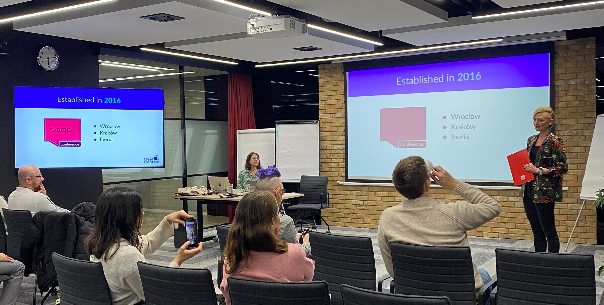

Wrocławski oddział MeetContent zatoczył w grudniu koło: dokładnie rok temu wystartowaliśmy z postpandemiczną reaktywacją meetupów! Co więcej dokładnie rok temu gościliśmy w firmie **Infor**, czyli tej samej w której odbył się nasz ostatni w tym roku MeetContentWRO. 

<!--truncate-->

Grudniowy meetup upłynął nam w atmosferze przedświątecznej - i choć w ojczystym języku unboxing nie brzmi tak zgrabnie, gubimy również subtelną grę językową gdyż nasza prelegentka, [Basia Czyż](https://www.linkedin.com/in/barbara-szwarc/), pracuje w firmie Box, to jej prezentacja zatytułowana: UnBOXing API Documentation dała nam dużo radości 😉

5 grudnia w siedzibie firmy Infor, Basia Czyż, na co dzień *Senior Technical Writer* w firmie Box oraz jedna z krakowskich organizatorek MeetContentKRK przybliżyła nam temat dokumentacji API.

Basia zaczęła swoją prezentację od tego co to jest API i dlaczego potrzebuje dokumentacji? Pozostając w świątecznym klimacie, koncept został wytłumaczony na przykładzie zapytań (GET) o prezenty w świątecznym worku. 

W kolejnym kroku mogliśmy dopytywać o szczegóły dotyczące konkretnych prezentów (atrybuty), dodawać lub usuwać prezenty z worka (zasobu). Używając zapytań z metodą , POST lub DELETE można było też odpowiednio: dodać nowy prezent albo całkowicie prezent z worka usunąć.

Na zapytania przychodzą odpowiedzi, które zwracają na przykład konkretny kolor, rodzaj lub rozmiar czyli wartości atrybutów, w zależności o co pytaliśmy. 

### Po co dokumentować API? 

Cel dokumentacji API jest dość jasny: bez niej użytkownicy byliby skazani na metodę prób i błędów i szybkość współpracy i integracji z nowym API pozostawiałby wiele do życzenia.

API nie ma interfejsu, a dokumentacja jest jedyną widoczną wskazówką w zakresie:

* Jak to działa?
* Jakie ścieżki prowadzą do jakich zasobów?
* Jakie zasoby są w ogóle dostępne do odpytania?
* Jakich parametrów użyć w zapytaniu oraz jak odczytać to co zostanie zwrócone?

### API w BOXie

Basia opowiedziała nam nieco o procesie powstawania nowych API oraz o procesie dokumentacyjnym. 
Dokumentacja API firmy Box dostępna jest publicznie pod [TYM LINKIEM](https://developer.box.com/reference/). Dokumentacja jest podzielona na tematyczne grupy, pozwalając szybko odnaleźć zasoby które interesują użytkowników a także dostępne endpointy, których z kolei można użyć, żeby uzyskać konkretne informacje dotyczące danego zasobu.

Każdy z zasobów opisany jest w szczegółach i zawiera informacje o parametrach zapytania, opisy atrybutów, kody błedu, przykładowe zapytanie i odpowiedź. 

Podlinkowane są też materiały pomocnicze, dodające kontekst i ułatwiające użytkownikom zintegrowanie się z API. 

Często API jest skomplikowane i wymaga wykonania całej litanii zapytań w określonej kolejności. Materiały pomocnicze, tzw. *integration guides*, nie należą bezpośrednio do dokumentacji danego zasobu ale są niezbędne żeby poprawnie API używać i pozwalają na odtworzenie rekomendowanej ścieżki działań. 

API, które dokumentuje Basia, obejmuje także dodatkowe, reużywalne atrybuty, których można użyć do skonstruowania zapytania i odpowiedzi. Jeżeli zaistnieje taka potrzeba, atrybuty mogą mieć kilka wersji.
Takie podejście pozwala na ponowne używanie istniejących parametrów (content reuse) i zachowanie spójności nazewnictwa i opisów. 

Zasoby, endpointy i atrybuty dokumentowane są w osobnych plikach .yml, z których potem budowana jest specyfikacja - jeden duży plik JSON. 

### Wyzwania

Oczywiście dokumentacja API ma swoje wyzwania, które różne firmy starają się przezwyciężyć na różne sposoby. Wyzwania dla dokumentalisty biorą się również z samych założeń wyjściowych jakie firma przyjmie. 

I tak w przypadku dokumentacji do Box API, dużym wyzwaniem są tak zwane breaking changes, czyli zmiany w API, które zmuszają klientów do ponownej integracji. Na przykład zmianą typu breaking change jest usunięcie atrybutu, który już jest wykorzystywany w integracjach.

Kolejnym wyzwaniem jest też wersjonowanie API i utrzymywanie (lub nie - w zależności od użytkowników i polityki firmy) starych wersji. 

### Dokumentacja API - jak to ugryźć? 

Basia miała kilka cennych wskazówek dla dokumentalistów chcących zająć się dokumentowaniem API:

* Po pierwsze, trzeba API poznać, a to najlepiej wychodzi poprzez rozmowę z programistami, którzy to je tworzą.
* Kolejna sprawa to nie skakanie od razu na głęboką wodę i zaczęcie od wysokopoziomowych integration guides, żeby dać sobie szansę zapoznać się z dostępnymi zasobami, ich przeznaczeniem i tym jak wpasowują się w szerszy ekosystem produktu. 
* Jak już nabierzemy wprawy, to dobrze jest też być blisko zespołów kiedy nowe dopiero API powstaje, żeby widzieć jego przeznaczenie i funkcje od samego początku. 

### Źródła

Basia postanowiła podzielić się swoją prezentacją, którą znajdziecie [TUTAJ](https://docs.google.com/presentation/d/1Fnu2R4MOmnrevXZIL6IocnxRp5TMpjg4/edit#slide=id.p1) 🤩
W prezentacji są również przetestowane i polecane kursy i źródła wiedzy do nauki o API.

Oceniając po dużej ilośc pytań do naszej prelegentki wnioskujemy, że temat cieszy się dużym zainteresowaniem.

Dziękujemy i do zobaczenia następnym razem! 

