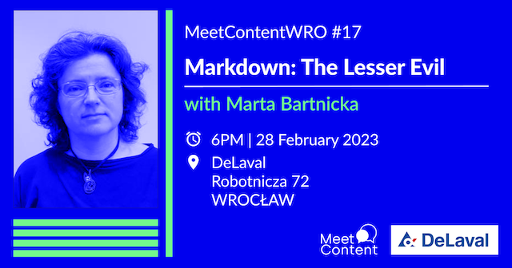
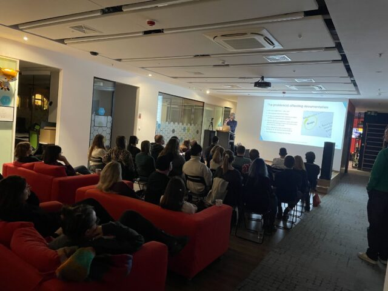
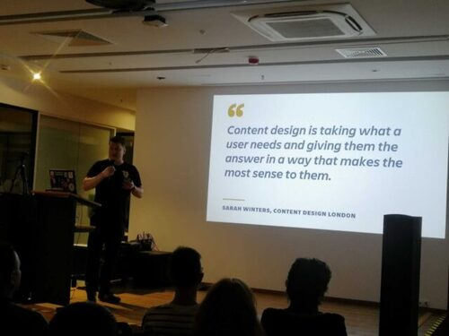
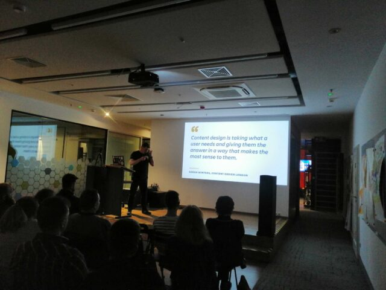

Przed nami kolejna edycja MeetContentWRO. Poniżej najważniejsze informacje.
Dodatkowo, przeczytacie dziś o tym co działo się podczas styczniowej odsłony
wrocławskiego meetupu.

Ekipa MeetContentWRO ma za sobą kolejny udany meetup. Ale zanim opowiemy o
styczniowym wydarzeniu, kilka słów na temat tego co przed nami!

## Luty 2023 - DeLaval

Tym razem, firma DeLaval będzie gościć lutowy MeetContentWRO. Ostatnio mieliście
bardzo dużo pytań do prowadzących, więc organizatorzy nauczeni doświadczeniem,
tym razem mają dla Was jedną prezentację.

[**Marta Bartnicka**](https://www.linkedin.com/in/marta-bartnicka-713969/),
_Publishing and Localization Senior Engineer_ w Dolby Laboratories opowie o
Markdownie. Temat na pierwszy rzut oka techniczny, ale nie do końca! Prezentacja
Marty, zatytułowana jest: **_Markdown: The Lesser Evil_**.

Markdown jest w samym sercu podejścia znanego jako _docs as code_. Oferuje
prostą składnię i jest niezmiernie przystępny dla początkujących. Coraz
powszechniej wykorzystywany przez tech writerów, ułatwia review i zbliża nas do
naszych braci developerów… Ale! Markdown, jak wszystko, ma swoje blaski i
cienie.

O obliczach markdowna, wskazówkach, dobrych i złych praktykach dowiecie się już
28 lutego. Żeby lepiej dopasować treść spotkania do oczekiwań organizatorów, do
standardowego już 
[formularza zgłoszeniowego](https://docs.google.com/forms/d/e/1FAIpQLScpPfZnZekXcR8nKfWMSdLBD-goqHSeSf4ToDZXXhpAv5yGpA/viewform?usp=sf_link)
dodano pytanie o to, czy mieliście już styczność z markdownem.

Bez względu na to czy pracowaliście już z tym językiem znaczników czy właśnie
googlujecie co to takiego, w prezentacji Marty każdy znajdzie coś dla siebie. No
i, rzecz jasna, jest to kolejna okazja, żeby spotkać się z kolegami i
koleżankami z branży.

Tak więc zapraszamy was serdecznie na: **_Markdown: The lesser evil_**.

### **GDZIE I KIEDY**

28 February 2023 godzina 18:00

Biuro DeLaval ul. Robotnicza 72

[Formularz zgłoszeniowy](https://docs.google.com/forms/d/e/1FAIpQLScpPfZnZekXcR8nKfWMSdLBD-goqHSeSf4ToDZXXhpAv5yGpA/viewform?usp=sf_link)

A teraz słów kilka o tym, co działo się na ostatnim, styczniowym meetupie.

## Styczeń 2023 - Ocado

W styczniu spotkaliśmy się w siedzibie firmy Ocado we Wrocławiu. Organizatorzy
zaplanowali dwie prezentacje. Obie dotyczyły dokumentacji jako produktu, choć
temat analizowany był przez dwóch prelegentów z nieco innych perspektyw.

**Ed Portas**, który kieruje działem Technical Communications w Ocado opowiadał
o rzeczy na pierwszy rzut oka oczywistej, która jednak, jak się okazuje bardzo
często bywa problematyczna w praktyce, czyli _Documentation as a product_.

Wychodzenie z takiego założenia przynosi między innymi korzyści dla organizacji,
SMEs, klientów, ale i samych Tech Writerów. Produkt jest skoncentrowany na
użytkowniku, na problemie który stawia sobie za zadanie rozwiązać. Aby tego
dokonać twórcy produktu opierają się na danych i nimi kierują się podejmując
decyzje.

Z dokumentacją można, a nawet wręcz należy zrobić podobnie! Analiza, projekt,
prototyp na małą skalę, być może MVP, faza testów i feedbacku - a potem od
początku! Jako Technical Writerzy powinniśmy pielęgnować w sobie podejście
innowatora, sprawdzać co działa, uczyć się z doświadczenia, jednym słowem
eksperymentować!

Drugą prezentację wieczoru, zatytułowaną: _Content meets design_, przedstawił
**Tomek Prus**, Experience Design Manager w Atlassian. Tomek opowiedział
uczestnikom o design critique, frameworku, który zdecydowali się zaadaptować w
Atlassian.

Design critique to metoda opisana przez Sarah Winters w książce (o nie
zaskakującym tytule) _Content design_. Polega na iteratywnym i grupowym
docieraniu do najlepszej wersji designu lub treści. Tomek podkreślał jak ważny
jest dialog, praca grupowa i konstruktywny feedback dla tworzenia treści.

Wykorzystanie design critique daje Writerom możliwość ‘testowania’ tworzonych
treści, rozwija w nich umiejętności efektywnego przekazania ‘clue’
funkcjonalności lub komunikatu, grupowego ‘obejrzenia’ go z każdej strony.
Design critique pomaga autorom rozwinąć podejście, że dla każdego zdania powinno
być racjonalne uzasadnienie. Za każdym zdaniem musi stać treść wnosząca istotną
informację i podczas sesji design critique, dokumentacja poddawana jest tego
typu testowi.

Tematyka najwyraźniej przypadła do gustu wrocławskiej społeczności Tech
Writerskiej. W meetupie udział wzięło ponad 50 osób!

W imieniu organizatorów dziękujemy za udział i zapraszamy ponownie na meetup 28
lutego!

---

Nasze dotychczasowe artykuły na temat MeetContentWRO:

- [MeetContentWRO  #15 - Grudzień 2022](http://techwriter.pl/meetcontentwro-wraca/)
- [MeetContentWRO #16 - Styczeń 2023](http://techwriter.pl/meetcontent-wroclaw-styczen-2023/)
