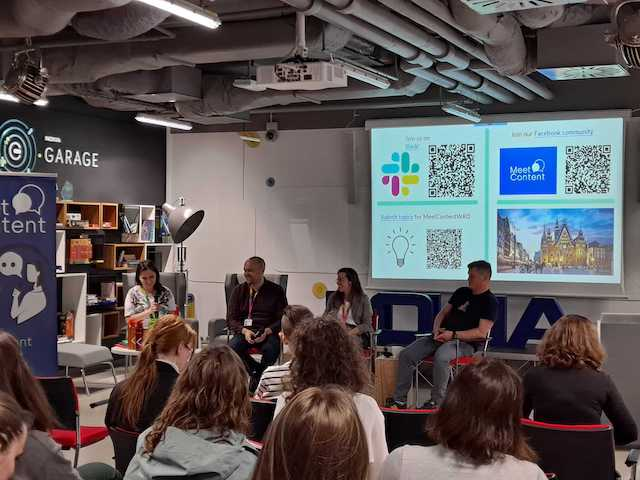

Za nami kwietniowa edycja MeetContentWRO. Poniżej podsumowanie oraz zapowiedź
tego, co czeka nas w maju. Zapraszamy!

<!--truncate-->

Po zebraniu feedbacku od użytkowników w kwietniu w Nokia Garage, w maju
wrocławscy contentowcy ruszają się lokalizować w Ten Square Games 😉

Ale zanim o feedbacku, jak zwykle, zaczniemy od tego co przed nami.

#### Maj - Ten Square Games

Majowy MeetContentWRO odbędzie się w siedzibie firmy **Ten Square Games**. Tym
razem tematem przewodnim będzie lokalizacja. Smaczku doda mu fakt, że dowiemy
się o lokalizacji gier komputerowych 🤩

Nasi prelegenci,
[Zuzanna Widz](https://www.linkedin.com/in/zuzanna-widz-846459230/),
_Localization & UX Writing Specialist_ oraz
[Bartłomiej Piątkiewicz](https://www.linkedin.com/in/barlomiej-piatkiewicz/),
_Senior Localization & Translation Specialist_ opowiedzą nam o tajnikach swojego
fachu w prezentacji pod przewrotnym tytułem: _BE A-HEAD OF THE GAME - Video game
localization for rookies_.

Zapowiada się arcyciekawie! Dowiemy się, między innymi, jak zazwyczaj przebiega
proces lokalizacji, jakich zmian życzyliby sobie nasi prelegenci oraz z jakimi
wyzwaniami zespoły lokalizacyjne muszą się mierzyć.

**GDZIE I KIEDY:**

- 17 maja 2023 godzina 18:00
- Ten Square Games, ul. Traugutta 45
- [Formularz zgłoszeniowy](https://forms.gle/84Z9Y2DYf71m4X3UA)

#### Kwiecień - Nokia

W kwietniu spotkaliśmy się w Nokia Garage a meetup miał formę panelu
dyskusyjnego. Trzech panelistów:
[Joanna Dec](https://www.linkedin.com/in/joanna-dec-01718394/),
[Jakub Jankowski](https://www.linkedin.com/in/jakub-jankowski-91a458144/) oraz
[Tomasz Prus](https://www.linkedin.com/in/tomasz-prus-4b09b01a/), wszyscy z
wieloletnim doświadczeniem, omawiało różne aspekty z obszaru customer feedback z
[Katarzyną Paśko-Jarosik](https://www.linkedin.com/in/katarzyna-pa%C5%9Bko-jarosik-49413116/).

Każdy z panelistów wnosił nieco inną perspektywę na zbieranie opinii klientów na
temat dokumentacji. Inna perspektywa wynikała głównie z odmiennych produktów i
sposobu ich użytkowania. Pewne elementy okazały się jednak uniwersalne:

- W przypadku dokumentacji dostępnej online, niezwykle przydatnym źródłem
  informacji jest zawsze analityka stron, która może nam pomóc zrozumieć jak
  klienci używają dokumentacji i które strony są najpopularniejsze. Jednak
  analityka nie podpowie nam, jakie wnioski na tej podstawie wyciągać 🤔
- W przypadku dokumentacji drukowanej, największym wyzwaniem okazuje się
  dotarcie do faktycznych użytkowników - zazwyczaj łatwiej o feedback z ‘drugiej
  ręki’, czyli od managerów.
- Jeśli tylko są dostępne - zespoły researcherów są nieocenionym źródłem
  feedbacku.
- Czasem brak feedbacku to dobra wiadomość jako, że z reguły jesteśmy bardziej
  skłonni podzielić się opinią negatywną niż pozytywną.

Kiedy już zbierzemy feedback, wypadałoby coś z nim zrobić. No właśnie, czyli co?

- W zależności od wielkości firmy i samej dokumentacji, feedback powinien być
  odpowiednio zarządzany: podobne komentarze można grupować w kategorie, włączyć
  do istniejącego backlogu a następnie priorytetyzować i implementować w miarę
  bieżących możliwości.
- Na podstawie opinii klientów czy częstotliwości używania można rozwijać pewne
  działy dokumentacji a w inne zmniejszać zaangażowanie.
- Żeby pomóc dokumentalistom, ale pośrednio też i klientom, Nokia sprofilowałała
  użytkowników swojej dokumentacji i stworzyła ‘persony’. Każda z nich związana
  jest z konkretną rolą, wykonywaną przez danego użytkownika, co pozwala
  precyzyjniej trafić z informacją dokładnie tam gdzie jest potrzebna.
- Atlassian stworzył wtyczkę do przeglądarki, która informuje dokumentalistę ile
  otwartych komentarzy zostało zgłoszonych do danej strony dokumentacyjnej.

Paneliści byli co do jednego zgodni: feedback to miecz obosieczny, czasem danych
jest bardzo wiele, szczególnie ilościowych. Trzeba jeszcze umieć wyciągnąć na
tej podstawie właściwe wnioski i wdrożyć na ich podstawie strategię ulepszeń.

Padło również sakramentalne pytanie: czy klient ma zawsze rację? Wydaje się, że
najlepsza odpowiedź, jak we wszystkim w życiu: to zależy 😉

Tym razem, dzięki uprzejmości firmy Nokia każdy uczestnik, który zadał pytanie
otrzymał drobny upominek. A pytań było sporo! Mamy nadzieję, że nie była to
jedyna przyczyna 😉

W trakcie meetupu wylosowaliśmy również szczęśliwca, który otrzymał darmową
wejściówkę na tegoroczny Soap! Conference 🤩

Dziękujemy za udział i widzimy się 17 maja w Ten Square Games!

---

Autorką tekstu jest zaprzyjaźniona z redakcją Monika Mrozek z MeetContentWRO.
