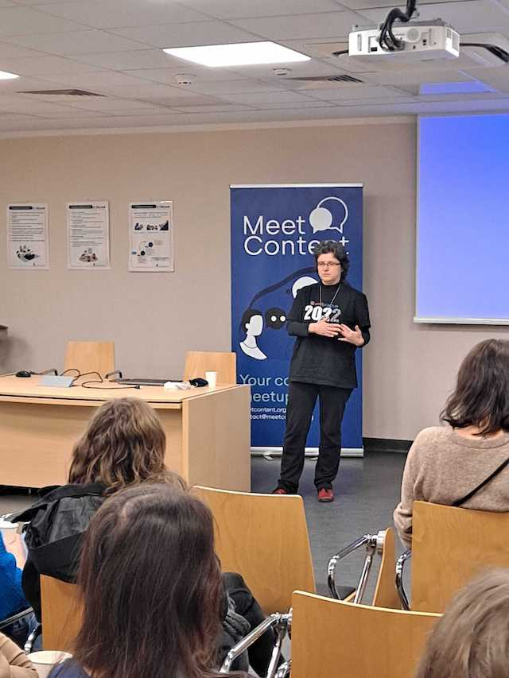
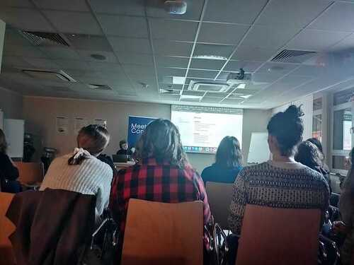

Spieszymy donieść, że ekipa MeetContentWRO i wrocławscy contentowcy mają za sobą
kolejny udany meetup! ;)  Ale zanim opowiemy o lutowym wydarzeniu, kilka słów na
temat tego co przed nami!

## **Marzec 2023 - Etteplan**

Marcowy **#MeetContentWRO** zagości w firmie **Etteplan**. Tym razem mamy dla
Was jedną prezentację, ale opowiadać będą dwie osoby.

**Temat:** _Simplified Technical English - How to control the beast?_

O STE opowiadać będą:

- [Barbara Kardel-Piątkowska](https://www.linkedin.com/in/barbara-kardel-piatkowska/),
  obecnie _Documentation Specialist_ w Etteplan. Basia ma za sobą doświadczenie
  w tworzeniu komunikacji technicznej na potrzeby przemysłu związanego z
  produkcją i obsługą maszyn.
- [Jan Sosna](https://www.linkedin.com/in/jan-sosna/), obecnie _Article Editor_
  w DeLaval. Janek również ma doświadczenie w tworzeniu komunikacji technicznej,
  zarówno od strony Technical Writera jak również Graphic Designera.

Janek i Basia opowiedzą jak opanować bestię zwaną _Simplified Technical
English_. Najpierw jednak dowiemy się o wadach i zaletach STE:

- Czy kontrolowany język, który jest w samym centrum STE, nie ogranicza, nie
  wiąże rąk Technical Writerom?
- Czy nie jest to zamach na techwriterską kreatywność?
- Jak prosty w użyciu jest STE?
- Czy można go równie efektywnie używać pisząc dokumentację dla software’u?
- A może dzięki podejściu STE odbiorcy zyskują dokumentację bardziej przystępną
  i zrozumiałą, a także tańszą w utrzymaniu i lokalizacji?

Zapraszamy Was serdecznie na: **_Simplified Technical English - How to control
the beast?_**

## **Gdzie i kiedy**

22 marzec 2023 godzina 18:00

Biuro Etteplan ul. Legnicka 48G

[Formularz zgłoszeniowy](https://forms.gle/BJzFUBxS3Wn56XcU6) - nie zapominijcie
o jego wypełnieniu, jeśli macie zamiar się stawić ;).

## **Luty 2023 - DeLaval**

W lutym natomiast meetup odbył się w siedzibie firmy DeLaval we Wrocławiu. Całe
wydarzenie poświęcone było jednemu tematowi.

[Marta Bartnicka](https://www.linkedin.com/in/marta-bartnicka-713969/),
_Publishing and Localization Senior Engineer_ w Dolby Laboratories rozważała
wraz z uczestnikami plusy i minusy Markdowna.

W swojej prezentacji: _Markdown - The lesser evil?,_ Marta zaczęła od samego
początku, czyli od pierwszej specyfikacji Markdowna z 2004: było to
uporządkowanie konwencji używanych od lat w Internecie (maile, usenet) i w
prostej dokumentacji (readme, release notes, dokumentacja API). Składnia
Markdowna składa się zaledwie z kilkunastu elementów, które zostały pokrótce
podsumowane. Można je znaleźć na
[stronie Marty na GitHubie](https://github.com/martab0/Markdown/blob/main/Markdown.md).

Uczestnicy mogli dowiedzieć się na co pozwala Markdown. A okazuje się, że wbrew
pozorom i niezbyt skomplikowanej składni, pozwala na wiele. Można na przykład:

- czytać go tak jak jest, w dowolnym edytorze
- opublikować z niego HTML, np. na GitHub Pages
- wrzucić na Confluence
- opublikować z niego PDF, np. używając dodatku do VSCode
- włączyć w mechanizm publikowania HTML, PDF i innych rzeczy za pomocą DITA-OT -
  pliki .md można wpiąć do DITA mapy tak samo jak pliki dita xml.

Po zaletach przyszedł czas na ograniczenia (lub ‘wady’ - jak kto woli), a więc
między innymi dowiedzieliśmy się, że Markdown:

- może ‘odstraszać’ niektórych SMEs jako zbyt techniczny
- nie umożliwia tworzenia bardziej rozbudowanych tabel
- daje ograniczone możliwości tagowania treści i content reuse.

Pytania uczestników dotyczyły między innymi możliwości użytkowania diagramów w
plikach .md oraz kompatybilności Markdowna z MadCap Flare i DITA.

Zwyczajowo, sesja Q&A przeszła w dalsze rozmowy przy pizzy :)

Jeśli zainteresował Was temat Markdowna, poniżej znajdziecie przydatne linki:

- [Marta’s page about Markdown on GitHub](https://github.com/martab0/Markdown)
- [Basic syntax cheat sheet](https://commonmark.org/help/)
- [Markdown and VSCode](https://code.visualstudio.com/docs/languages/markdown)

Dziękujemy za udział i widzimy się 22 marca w Etteplan!
