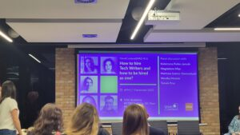

Na pizzę i pogaduchy do Wrocławia? Czemu nie, zwłaszcza jeśli i jedno, i drugie
to część nieformalnego spotkania techwriterskiej społeczności. Tak, tak: 7
grudnia 2022 r. po dłuuugiej covidowej przerwie MeetContentWRO wrócił na
meetupową scenę. Spotkaliśmy się w gościnnych progach Infor Academy.

Przypomnijmy: MeetContent powstał w 2016 jako "odprysk" po konferencji
[SOAP!](https://soapconf.com/) i z założenia miał być cyklem spotkań, wykładów,
warsztatów oraz szkoleń dla osób związanych z szeroko pojętą branżą komunikacji
technicznej oraz IT. Pierwsze spotkania odbyły się w Krakowie, a już rok
później, do rodziny dołączyła techwriterska społeczność z Wrocławia. W stolicy
Dolnego Śląska odbyło się 15 spotkań, ale w marcu 2020 roku przerwał je
lockdown. Tegoroczny meetup był więc 16 z kolei, a zorganizowała go już nieco
inna, bardziej sfeminizowana ekipa.

Ponad dwa lata przerwy to szmat czasu, podczas którego w branży zmieniło się
całkiem sporo. Jedną z tych najbardziej zauważalnych zmian był wzrost liczby
ofert pracy dla techwriterów. Dlatego tematem spotkania było: _How to hire
technical writers and how to be hired as one_. Wbrew angielskiemu tytułowi
rozmawialiśmy jednak po polsku. Meetup miał formę panelu dyskusyjnego
prowadzonego przez Kasię Paśko-Jarosik. Pytaniami prowadziła ona zgromadzonych
przez wszystkie etapy procesu rekrutacyjnego: od porad dotyczących
przebranżowienia się, przez budowanie CV i szukanie potencjalnych pracodawców,
aż po przygotowanie się do samej rozmowy. Było też o najlepszych pytaniach,
które warto zadać rekrutującemu.

Swoimi refleksjami podzielili się uczestnicy i uczestniczki panelu, doświadczeni
specjaliści: Magda Miąc, Martyna Gatner-Siemieniuch, Monika Mrozek i Tomek Prus.
Aktywny udział w panelu brała także publiczność - na sali zgromadziło się ponad
30 osób, nie tylko z Wrocławia. W trakcie sesji pytań i odpowiedzi padły między
innymi następujące kwestie:

- Jak zbudować portfolio?
- Czy wiedza techniczna jest konieczna?
- Czy osobowość kandydata ma znaczenie?
- Czego szukają rekruterzy podczas analizy CV, a co sprawia, że CV zostanie
  odrzucone?
- Absolwentami jakich studiów najczęściej są techwriterzy?
- Jak rekrutować introwertyków? ;)

Dyskusja trwała ponad godzinę i pewnie trwałaby dłużej, gdyby na stoły nie
wjechała gorąca pizza. Uczestnicy przenieśli się więc na część nieoficjalną do
kuchni. Jak wiadomo, to w kuchni są zwykle najlepsze imprezy - a zatem przy
niezdrowym (ale pysznym) jedzeniu i słodkich napojach (raz się żyje) rozmawiano
o techwriterskim wszystkim i niczym. Spotkali się starzy znajomi, zawarto nowe
znajomości - na meetup przyszli m.in. wykładowcy oraz aktualne i byłe studentki
podyplomowych studiów z komunikacji technicznej na Vistuli.

Następne spotkanie już w styczniu 2023. Szczegóły wkrótce! Jeśli chcecie
skontaktować się z organizatorami, piszcie na
[contact@meetcontent.org](mailto:contact@meetcontent.org) albo zajrzyjcie na
[fanpage meetupu](https://www.facebook.com/meetcontentcommunity) na FB.
