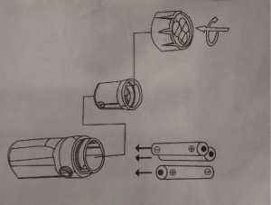

Podejście minimalistyczne w pisaniu dokumentacji jest jak najbardziej wskazane,
o czym wspominaliśmy w jednym z [postów](../prostota-glupcze/index.md) jakiś
czas temu. Długie, skomplikowane i przeładowane informacjami instrukcje to samo
zło, którego należy unikać.

<!--truncate-->

Zapewne wielu z Was zna powiedzenie **"Everything should be made as simple as
possible, but not simpler"** przypisywane Albertowi Einstenowi. Jedna z bardzo
znanych firm produkujących rowery i akcesoria rowerowe najwyraźniej nie słyszała
o tej zasadzie. Firma posiada w swojej ofercie zestaw oświetlenia przedstawiony
na obrazku poniżej (w celu uniknięcia kosztownych procesów sądowych
postanowiliśmy nie ujawniać nazwy firmy i produktu 😊).

Jak widać zestaw składa się z lampki przedniej i tylnej oraz uchwytów do montażu
na kierownicy i pod siodełkiem. Lampki można wypinać z tych uchwytów. W zestawie
dostarczane są również baterie oraz instrukcja, która jest wzorem minimalizmu.
Zresztą zobaczcie sami.

Tak, to wszystko, karteczka w rozmiarze 8x6 cm. Brakuje informacji o tym jak
zamontować uchwyty oraz jak włożyć baterie do tylnej lampki. Być może założenie
było takie, że montaż całego zestawu jest banalnie prosty i nie wymaga
wyjaśnienia, a najbardziej skomplikowaną czynnością jest prawidłowe włożenie
baterii do przedniej lampki, dlatego właśnie tą część należało udokumentować.
Pomimo tego, że takie podejście jest pochwałą inteligencji użytkownika, to
jednak wydaje nam się, że skoro przedstawiony został montaż baterii w przedniej
lampce to użytkownik oczekuje takiej samej informacji dla tylnej lampki. Jeśli
producent ma na względzie troskę o lasy, to mógł chociaż dla spójności umieścić
drugi obrazek na odwrocie karteczki. Jakie jest Wasze zdanie? Według nas taka
skąpa instrukcja pozostawia jakiś niedosyt czy niesmak. Tym bardziej, że
producent na swojej stronie podaje w opisie produktu, że przednia lampka
potrzebuje trzech, a tylna dwóch baterii AAA do działania, a do zestawu z którym
mieliśmy do czynienia dołączone były tylko cztery baterie. Podejście
minimalistyczne jest dobre, ale jak widać łatwo się w nim zatracić 😉
