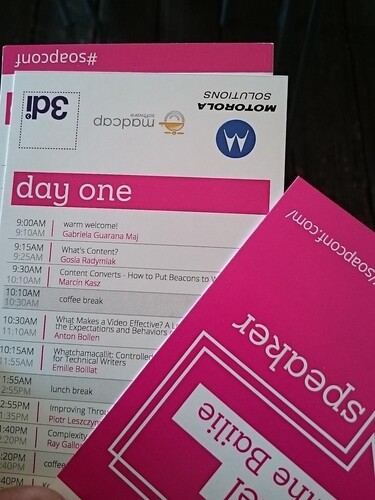
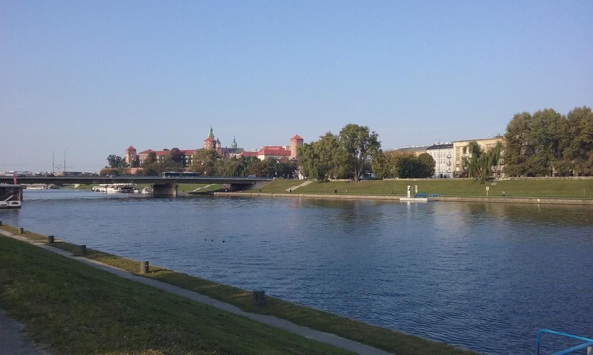
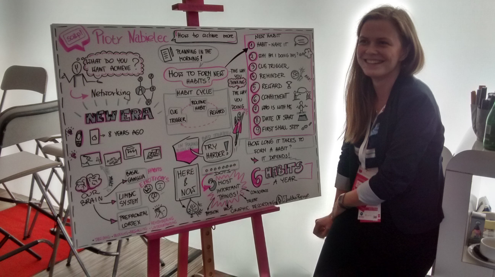
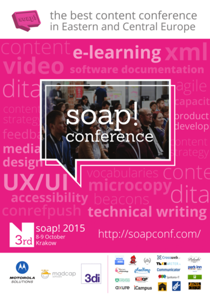

Za nami trzecia edycja konferencji [soap!](http://soapconf.com/). Jak było w tym roku? Zdecydowanie inaczej niż w poprzednim.

Chcąc świecić przykładem zjawilismy się w [Beach Barze na Plaży Kraków](http://www.plazakrakow.com.pl/klub) punktualnie o 8:30. Jak można było się spodziewać, wszystko dopiero zaczynało się rozkręcać. Rejestracja przebiegła bardzo sprawnie i zajęła dosłownie minutę. W tym roku organizatorzy zastosowali podejście "eko" i w pakiecie rejestracyjnym nie było żadnych drukowanych materiałów promocyjnych ani przyborów piśmienniczych. Tylko identyfikator oraz program okiełznane smyczą.

_Źródło: https://twitter.com/rahelab_

W programie zwróciliśmy uwagę na fakt, że w przeciwieństwie do zeszłorocznej edycji, drugiego dnia była jedna ścieżka tematyczna. Nie było też warsztatów na zakończenie konferencji. Trochę szkoda, bo w zeszłym roku bardzo przypadły nam do gustu warsztaty poświęcone Agile.

Otoczenie, w którym odbywała się konferencja było zgoła odmienne od tego z zeszłego roku. Żadnych psów ganiających za piłką oraz ludzi na hulajnogach. W toalecie również cisza i spokój. Przyznajemy, że brak stanowiska do selfie był dla nas lekkim rozczarowaniem ;) Za to mogliśmy podziwiać przyjemne widoki z okna.

_Źródło: https://twitter.com/Railwaymen\_org_

Ciekawą opcją była możliwość oceniania prezentacji na żywo za pomocą aplikacji [PheedLoop](http://pheedloop.com/), która została udostępniona dla uczestników w lokalnej sieci Wi-Fi. Wystarczyło kilka kliknięć i krótki komentarz, żeby wyrazić swoje zdanie na temat prowadzącego i jego wysiłków na scenie.

Po szybkim zbadaniu otoczenia, zajęliśmy miejsca w oczekiwaniu na “gwizdek rozpoczynający spotkanie”.

## Content zamiast chleba i soli

Po powitaniu uczestników i przedstawieniu sponsorów przez wodzirejkę **Gabrielę Guaranę Maj**, nastąpiło otwarcie konferencji. W tym roku ten zaszczyt przypadł **[Gosi Radymiak](http://soapconf.com/team/)**, która jest współtwórczynią konferencji. Jej przemowa była zatytułowana “What’s Content?”.

_Źródło: http://spotkania-it.pl_

Gosia starała się nas uświadomić, że treść to coś więcej niż tekst - to dokumentacja, media, materiały treningowe, interfejs użytkownika. Właściwie jest to wszystko co “przemawia” w jakiś sposób do klienta.

Ogólnie za bardzo skupiamy się na trzonie, czyli na funkcjach produktu, a to jest tylko jakaś część większej całości. Na około tego produktu jest właśnie treść, która nadaje mu kształt. Odjechane funkcje opakowane w kiepską i niezachęcającą treść nie mają zbyt dużej wartości.

Odbiorca naszej treści ma jakieś odczucia, dlatego zadaniem osób tworzących treść jest bardziej [projektowanie doświadczeń](http://www.kursusability.pl/slownik-interactive/projektowanie-doswiadczen--ang-experience-design-) (experience design) niż dostarczanie informacji.

Jakiś czas temu na łamach techwriter.pl również podjęliśmy próbę zdefiniowania czym jest content, ale z trochę innej perspektywy ;) Jej efekty możecie podziwiać [tutaj](http://techwriter.pl/langlydz-part-najn/).

## O co chodzi z tym różowym mydłem?

Na początku drugiego dnia konferencji Gosia również miała swoje 5 (a dokładniej 10) minut w czasie których przybliżyła uczestnikom pokrótce historię powstania konferencji oraz jej nazwy.

To właśnie nazwa powoduje, że organizatorzy otrzymują e-maile z osobliwymi pytaniami. Jedni chcą im sprzedać tonę mydeł, a drudzy niedowierzają, że ktoś mógł stworzyć dwudniową konferencję poświęconą [SOAP](https://pl.wikipedia.org/wiki/SOAP).

Cały pomysł na stworzenie takiego wydarzenia zrodził się podczas udziału w konferencji [Congility w 2013](http://congility.com/congility-2013/). Stwierdzili, że po co jeździć taki szmat drogi skoro można mieć coś takiego na własnym podwórku. Proste. Było to pod koniec czerwca. Poziom adrenaliny był tak wysoki, że data pierwszego soapa! została ustalona na październik 2013. Trzeba przyznać, że dość wysoko postawiona poprzeczka.

Klamka zapadła. Na pierwszy ogień poszły sprawy najważniejsze, czyli nazwa i logo. Inspiracją była jedna z [prezentacji TED](https://www.ted.com/), w której prowadząca opowiadała o bańce (bubble), która tworzy się wokół nas podczas korzystania z internetu.

Bańki były miłe i przyjemne, więc połączyli to ze źródłem ich powstawania czyli mydłem i tak powstały bańki mydlane. Po czasie stwierdzili jednak, że bańki mają złe konotacje. Burza mózgów zaczęła się niebezpiecznie wydłużać, a terminy goniły, więc bańki zostały usunięte i zostało tylko mydło.

Była nazwa, potrzebne było logo. Powstały dwie propozycje kolorystyczne - niebieska i różowa. Padło na tą drugą.

W taki oto sposób pojawiło się różowe mydło. Ot, cała historia :)

_Źródło: https://twitter.com/m\_kasz_

## My tu gadu gadu, a Jadźka Rysuje

A właściwie to **Natalia Klonowska**, którą nazywają Jadźką. Jej pasja do “bazgrania” przerodziła się w sposób na życie. Obecnie Natalia specjalizuje się w technikach wizualnego myślenia oraz rozwoju kreatywności. Zajmuje się m.in. zapisem graficznym (graphic recording) podczas różnych konferencji, co też właśnie czyniła w trakcie tegorocznej edycji soap!.

Na swoim stanowisku dowodzenia umiejscowionym nieopodal sceny pracowała w pocie czoła, żeby każda prezentacja została uwieczniona w przyjemnej dla oka i zwięzłej formie graficznej. Za co nieraz została doceniona przez uczestników gromkimi oklaskami.

Świetna inicjatywa. Duży plus dla organizatorów i czapki z głów dla Jadźki za talent oraz pasję z jaką podchodzi do swojej pracy.

Więcej informacji o tym co robi Natalia możecie znaleźć na stronie [jadzkarysuje.pl](http://jadzkarysuje.pl/).

## Ogłoszenia parafialne

Na zakończenie pierwszego dnia przez 15 minut mikrofon był dostępny dla wszystkich, którzy chcieli się czymś podzielić z innymi uczestnikami konferencji.

[**Ray Gallon**](http://soapconf.com/speaker/) skorzystał z okazji i ogłosił, że zaangażował się w inicjatywę o nazwie [ARIP (Augmented Reality in Information Products)](https://www.oasis-open.org/committees/tc_home.php?wg_abbrev=arip), której przewodzi konsorcjum [OASIS](https://pl.wikipedia.org/wiki/OASIS). Mówił też, że poszukują ludzi z doświadczeniem w [rzeczywistości rozszerzonej (Augmented Reality)](https://www.oasis-open.org/committees/tc_home.php?wg_abbrev=arip), którzy mogliby podzielić się wiedzą. Może to coś dla Was?

## Nie do końca tak różowo

Jak wiadomo, szczególnie w naszym kraju, każda okazja jest dobra, żeby sobie trochę ponarzekać. Dlatego na chwilę pozwolimy sobie przestawić nasze mózgi w tryb narracyjny.

Niestety ciepłe powitanie na początku każdego dnia konferencji nie było w stanie ruszyć słupka termometru nawet o stopień w górę. System grzewczy nie zapewniał odpowiedniej ilości ciepła, dlatego warunki panujące na sali przypominały trochę Przystanek Alaska. Z nieoficjanych informacji wiemy, że taki stan rzeczy był spowodowany zaniedbaniem po stronie właściciela lokalu.

Drugą rzeczą, o której nie sposób nie wspomnieć to bardzo słaba czytelność prezentacji wynikająca najpewniej z kiepskiej jakości projektora. Problem dotyczył szczególnie prezentacji o niskim kontraście. Było to spore utrudnienie zarówno dla prowadzących jak i uczestników. Tutaj nie wiadomo do końca czy zawinił człowiek czy maszyna, jednak jest to na pewno jedna z głównych rzeczy do poprawy na przyszły rok.

Narzekanie na kwestie techniczne wyważymy trochę tym, że w stosunku do poprzedniego roku nastąpiła duża poprawa w kwestii przeciągających się przerw technicznych spowodowanych podpinaniem laptopów prowadzących. Wszelkie podpinanie, przepinianie i wypinanie było tym razem ogarnięte jak należy. Warto też dodać, że organizatorzy pilnowali, aby prezentacje rozpoczynały się zgodnie z planem, a przerwy nie wydłużały się. Dzięki temu panował ogólny ład i porządek.

## Cyferki

A teraz czas na garść faktów, które otrzymaliśmy od organizatorów. Pierwszy (darmowy) dzień konferencji przyciągnął **170** uczestników, drugi (płatny) dzień **80**. Ogółem spożyto około 650 filiżanek kawy i herbaty oraz kubków wody. Dwa dni konferencji dostarczyły nam 17 prezentacji, które poprowadziło 17 mówców. Goście przybyli na konferencję z takich krajów jak: Polska, Stany Zjednoczone, Wielka Brytania, Ukraina, Niemcy, Czechy, Szwajcaria, Francja, Rosja i Kanada. Polscy goście przyjechali z Krakowa, Rzeszowa, Warszawy, Łodzi, Wrocławia, Gdańska, Okocimia, Katowic, Tarnowa, Torunia i Bytomia. Spektrum poruszonych tematów przedstawione jest na plakacie konferencji poniżej.

## Podsumujmy

Tak jak pisaliśmy na początku, tegoroczny soap! był zdecydowanie inny niż rok temu. Czy na plus czy na minus to już pozostawiamy indywidualnej ocenie uczestników. Oczywiście minusy, o których wspominaliśmy pozostaną minusami bez względu na punkt widzenia, jednak jeśli chodzi o całą resztę to na pewno znajdą się osoby, dla których tegoroczna atmosfera była właśnie tym czego oczekiwali.

Cieszymy się ogromnie, że w kalendarzu konferencji dla naszego kraju na stałe zagościło wydarzenie, które daje nam, specjalistom od tworzenia treści, możliwość spotkania się i wymiany doświadczeń. Jest to tym bardziej pozytywne, że już drugi rok z rzędu można było uczestniczyć w pierwszym dniu konferencji całkowicie za darmo. 

Mamy nadzieję, że zapał organizatorów nie opadnie i że lekcje wyniesione z tegorocznej edycji wykorzystają do zrobienia jeszcze lepszej konferencji w następnym roku. Tym bardziej im dopingujemy, że lwią część roboty związanej z organizacją konferencji wykonują w swoim wolnym czasie.

Niedługo postaramy się zamieścić opis najciekawszych (według nas) prezentacji.

A co Wy sądzicie o tegorocznej edycji konferencji? Jak oceniacie organizację wydarzenia, poziom prezentacji oraz koszt udziału w drugim dniu wydarzenia? Czekamy na Wasze komentarze.
