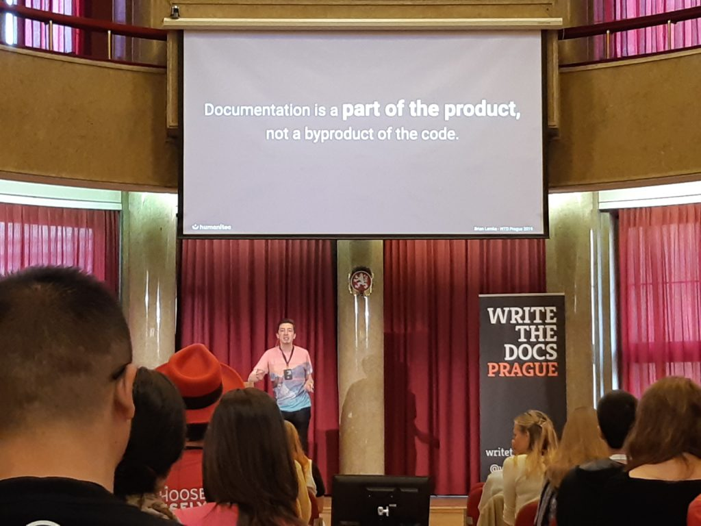

We wrześniu 2019 odbyła się kolejna edycja konferencji
[WTD](https://www.writethedocs.org/conf/prague/2019/). Nasz nowy reporter -
**Rafał Pawlicki** - podzielił się z nami swoimi wrażeniami, za co jesteśmy mu
bardzo wdzięczni!

<!--truncate-->

Miałem okazję uczestniczyć w tym wydarzeniu, które zgromadziło około 300 osób z
całego Świata. Wszyscy ci ludzie, chcąc powymieniać się wiedzą, pojawili się w
tym roku w Pradze (Czechy). Techwriter.pl, jak co roku, był partnerem medialnym
tego wydarzenia.

W tym artykule postaram się przybliżyć tematy, które pojawiły się w ramach
wystąpień, ale także wątki, które udało mi się uchwycić w trakcie rozmów z
uczestnikami — writerami, managerami, projektantami.

### Writing day

Tradycją stało się już to, że pierwszy dzień konferencji ma charakter
warsztatowy. Każdy z uczestników ma okazję zaproponować temat/projekt, nad
którym obecnie pracuje lub o którym chciałby porozmawiać. Writing day to świetna
okazja do znalezienia odpowiedzi na konkretne pytania, rozwiązanie konkretnych
problemów przy wsparciu specjalistów posiadających bardzo zróżnicowaną wiedzę i
doświadczenie.

Korzystając z tej możliwości, zorganizowałem grupę, która postawiła sobie za cel
znalezienie odpowiedzi na pytanie:

#### Jak dobra jest twoja dokumentacja (w liczbach)?

Temat był na tyle inspirujący i rozległy, że jako jedyna grupa potrzebowaliśmy
dwóch stołów i jako jedna z nielicznych pracowaliśmy aż do końca zaplanowanego
czasu.

Nie sposób opisać wszystkich poruszonych przez nas wątków, dlatego wspomnę
jedynie o dwóch:

_**Co należy sprawdzić w ramach doc review realizowanego przez człowieka?**_

Doszliśmy do wniosku, że są elementy, których nie da się sprawdzić przy pomocy
automatów, np. Czy tytuł dokumentu koresponduje z treścią? Czy tutorial wymaga
dodatkowych screenshotów? Czy dokument jest w ogóle potrzebny?

_**Jakie miary pozwolą nam określić jakość dokumentacji i które z nich mogą być
zbierane automatycznie?**_

Istotne jest, aby pokazywać, jak dokumentacja pomaga wspierać klienta, jak
używamy jej w ramach procesu supportu, jak wpływa ona na liczbę rejestrowanych
zapytań.

W mniej lub bardziej automatyczny sposób możemy wykorzystywać liczby do oceny
dojrzałości dokumentacji, co z kolei pozwoli przekonać managerów dysponujących
budżetem do inwestycji w tym obszarze.

Writing Day był bardzo intensywnym, kreatywnym dniem, który wielu z nas pozwolił
na rozwiązanie problemów, z którymi borykamy się na co dzień.

### Conference talks

Kolejne dwa dni to głównie wystąpienia omawiające, podkreślające istotne aspekty
związane z dokumentacją, ale i narzędziami czy podejściem do pracy,
rozwiązywania problemów. Chciałbym wyróżnić kilka tematów, które w mojej ocenie
były najciekawsze, ponieważ odnosiły się do przyszłości, omawiały ścieżki,
którymi powinniśmy podążać, aby odpowiadać na szybko zmieniające się wymagania
odbiorców dokumentacji.

#### Docs as Code rośnie w siłę

Wielu prelegentów omawiając swój proces tworzenia/dostarczania dokumentacji
mówiło o koncepcji przechowywania/przetwarzania dokumentacji tak, jak kodu
źródłowego — znanej pod pojęciem docs—as—code.

Tutaj należy wspomnieć o prezentacji **Jen Lambourne**, która opisuje, jak
tworzona i publikowana jest dokumentacja rządu Wielkiej Brytanii (_The UK
government meets docs as code_). Jen świetnie omawia zagadnienia związane z
procesem tworzenia dokumentacji, podejmowane decyzje oraz ich skutki. Historia
ta pokazuje, że nawet w „trudnych” warunkach — kiedy trzeba mocno argumentować
potrzeby, konieczność wdrażania nowych narzędzi, docs—as—code zdaje egzamin.

#### Nowe role i wyzwania

Bardzo interesującym, momentami kontrowersyjnym, wątkiem, pojawiającym się
bardzo często była rola technical writera w kontekście nowych wyzwań oraz
współpracy z innymi obszarami w ramach organizacji. Świetnym przykładem było
wystąpienie **Kelly O'Brien** (_Surprise! You’re designer now_), która
podkreślała, że w dzisiejszych czasach writer nie może być już tylko writerem. W
związku tym, że technologia zmienia się tak szybko, writer musi bardziej
intensywnie współpracować z inżynierami, deweloperami, biznesem...

Technical writer musi być uwzględniony w procesie wytwarzania oprogramowania —
im wcześniej, tym lepiej. Pozwoli mu to wpływać na kształt dostarczanych
produktów, ponieważ... Dokumentacja jest częścią produktu!

 Nie oznacza to jednak, że writer
jest jedyną osobą, która może pisać dokumentację. Często pojawiają się tematy —
szczególnie techniczne, niskopoziomowe — w których lepiej sprawdzi się
deweloper. Tak! Deweloperzy również potrafią pisać dokumentację!

Polecam obejrzeć prezentację, którą przygotował **Ben Ahmady** (_Write the API
docs before the API exists_). Omawia on temat projektowania API i opisywania go
jeszcze przed etapem programowania. Główną zaletą takiego podejścia jest to, że
w pełni wykorzystujemy wiedzę i doświadczenie z różnych miejsc w organizacji,
dzielimy się nią, co sprawia, że na koniec dnia dostarczamy spójne, bardziej
dojrzałe i lepiej udokumentowane rozwiązanie.

### Klient jest najważniejszy

Tworząc oprogramowanie, powinniśmy myśleć przede wszystkim o naszych odbiorcach.
No dobrze, ale kim oni są? Odpowiedź na to pytanie to klucz, który otwiera drzwi
do świata prawdziwie dojrzałej dokumentacji. Drzwi te uchylił nam nieco **Aaron
Collier** swoim wystąpieniem (_Seeing your docs through different eyes: Mapping
doc users experiences_).

Aaron bardzo precyzyjnie i na prawdziwych przykładach przedstawił proces
tworzenia mapy, definiowania ścieżek, które przechodzą użytkownicy pracując z
oprogramowaniem. Podkreślił on również newralgiczne punkty, na które należy
zwrócić uwagę podczas budowania strategii i procesu dokumentacji. Prezentacja
pokazała w jaki sposób dotychczasowe przejścia, doświadczenia użytkownika mogą
wpływać na odbiór dokumentacji, a tym samym jak powinniśmy tworzyć treści, aby
możliwie szybko rozwiązywać konkretne problemy.

### Podsumowanie

Tegoroczna konferencja Write The Docs Prague 2019 była świetną okazją do
zintegrowania się z największą na świecie społecznością wyznaczającą trendy,
według których tworzymy dokumentację. Wróciłem wyposażony w wiedzę i pomysły,
które można wprost przekuć w działania — wprowadzić jako usprawnienia w naszej
organizacji.

Z tego miejsca należy podziękować Organizatorom oraz wszystkim zaangażowanym w
przygotowanie tego wydarzenia. Dzięki ich pracy i zaangażowaniu, przez okrągłe
trzy dni mieliśmy okazję poznawać nowych ludzi, spotkać się z ludźmi, których do
tej pory znaliśmy jedynie z tętniącego życiem kanału WriteTheDocs Slack.

Co dalej?

Polecam odwiedzić oficjalną stronę
[WriteTheDocs.org](https://www.writethedocs.org/), na której znajdziecie masę
ciekawych artykułów, materiałów mówiących o tym, jak pisać, jakich narzędzi
używać, itd. Zachęcam również do zapisania się na newsletter, który w skróconej
wersji podsumowuje wątki omawiane przez WriteTheDocs Community.

---

Od redakcji: **Serdecznie dziękujemy Rafale! 😊 Za zdjęcia również!**

Jeżeli chcecie obejrzeć wszystkie wystąpienia z praskiej konferencji -
koniecznie odwiedźcie kanał organizatorów na YouTube:

https://www.youtube.com/playlist?list=PLZAeFn6dfHpkpYchP1iFnQnc7i-2xJd0I

Większość prezentacji była też relacjonowana na bieżąco i jest dostępna (wraz z
obszernym podsumowaniem konferencji)
[na blogu ffeathers (by Sarah Maddox)](https://ffeathers.wordpress.com/2019/09/18/write-the-docs-prague-2019-wrapup/) -
polecamy!
