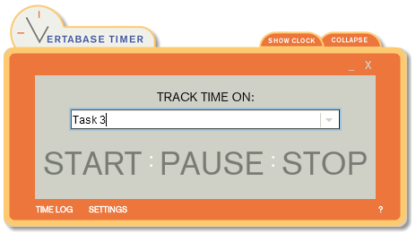
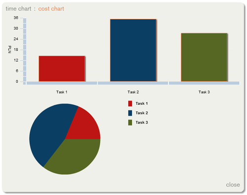
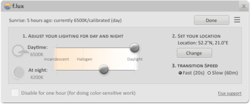

Jak już zapewne zdążyliście zauważyć, bardzo lubimy darmowe narzędzia. Dzisiaj
mamy dla Was trzy małe, ale za to pomocne aplikacje, z których sami korzystamy i
uważamy, że są godne polecenia. Nie są one ściśle związane z pracą Tech Writera,
jednak zdecydowanie mogą Wam ułatwić codzienne zadania.

<!--truncate-->

# Coś do notowania

Jeśli chodzi o zapisywanie wszelkiego rodzaju ważnych informacji, to zapewne
jednym z pierwszych skojarzeń są karteczki samoprzylepne, bardziej znane jako
Sticky Notes. Windows oferuje nam wbudowaną aplikację pod taką nazwą, która
prawdopodobnie wielu osobom w zupełności wystarcza. Głównym czynnikiem, który
nas popchnął do szukania innych "karteczek" była... domyślna czcionka, której
nie mogliśmy znieść 😊 Okazało się, że jej zmiana na coś bardziej ludzkiego
wiązała się z grzebaniem w rejestrze, dlatego postanowiliśmy znaleźć
alternatywę. W taki oto sposób natknęliśmy się na
[Simple Sticky Notes](http://www.simplestickynotes.com/). Oczywiście oprócz
możliwości zmiany domyślnej czcionki, program oferuje też opcje do zmiany
tytułu, który jest automatycznie przypisywany nowym notatkom (np. data i czas),
ich przeźroczystości, koloru oraz motywu. Tekst w notatkach można formatować na
różne sposoby: pogrubiać, dodawać kursywę, zmieniać kolor i rozmiar czcionki.
Wspierane jest też wyrównywanie, listy numerowane i nienumerowane oraz
ustawianie odstępów między liniami. Aplikacja daje nam też możliwość ustawiania
przypomnień (jednorazowych, tygodniowych, miesięcznych lub rocznych) dla
poszczególnych notatek. Dźwięk przypomnienia można zmienić według własnych
upodobań w ustawieniach programu. Notatki możemy drukować i udostępniać przez
Facebooka, Twittera lub e-mail. Ciekawą opcją jest wyszukiwanie tekstu w
Google - wystarczy zaznaczyć w notatce tekst, który chcemy wyszukać i z menu
kontekstowego wybrać **Search at Google for \[...\]** lub użyć skrótu
**Ctrl+G**. Program otworzy naszą domyślną przeglądarkę i wyszuka zaznaczony
tekst przez www.google.com.

Aplikacja oparta jest na bazie danych [SQLite](https://www.sqlite.org/), dzięki
czemu mamy możliwość tworzenia i przywracania lokalnej kopii zapasowej. Program
można zainstalować tylko na Windowsie.

# Coś do śledzenia czasu

[Vertabase Timer](http://timer.vertabase.com/) to prosty w użyciu, ale najeżony
funkcjami miernik czasu. Program może być przydatny dla osób, które muszą
raportować czas spędzony nad każdym zadaniem w środowisku gdzie częste
przełączanie się między projektami to codzienność. Jest to też ciekawa
propozycja dla wolnych strzelców, którzy fakturują swoich klientów według stawki
godzinowej. Aplikację można zainstalować na Windowsie i Mac OSie, jednak
wymagana jest wcześniejsza instalacja Adobe Air. Żeby zacząć śledzić czas dla
nowego zadania, wystarczy wpisać nazwę zadania w polu "TRACK TIME ON" i kliknąć
START.

Przyciskiem PAUSE możemy wstrzymać pomiar czasu. Przyciskiem STOP zatrzymujemy
mierzenie czasu, co powoduje stworzenie wpisu w dzienniku. Program daje nam
możliwość ustawienia, żeby pomiar czasu był wstrzymywany automatycznie po
określonym czasie bezczynności. Wszystkie odcinki czasu zapisane w dzienniku
możemy edytować, eksportować do plików CSV i XML oraz wyświetlać w formie
wykresów czasu lub kosztów.

Dla każdego zadania możemy określić osobną stawkę godzinową, dzięki czemu po
zakończeniu możemy od razu sprawdzić jego całkowity koszt za pomocą wykresu
kosztów.

# Coś dla zdrowia

W poprzednim tygodniu opublikowaliśmy
[garść wskazówek](http://techwriter.pl/technical-writer-w-dobrej-formie/), które
pomagają pozostać Tech Writerom w dobrej formie. Jedna z nich mówiła o robieniu
przerw dla zmęczonych oczu. Tak samo jak przerwy, dla naszego wzroku ważne jest
również odpowiednie ustawienie ekranu. Tutaj z pomocą przychodzi nam aplikacja
[f.lux](https://justgetflux.com/), która dostosowuje kolory ekranu komputera do
pory dnia. W ciągu dnia, kiedy świeci słońce, ekran dostosowany jest do
oświetlenia naturalnego. Po zachodzie słońca, ustawienia zmieniają się tak, żeby
pasowały do oświetlenia używanego w pokoju. Jedyne co musimy zrobić to ustawić
rodzaj oświetlenia jaki jest używany w pomieszczeniu oraz podać swoją
lokalizację, dzięki czemu aplikacja będzie wiedzieć kiedy ma miejsce wschód i
zachód słońca.

Ponadto, aplikacja ma kilka "szybkich" ustawień, m.in. możliwość wyłączenia
aplikacji na godzinę albo do wschodu słońca, kiedy musimy popracować nad jakąś
grafiką i nie chcemy, żeby kolory ekranu zmieniały się. Program można
zainstalować na systemach Windows, Mac OS, Linux oraz iOS.

# Podsumowanie

Największymi zaletami przedstawionych aplikacji jest zdecydowanie szerokie
spektrum funkcji jakie oferują przy jednoczesnej prostocie użytkowania. Jedynym
minusem jaki dostrzegamy jest brak obsługi języka polskiego. Jeśli chodzi o
dokumentację do opisanych aplikacji to nie za bardzo jest się o czym rozpisywać.
Pomoc dla Simple Sticky Notes to właściwie tylko
[jedna, krótka strona](http://www.simplestickynotes.com/help/). Dokumentacja dla
Vertabase Timera to małe, otwierane z poziomu aplikacji okienko, którego nie da
się powiększyć, a zawarty w nim tekst jest kiepsko sformatowany. Twórcy programu
f.lux postawili z kolei na [FAQ](https://justgetflux.com/faq.html) i
[forum](https://justgetflux.com/forum/). Jest to zdecydowanie najbardziej
rozbudowana pomoc ze wszystkich trzech aplikacji. Czy taka ilość dokumentacji
jest wystarczająca? To już pozostawiamy Waszej ocenie 😊
