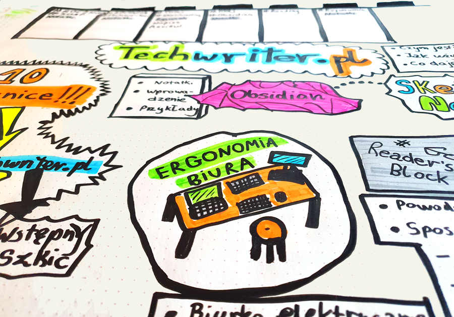

---
title:
  'Odręczne notatki graficzne w warsztacie technical writera'
authors: niewiarowski
date: '2024-12-19'
tags:
  - 'dobre-praktyki'
  - 'warsztat'
  - 'notatki'
  - 'facylitacja-graficzna'
  - 'grafika'
coverImage: 'upload_0085.png'
---
Czy analogowe notatki mają prawo bytu w dzisiejszym cyfrowym świecie? Uważam, że tak, a przynajmniej "u mnie to działa" :). Zaprasza zapoznania się z  metodą tworzenia graficznych notatek.

<!--truncate-->
## Szkolenie z tworzenia graficznych notatek

W marcu 2023 wziąłem udział w szkoleniu prowadzonym przez  [Gabrielę Borowczyk](https://www.linkedin.com/in/gabriela-borowczyk-%E2%9C%8F-55558126/). Otrzymałem solidną porcję wiedzy o technikach tworzenia różnego rodzaju napisów, elementów dekoracyjnych, liter i rysunków. Są to umiejętności pomocne zwłaszcza dla scrum masterów podsumowujących wizualnie spotkania, warsztaty i różne spontaniczne burze mózgów. 
Na szkoleniu Gabrieli w jakim wziąłem udział z innymi pracownikami Hitachi Energy było bardzo sympatycznie i intensywnie. Mieliśmy okazję podkręcić kreatywność na wyższe obroty. Ubawiłem się przednio, szczególnie, że ostatni raz tyle rysowałem w liceum, a później było coraz mniej do tego okazji. Sam temat był dla mnie ważny o tyle, że moją odwieczną bolączką był charakter pisma zbliżony do szyfru lub recepty wypisanej przez lekarza. Było to krzepiące, że mimo mojego awangardowego stylu pisania, również i ja byłem w stanie się nauczyć jak pisać na plakatach dostatecznie wyraźnie.
Dowiedziałem się też o graficznych facilitatorach prowadzących spotkania z użyciem wsparcia własnoręcznie narysowanych materiałów, a także o ilustratorach spotkań i wydarzeń tworzących piękne i edukacyjne zapisy wydarzeń.

## I co dalej zrobić z tą wiedzą?

Warsztaty ukończyłem, dyplom otrzymałem. Przez dłuższy czas nie tykałem flamastra, aż pewnego pięknego dnia stwierdziłem, że wypróbuję tę wiedzę w codziennej praktyce speca od dokumentacji i autora radosnej twórczości po godzinach.
Poszerzyłem mój zestaw pisaków, zakupiłem BIUWAR i zacząłem eksperymenty z pisanymi i rysowanymi notatkami. Dla mniej zorientowanych, biuwar to duży arkusz papieru z kalendarzem, miejscem na odręczne rysunki i listę zadań.
## Jak korzystam z wizualnych notatek

Zarówno w pracy jak i po godzinach tworzę listy zadań, mapy tematów i sieć połączeń miedzy nimi. 
Rysunki i zapiski pomagają mi spamiętać rzeczy, które aktualnie biorę na tapet. Zapisuję sobie główne tagi, którymi kategoryzuję notatki w narzędziu Obisidian, któremu poświęcę przyszły artykuł :)
Rysunki "pączkują" i z biegiem czasu tworzy się mozaika. Jeśli tematy znajdują się blisko siebie, znaczy to, że są w jakiś sposób ze sobą związane.
Za pomocą kolorów i innych metod mogę podkreślać powiązane tematy. 
Z lubością wykreślam zamknięte sprawy.
Kiedy na arkuszu robi się zbyt tłoczno albo większość kwestii jest rozwiązanych, wydzieram kartkę i biorę się do zapisywania kolejnej. 
Stare zapiski zachowuję, bo stanowią wizualny zapis stanu rzeczy z danego momentu projektu, czasem do pewnych szczegółów warto wrócić
## W czym pomagają mi wizualne notatki

Notatki wizualne wspierają mnie w zapamiętywaniu nazw projektów, komponentów, dat i powiązań. Tak jak notatka na lodowce, wzrok często spoczywa na arkuszu i pomaga mi to odświeżyć kluczowe informacje. 
Im bardziej złożona struktura tego nad czym pracujesz, tym bardziej wizualizacja pomaga Ci ułożyć to sobie w głowie. Jest to szczególnie pomocne podczas etapu analizy.
Dodatkowym plusem jest to, że kiedy masz niezapowiedzianą rozmowę na Teams na temat danego projektu, masz przed oczami kluczowe fakty. No i oczywiście masz miejsce na arkuszu na zrobienie szybkich notatek w trakcie rozmowy.
Czasem za status mojego projektu wystarcza zdjęcie rysunku podsumowującego moje działania.
Potrzebujesz zaprojektować diagram? Do dzieła, papier wszystko przyjmie!

## Dlaczego uważam, że warto notować i rysować
Graficzne notatki mogą urozmaicić Twój dzień, jeśli czujesz pewien przesyt od patrzenia w monitor i stukania na klawiaturze. Uważam, że rysowanie jest rozwijającą czynnością, która angażuje dodatkowe obszary mózgu, wspierając kreatywność, wyobraźnie i myślenie. 
Najlepsze rzeczy w życiu są najprostsze. Rysowanie jest niezwykle relaksująca i rozwijającą czynnością. Jest w tym dziecięca radość tworzenia. Nie bez powodu dzieci w wieku przedszkolnym i szkolnym spędzają masę czasu na rysowaniu. Jeśli Ty spędzisz chociaż 15 minut w ciągu dnia, nie pożałujesz. 
Słyszałem, że rysowanie podczas wykładów pomaga studentom lepiej zapamiętywać. 
Rysunki są przy tym niezwykle elastyczne - możliwości ekspresji są ogromne. Kółko, kreska, przekreślenie czy falista linia potrafią w kilka sekund uchwycić wiele ulotnych koncepcji na papierze.

## Co na to nauka?
## A co z cyfrowymi notatkami?

Nie odżegnuję się od cyfrowych notatek - również z nich korzystam. Można powiedzieć, że różne rodzaje notatek wspólnie tworzą coś na kształt ekosystemu. Notatki cyfrowe w markdown (Obsidian) potrafią się dobrze uzupełniać z zapiskami. Zależnie od sytuacji, czasem wybieram rozwiązanie analogowe, czasem cyfrowe, co stanowi pewne urozmaicenie :)
Czasem potrzebuję przepisać odręczne notatki do Obsidian żeby zasilić moją wirtualną skarbnicę wiedzy ;) Gdy jestem bardzo leniwy, robię zdjęcie notatce i umieszczam ją w systemie. Też tak można.
## Komu mogę to polecić

Myślę, że graficzne notowanie jest dobre dla osób, które lubiły rysować i szukają urozmaicenia w robieniu notatek. Życie jest krótkie, dlaczego nie spróbować?
## Wskazówki

- Możesz czuć opór wewnętrzny, może pomyślisz, że to dziecinada. Pamiętaj, że nikt nie ocenia piękna Twoich wytworów, a flamaster nie gryzie :) Spróbuj a nie pożałujesz. 
- Przejdź godziwe szkolenie :) Energia pracy w grupie doda Ci rozpędu ;)
- Nie przejmuj się perfekcjonizmem. Linia wyszła krzywo, rysunek nie zmieścił się przy brzegu kartki? Przekreśl, zaadaptuj to, bo, cytując Gabrielę Borowczyk: "Tak miało być i koniec".
- Chętnie się wraca do estetycznych i dobrze zaprojektowanych notatek. Nie musisz być artystą i spędzać nad rysunkiem całego dnia. Minimalna chlujność jest konieczna, żeby oczy nie bolały przy oglądaniu.
- Rysunki mogą być minimalistyczne.
- Daj sobie czas na nabranie doświadczenia. Po jakimś czasie znajdziesz triki, by szybko wyrazić to, na czym Ci zależy.
- Internet jest pełen przepisów na tworzenie uproszczonych grafik czy symboli. Wpisz w wyszukiwarkę obrazów: "Jak narysować X".
- Przede wszystkim rysuj i baw się dobrze. 
