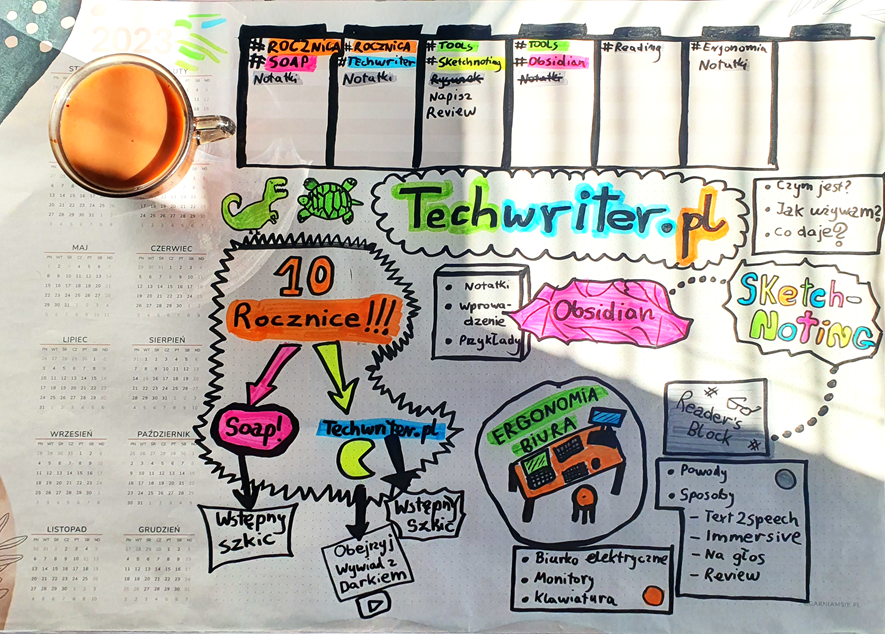

Czy analogowe notatki mają prawo bytu w dzisiejszym cyfrowym świecie? Uważam, że
tak, a przynajmniej "u mnie to działa" :). Zapraszam do zapoznania się z metodą
tworzenia notatek wizualnych.

<!--truncate-->

## Szkolenie z tworzenia notatek wizualnych

W marcu 2023 wziąłem udział w szkoleniu prowadzonym przez
[Gabrielę Borowczyk](https://www.linkedin.com/in/gabriela-borowczyk-%E2%9C%8F-55558126/).
Otrzymałem solidną porcję wiedzy o technikach tworzenia różnego rodzaju napisów,
elementów dekoracyjnych, liter i rysunków. Są to umiejętności pomocne zwłaszcza
dla scrum masterów podsumowujących wizualnie spotkania, warsztaty i spontaniczne
burze mózgów. Szkolenie, w którym wziąłem udział z innymi pracownikami Hitachi
Energy, było przyjemne i intensywne. Mieliśmy okazję podkręcić
naszą kreatywność bawiąc się przy tym wyśmienicie.
Muszę przyznać, że z takim zapałem rysowałem ostatnio w liceum. Niestety z biegiem czasu było do tego coraz mniej okazji.
Sam temat był dla mnie ważny o tyle, że moją odwieczną bolączką był charakter
pisma zbliżony do szyfru lub recepty wypisanej przez lekarza. Było to krzepiące,
że mimo mojego awangardowego stylu pisania, również i ja byłem w stanie się
nauczyć jak pisać na plakatach dostatecznie wyraźnie. Dowiedziałem się też o
graficznych facylitatorach prowadzących warsztaty z użyciem własnoręcznie
narysowanych materiałów, a także o ilustratorach spotkań i wydarzeń, tworzących
wizualne podsumowania, które są świetnymi materiałami edukacyjnymi.
Przykładami wydarzeń tech writingowych które uświetnione zostały zapisami graficznymi były [soap! 2015](https://techwriter.pl/namydleni-po-raz-trzeci/#my-tu-gadu-gadu-a-jad%C5%BAka-rysuje) i [Write the Docs 2021](https://techwriter.pl/relacja-z-konferenecji-write-the-docs-prague-2021/).

## I co dalej zrobić z tą wiedzą?

 Warsztaty ukończyłem, dyplom otrzymałem. Przez
dłuższy czas nie tykałem flamastra, aż pewnego pięknego dnia stwierdziłem, że
wypróbuję te umiejętności w codziennej praktyce speca od dokumentacji i autora
radosnej twórczości po godzinach. Poszerzyłem mój zestaw pisaków, zakupiłem
[biuwar (moje nowe ulubione słowo ;)](https://kalendarzecsk.pl/blog/52,biuwary---co-to-jest-i-jak-mozna-ich-uzywac) i
zacząłem eksperymenty z pisanymi i rysowanymi notatkami. Dla mniej
zorientowanych, biuwar to duży arkusz papieru z kalendarzem, miejscem na
odręczne rysunki i listę zadań.

## Jak korzystam z wizualnych notatek

 Zarówno w pracy jak i po godzinach tworzę listy
zadań, mapy tematów i sieć połączeń miedzy nimi. Rysunki i zapiski pomagają mi
spamiętać rzeczy, które aktualnie biorę na tapet. Zapisuję sobie główne tagi,
którymi kategoryzuję notatki w narzędziu Obsidian. Postaram się napisać więcej o tej aplikacji w jednym z moich przyszłych artykułów.
Rysunki "pączkują" i z biegiem czasu tworzy się z nich mozaika.
Jeśli tematy znajdują się blisko siebie, oznacza to, że są w jakiś sposób ze sobą
związane. Za pomocą kolorów i innych metod mogę podkreślać powiązane tematy. Z
lubością wykreślam zamknięte sprawy. Kiedy na arkuszu robi się zbyt tłoczno albo
większość kwestii jest rozwiązana, wydzieram kartkę i biorę się do zapisywania
kolejnej. Stare notatki zachowuję, bo stanowią wizualny zapis stanu rzeczy z
danego momentu projektu. Czasem do pewnych szczegółów warto wrócić.

## W czym pomagają mi wizualne notatki

Notatki wizualne wspierają mnie w zapamiętywaniu nazw projektów, komponentów,
dat i powiązań. Arkusz z zapiskami jest jak notatka na lodówce. Wystarczy na nią spojrzeć, żeby odświeżyć sobie kluczowe informacje.
Im bardziej złożona struktura tego
nad czym pracujesz, tym bardziej wizualizacja pomaga Ci ułożyć to sobie w
głowie. Jest to szczególnie pomocne podczas etapu analizy. Dodatkowym plusem
jest to, że kiedy masz niezapowiedzianą rozmowę na Teams na temat danego
projektu, masz przed oczami kluczowe fakty. No i oczywiście masz miejsce na
arkuszu na zrobienie szybkich notatek w trakcie rozmowy. Czasem za status mojego
projektu wystarcza zdjęcie rysunku podsumowującego moje działania. Potrzebujesz
zaprojektować diagram? Do dzieła, papier wszystko przyjmie!

## Dlaczego uważam, że warto notować i rysować

 Notatki wizualne to doskonałe urozmaicenie pracy biurowej, która polega głównie na patrzeniu w monitor i klepaniu na klawiaturze.
Uważam,
że rysowanie jest relaksującą i rozwijającą czynnością, która angażuje dodatkowe obszary
mózgu, wspierając kreatywność, wyobraźnie i myślenie. Najlepsze rzeczy w życiu
są najprostsze.
Jest w tym czysta radość tworzenia. Nie bez powodu dzieci w wieku
przedszkolnym i szkolnym spędzają masę czasu na rysowaniu. Jeśli Ty spędzisz
chociaż 15 minut w ciągu dnia, nie pożałujesz. Odręczne notatki to bardzo
elastyczna metoda - możliwości ekspresji są ogromne. Kółko, kreska,
przekreślenie czy falista linia potrafią w kilka sekund uchwycić wiele ulotnych
koncepcji na papierze.

## Co na to nauka?

Nie powinno być zaskoczeniem, że istnieją badania naukowe wskazujące na
dobroczynny wpływ rysowania na rozwój dzieci. Dowiedziono również, że robienie
rysowanych notatek czy nawet gryzmolenie na brzegu zeszytu ma pozytywny wpływ na
koncentrację, przetwarzanie i zapamiętywanie informacji. Jedną z przyczyn może
być aktywizacja i współpraca kilku obszarów mózgu jednocześnie. Tłumaczenie myśli i
koncepcji na obrazy wspiera tworzenie nowych połączeń neuronowych, co pomaga
lepiej rozumieć i zapamiętywać. Rysowanie odgrywa rolę we wspieraniu osób w
spektrum autyzmu oraz osób z demencją. Zastosowań dla rysowania i korzyści z
niego płynących jest naprawdę mnóstwo. Jest to temat rzeka, dlatego udostępniam linki do
dodatkowych źródeł dla osób zainteresowanych:

- [The Drawing Effect Evidence for Reliable and Robust Memory Benefits in Free Recall](https://www.researchgate.net/publication/282658904_The_Drawing_Effect_Evidence_for_Reliable_and_Robust_Memory_Benefits_in_Free_Recall)
- [Drawing and memory](https://www.edutopia.org/article/science-drawing-and-memory)
- [Unlocking cognitive benefits - drawing makes you smarter](https://drawdrawing.com/unlocking-cognitive-benefits-does-drawing-make-you-smarter/)
- [Visualization in mathematics](https://www.edutopia.org/article/power-visualization-math)
- [Art therapy for children with autism spectrum disorder](https://www.neurologia.com.pl/artykul.php?a=1251)

## A co z cyfrowymi notatkami?

 Nie odżegnuję się od cyfrowych notatek - również z
nich korzystam. Można powiedzieć, że różne rodzaje notatek wspólnie tworzą coś
na kształt ekosystemu. Notatki cyfrowe (Obsidian) potrafią się dobrze
uzupełniać z odręcznymi zapiskami. Zależnie od sytuacji, raz wybieram
rozwiązanie analogowe a raz cyfrowe. Czasem potrzebuję przepisać odręczne
notatki do Obsidian, żeby zasilić moją wirtualną skarbnicę wiedzy. Gdy jestem
bardzo leniwy, robię zdjęcie notatce i umieszczam ją w systemie. Też tak można.

## Komu mogę to polecić

Myślę, że notowanie wizualne jest dobre dla osób, które lubiły rysować i
szukają urozmaicenia w robieniu notatek. Jeśli jesteś wzrokowcem a aspekt
wizualny ma dla Ciebie znaczenie podczas nauki i organizacji informacji,
zdecydowanie możesz na takich notatkach skorzystać.

## Wskazówki

- Możesz czuć opór wewnętrzny, może pomyślisz, że to dziecinada. Pamiętaj, że
  nikt nie ocenia piękna Twoich wytworów, a flamaster nie gryzie :)
- Przejdź porządne szkolenie. Energia płynąca z pracy w grupie doda Ci skrzydeł.
- Nie przejmuj się perfekcjonizmem. Linia wyszła krzywo, rysunek nie zmieścił
  się przy brzegu kartki? Przekreśl i zaadaptuj to, bo, cytując Gabrielę
  Borowczyk: "Tak miało być i koniec".
- Chętnie się wraca do estetycznych i dobrze zaprojektowanych notatek. Nie
  musisz być artystą i spędzać nad rysunkiem całego dnia. Minimalna chlujność
  jest konieczna, żeby oczy nie bolały przy oglądaniu.
- Rysunki mogą być minimalistyczne.
- Daj sobie czas na nabranie doświadczenia. Po jakimś czasie znajdziesz triki,
  by szybko wyrazić to, na czym Ci zależy.
- Internet jest pełen przepisów na tworzenie uproszczonych grafik czy symboli.
  Wpisz w wyszukiwarkę obrazów: "Jak narysować X".
- Przede wszystkim rysuj i baw się dobrze.

