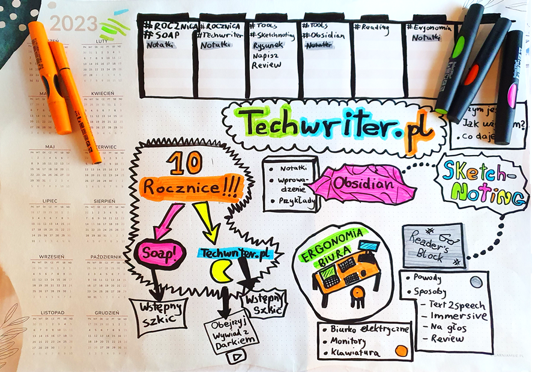

Czy analogowe notatki mają prawo bytu w dzisiejszym cyfrowym świecie? Uważam, że
tak, a przynajmniej "u mnie to działa" 🙂 Zapraszam do zapoznania się z metodą
tworzenia notatek wizualnych.

<!--truncate-->

## Szkolenie z tworzenia notatek wizualnych

W marcu 2023 wziąłem udział w szkoleniu prowadzonym przez
[Gabrielę Borowczyk](https://www.linkedin.com/in/gabriela-borowczyk-%E2%9C%8F-55558126/).
Otrzymałem solidną porcję wiedzy o technikach tworzenia różnego rodzaju napisów,
elementów dekoracyjnych, liter i rysunków. Są to umiejętności pomocne zwłaszcza
dla scrum masterów podsumowujących wizualnie spotkania, warsztaty i spontaniczne
burze mózgów.

Szkolenie, w którym wziąłem udział z innymi pracownikami Hitachi Energy, było
przyjemne i intensywne. Mieliśmy okazję podkręcić naszą kreatywność bawiąc się
przy tym wyśmienicie. Muszę przyznać, że z takim zapałem rysowałem ostatnio w
liceum. Niestety z biegiem czasu było do tego coraz mniej okazji. Sam temat był
dla mnie ważny o tyle, że moją odwieczną bolączką był charakter pisma zbliżony
do szyfru lub recepty wypisanej przez lekarza. Było to krzepiące, że mimo mojego
awangardowego stylu pisania, również i ja byłem w stanie się nauczyć jak pisać
na plakatach dostatecznie wyraźnie. Dowiedziałem się też o
[graficznych facylitatorach](https://flipowanie.pl/blog/rozwoj-osobisty/kto-to-jest-i-czym-sie-zajmuje-facylitator/)
prowadzących warsztaty z użyciem własnoręcznie narysowanych materiałów, a także
o ilustratorach spotkań i wydarzeń, tworzących wizualne podsumowania, które są
świetnymi materiałami edukacyjnymi. Przykładami wydarzeń tech writingowych
uświetnionych zapisami graficznymi są
[soap! 2015](https://techwriter.pl/namydleni-po-raz-trzeci/#my-tu-gadu-gadu-a-jad%C5%BAka-rysuje)
i
[Write the Docs 2021](https://techwriter.pl/relacja-z-konferenecji-write-the-docs-prague-2021/)
z których relacje możesz przeczytać na Techwriter.pl.

Jeśli poszukujesz szerszych definicji notatek wizualnych i powiązanych z nimi
tematów, zajrzyj na
[blog Gabrieli](https://flipowanie.pl/blog/flipowanie-i-facylitacja-graficzna/co-to-jest-sketchnoting/),
którego dodatkowym atutem są piękne rysunki.

## I co dalej zrobić z tą wiedzą?

 Warsztaty ukoczyem, dyplom otrzymaem. Przez
dłuższy czas nie tykałem flamastra, aż pewnego pięknego dnia stwierdziłem, że
wypróbuję te umiejętności w codziennej praktyce speca od dokumentacji i autora
radosnej twórczości po godzinach. Poszerzyłem mój zestaw pisaków, zakupiłem
[biuwar (moje nowe ulubione słowo ;)](https://sjp.pwn.pl/poradnia/haslo/Zagadkowy-biwuar;17365.html)
i zacząłem eksperymenty z pisanymi i rysowanymi notatkami. Dla mniej
zorientowanych, biuwar to duży arkusz papieru z kalendarzem, miejscem na
odręczne rysunki i listę zadań.

## Jak korzystam z wizualnych notatek

 Zar贸wno w pracy jak i po godzinach tworz listy
zadań, mapy tematów i sieć połączeń między nimi. Rysunki i zapiski pomagają mi
spamiętać rzeczy, które aktualnie biorę na tapet. Zapisuję sobie główne tagi,
którymi kategoryzuję notatki w narzędziu Obsidian. Postaram się napisać więcej o
tej aplikacji w jednym z moich przyszłych artykułów.

Rysunki "pączkują" i z biegiem czasu tworzy się z nich mozaika. Jeśli tematy
znajdują się blisko siebie, oznacza to, że są w jakiś sposób ze sobą związane.
Za pomocą kolorów i innych metod mogę podkreślać powiązane tematy. Z lubością
wykreślam zamknięte sprawy. Kiedy na arkuszu robi się zbyt tłoczno albo
większość kwestii jest rozwiązana, wydzieram kartkę i biorę się do zapisywania
kolejnej. Stare notatki zachowuję, bo stanowią wizualny zapis stanu rzeczy z
danego momentu projektu. Czasem do pewnych szczegółów warto wrócić.

## W czym pomagają mi wizualne notatki

Notatki wizualne wspierają mnie w zapamiętywaniu nazw projektów, komponentów,
dat i powiązań. Arkusz z zapiskami jest jak notatka na lodówce. Wystarczy na nią
spojrzeć, żeby odświeżyć sobie kluczowe informacje. Im bardziej złożona
struktura tego nad czym pracujesz, tym bardziej wizualizacja pomaga Ci ułożyć to
sobie w głowie. Jest to szczególnie pomocne podczas etapu analizy. Dodatkowym
plusem jest to, że kiedy masz niezapowiedzianą rozmowę na Teams na temat danego
projektu, masz przed oczami kluczowe fakty. No i oczywiście masz miejsce na
arkuszu na zrobienie szybkich notatek w trakcie rozmowy. Czasem za status mojego
projektu wystarcza zdjęcie rysunku podsumowującego moje działania. Potrzebujesz
zaprojektować diagram? Do dzieła, papier wszystko przyjmie!

## Dlaczego uważam, że warto notować i rysować

 Notatki wizualne to doskonae urozmaicenie pracy
biurowej, która polega głównie na patrzeniu w monitor i klepaniu na klawiaturze.
Uważam, że rysowanie jest relaksującą i rozwijającą czynnością, która angażuje
dodatkowe obszary mózgu, wspierając kreatywność, wyobraźnie i myślenie.
Najlepsze rzeczy w życiu są najprostsze. Jest w tym czysta radość tworzenia. Nie
bez powodu dzieci w wieku przedszkolnym i szkolnym spędzają masę czasu na
rysowaniu. Jeśli i Ty spędzisz na tym chociaż 15 minut w ciągu dnia, nie
pożałujesz. Odręczne notatki to bardzo elastyczna metoda - możliwości ekspresji
są ogromne. Kółko, kreska, przekreślenie czy falista linia potrafią w kilka
sekund uchwycić wiele ulotnych koncepcji na papierze.

## Co na to nauka?

Nie powinno być zaskoczeniem, że istnieją badania naukowe wskazujące na
dobroczynny wpływ rysowania na rozwój dzieci. Dowiedziono również, że robienie
rysowanych notatek czy nawet gryzmolenie na brzegu zeszytu ma pozytywny wpływ na
koncentrację, przetwarzanie i zapamiętywanie informacji. Jedną z przyczyn może
być aktywizacja i współpraca kilku obszarów mózgu jednocześnie. Tłumaczenie
myśli i koncepcji na obrazy wspiera tworzenie nowych połączeń neuronowych, co
pomaga lepiej rozumieć i zapamiętywać. Rysowanie odgrywa rolę we wspieraniu osób
w spektrum autyzmu oraz osób z demencją. Zastosowań dla rysowania i korzyści z
niego płynących jest naprawdę mnóstwo. Jest to temat rzeka, dlatego udostępniam
linki do dodatkowych źródeł dla osób zainteresowanych:

- [The Drawing Effect Evidence for Reliable and Robust Memory Benefits in Free Recall](https://www.researchgate.net/publication/282658904_The_Drawing_Effect_Evidence_for_Reliable_and_Robust_Memory_Benefits_in_Free_Recall)
- [Drawing and memory](https://www.edutopia.org/article/science-drawing-and-memory)
- [Unlocking cognitive benefits - drawing makes you smarter](https://drawdrawing.com/unlocking-cognitive-benefits-does-drawing-make-you-smarter/)
- [Visualization in mathematics](https://www.edutopia.org/article/power-visualization-math)
- [Art therapy for children with autism spectrum disorder](https://www.neurologia.com.pl/artykul.php?a=1251)

## A co z cyfrowymi notatkami?

 Nie odżegnuj si od cyfrowych notatek - r贸wnież z
nich korzystam. Można powiedzieć, że różne rodzaje notatek wspólnie tworzą coś
na kształt ekosystemu. Notatki cyfrowe (Obsidian) potrafią się dobrze uzupełniać
z odręcznymi zapiskami. Zależnie od sytuacji, raz wybieram rozwiązanie
analogowe, a raz cyfrowe. Czasem potrzebuję przepisać odręczne notatki do
Obsidian, żeby zasilić moją wirtualną skarbnicę wiedzy. Gdy jestem bardzo
leniwy, robię zdjęcie notatce i umieszczam ją w systemie. Też tak można.

## Komu mogę to polecić

Myślę, że notowanie wizualne jest dobre dla osób, które lubiły rysować i szukają
urozmaicenia w robieniu notatek. Jeśli jesteś wzrokowcem, a aspekt wizualny ma
dla Ciebie znaczenie podczas nauki i organizacji informacji, zdecydowanie możesz
na takich notatkach skorzystać.

## Wskazówki

- Możesz czuć opór wewnętrzny, może pomyślisz, że to dziecinada. Pamiętaj, że
  nikt nie ocenia piękna Twoich wytworów, a flamaster nie gryzie :)
- Przejdź porządne szkolenie. Energia płynąca z pracy w grupie doda Ci skrzydeł.
- Nie przejmuj się perfekcjonizmem. Linia wyszła krzywo, rysunek nie zmieścił
  się przy brzegu kartki? Przekreśl i zaadaptuj to, bo, cytując Gabrielę
  Borowczyk: "Tak miało być i koniec".
- Chętnie się wraca do estetycznych i dobrze zaprojektowanych notatek. Nie
  musisz być artystą i spędzać nad rysunkiem całego dnia. Minimalna chlujność
  jest konieczna, żeby oczy nie bolały przy oglądaniu.
- Rysunki mogą być minimalistyczne.
- Daj sobie czas na nabranie doświadczenia. Po jakimś czasie znajdziesz triki,
  by szybko wyrazić to, na czym Ci zależy.
- Internet jest pełen przepisów na tworzenie uproszczonych grafik czy symboli.
  Wpisz w wyszukiwarkę obrazów: "Jak narysować X".
- Przede wszystkim rysuj i baw się dobrze.

