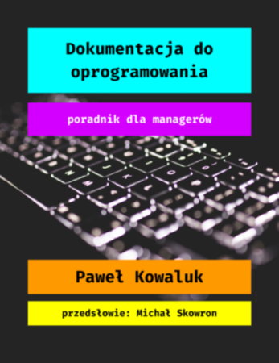

Takie informacje nie pojawiają się często w polskim tech commie. Właśnie ukazała się nowa publikacja pt. "Dokumentacja do oprogramowania. Poradnik dla managerów.", której autorem jest wszystkim dobrze znany Paweł Kowaluk. Tym bardziej cieszy nas fakt pojawienia się tej mini książki, bo jest ona napisana po polsku a do tego dostępna całkowicie za darmo w formacie HTML i PDF.

# Dla kogo jest ten poradnik?

Poradnik został napisany z myślą o osobach, których zadaniem jest kompleksowo zająć się dokumentacją. Chodzi tu zarówno o kierowników zespołów, product ownerów jak i Tech Writerów, którzy są jedynymi specjalistami ds. dokumentacji w swojej organizacji, przez co na ich barkach spoczywa cała odpowiedzialność za tworzenie treści technicznych.

# Co w nim można znaleźć?

Poradnik krótko i zwięźle przedstawia aspekty dokumentacji, które wydają się istotne z punktu widzenia osoby zarządzającej nią w organizacji. Dlatego znajdziecie w nim m.in. informacje na temat kalkulowania opłacalności dokumentacji, analizy potrzeb dokumentacyjnych, organizowania pracy zespołu dokumentacyjnego, mierzenia jakości dokumentacji i narzędzi.

Celem poradnika nie jest uczenie dobrych praktyk pisania tekstów technicznych czy szlifowanie umiejętności językowych. Dlatego nie znajdziecie w nim rozważań na temat przecinka oksfordzkiego czy terminologii.

# Gdzie można go dostać?

Poradnik możecie przeczytać pod tym adresem: [https://pensjonatus.github.io/dokumentacja-do-oprogramowania/](https://pensjonatus.github.io/dokumentacja-do-oprogramowania/)

Dostęp do poradnika jest otwarty i nie wymaga rejestracji ani podawania żadnych danych.

# Kilka słów o autorze

Paweł Kowaluk rozpoczął swoją przygodę z komunikacją techniczną w 2008 roku. W tym czasie pełnił różne role związane z dokumentacją - był Tech Writerem, specjalistą od narzędzi dokumentacyjnych i dyrektorem technicznym. W 2018 powrócił do tego, w czym czuje się najlepiej i został starszym specjalistą ds. dokumentacji w polskim oddziale Guidewire. Na co dzień zajmuje się strategią dokumentacyjną, architekturą informacji, tworzeniem treści oraz angażuje się w projektowanie i wdrażanie narzędzi dla zespołu dokumentacyjnego. Pawła możecie kojarzyć z licznych występów na konferencjach i spotkaniach branżowych, takich jak soap!. Obecnie jest też współtwórcą podcastu "Tech Writer koduje" oraz członkiem zarządu [ITCQF](http://itcqf.org/), organizacji zajmującej się dostarczaniem programów certyfikacyjnych dla specjalistów komunikacji technicznej.

Jeśli chcecie skontaktować się z Pawłem to możecie to zrobić za pośrednictwem jego [profilu na LinkedIn](https://www.linkedin.com/in/pawel-kowaluk/).
