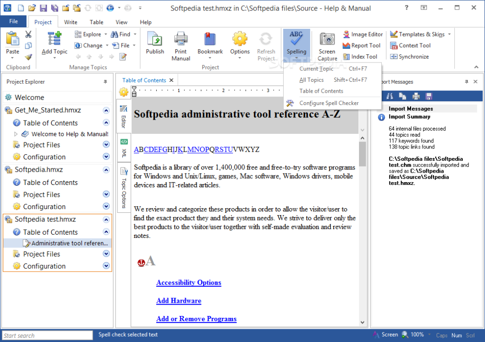
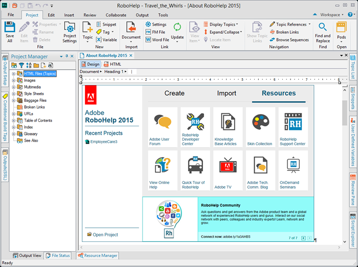

Bieżący rok przyniósł nowe wersje dwóch popularnych narzędzi do tworzenia dokumentacji. Przyjrzyjmy się co ciekawego kryje się pod nowymi "numerkami".

# Help+Manual

 To już siódma wersja narzędzia od firmy EC Software GmbH. Od wydania wersji 6, którą [opisywaliśmy](http://techwriter.pl/help-and-manual-opis-narzedzia/) na łamach techwriter.pl w zeszłym roku, minęło już całkiem sporo czasu - z naszych wyliczeń wynika, że prawie 4 lata. Pierwszą, może nie do końca rzucającą się w oczy zmianą jest mała modyfikacja nazwy - zamiast "&" mamy teraz "+". Druga, dużo bardziej widoczna aktualizacja, to zmiana stylu wstążki na ten znany z MS Office 2013 oraz reorganizacja pewnych opcji. Oprócz takiej kosmetyki, pojawiły się też bardziej istotne usprawnienia.

 _Źródło: www.softpedia.com_

### Nowe formaty publikacji

Wreszcie doczekaliśmy się publikacji projektów do formatu DOCX, który zastąpił niezbyt dopracowany eksport do formatu RTF. Nie ukrywamy, że była to jedna z naszych największych bolączek w trakcie korzystania z wersji 6. Nowy format plików zawiera osadzone obrazki i formatowanie tekstu zgodne z programem Help+Manual. Dodatkowo mamy do dyspozycji szablony, podobne do tych, które dostępne są dla formatu PDF. Są to pliki DOCX, dzięku czemu można je dostosować do swoich potrzeb używając MS Worda. Ciekawe rozwiązanie. W kwestii formatów eksportu, pojawiło się wsparcie dla ePUB 3.0, Amazon Kindle/Mobi, a Windows EXE eBooks został zastąpiony przez nowy format o nazwie EWriter eBooks. Format ten z powodzeniem może zastąpić poczciwy CHM, ponieważ także występuje w formie jednego pliku oraz ma pełne wsparcie dla pomocy kontekstowej, której wywołanie znacznie łatwiej zaprogramować niż w przypadku CHM.

### Lepszy PDF

Żeby tego było mało, format PDF został poddany gruntownym przeróbkom. Wprowadzone zostało wsparcie dla formatu pliku [PDF/A](https://pl.wikipedia.org/wiki/PDF/A) oraz osadzanie czcionek Base 14 Type 1, Type 3 oraz CID. Ponadto, teraz istnieje możliwość wygenerowania dokumentu PDF wraz z komentarzami, co może być przydatne w trakcie korekty. Obrazki PNG zachowują teraz przezroczystość, a obrazki SVG są dołączane natywnie do dokumentu jako grafika wektorowa, o ile jest to możliwe (w innym wypadku grafika jest osadzana jako PNG). Dodatkowo, zostały wprowadzone pewne ulepszenia modułu Manual Designer, który służy do konfiguracji szablonów do publikacji dokumentów PDF. Na przykład pojawiły się nowe opcje podziału strony, które ułatwiają drukowanie dokumentów.

### Rozszerzone wsparcie dla multimediów

Obiekty graficzne oraz wideo skalują się teraz wraz z rozmiarem okna. Nowa opcja, która pozwala na ustawienie przybliżenia proporcjonalnie do szerokości dokumentu, powoduje, że szerokość grafiki lub wideo to ustawiony procent rzeczywistej szerokości wyświetlanego dokumentu. Producenci oprogramowania wprowadzili również wsparcie dla grafiki wektorowej, dzięki czemu do projektów można wstawiać pliki SVG tak samo jak inne formaty graficzne. Oprócz tego, można wstawiać filmy z serwisów YouTube, Vimeo oraz Prezi, które następnie są osadzane w ramce iFrame.

### Nowe opcje kontroli wersji

Oprócz dostępnej już w wersji 6 integracji z [SVN](https://pl.wikipedia.org/wiki/Subversion) oraz [Microsoft Visual SourceSafe](https://en.wikipedia.org/wiki/Microsoft_Visual_SourceSafe), w nowej wersji zostało wprowadzone wsparcie dla [MS Team Foundation Server](https://www.visualstudio.com/pl-pl/products/tfs-overview-vs.aspx). Twórcy oprogramowania zadbali również o użytkowników, którzy nie korzystają z żadnego systemu kontroli wersji. Mają oni teraz dostęp do wszystkich poprzednich wersji poszczególnych rozdziałów, dzięki czemu mogą cofnąć zmiany do wcześniejszej wersji w dowolnym momencie.

  Więcej informacji na temat programu możecie uzyskać na stronie [produktu](http://www.helpandmanual.com/index.html). Możecie tam również znaleźć 30-dniową, darmową wersję próbną programu, którą można ściągnąć z sekcji [Free Trial](http://www.helpandmanual.com/downloads.html), bez potrzeby tworzenia konta lub podawania danych. Po prostu klikamy, ściągamy, instalujemy i testujemy. Tak jak być powinno :)

# RoboHelp

 Konkurencja nie śpi. W obozie Adobe także nastąpiły zmiany w kwestii oprogramowania do tworzenia dokumentacji. Tutaj również pojawiła się modyfikacja nazwy produktu, wynikająca ze zmiany polityki firmy dotyczącej oznaczania wersji - teraz będzie to rok, zamiast numeru wersji. Dlatego nowa wersja RoboHelpa nosi oznaczenie 2015, a nie 12.

 _Źródło: www.techwhirl.com_

### Nowy interfejs

Mocno archaiczny wygląd aplikacji z wersji 11 został zastąpiony popularną w ostatnich latach wstążką. Jest to całkiem spora zmiana, więc starzy wyjadacze będą zapewne musieli poświęcić chwilę na opanowanie nowego interfejsu. Ciekawą rzeczą jest brak zakładki Help. Dość osobliwa sprawa biorąc pod uwagę, że jest to program do tworzenia pomocy ;)

### Ulepszone formaty publikacji

Format HTML5 został dopieszczony. Teraz bardziej przypomina wyglądem aplikację webową lub mobilną. Dodano dwa nowe motywy o nazwie Azure Blue i Charcoal Grey, które są krokiem naprzód w porównaniu do RH 11 jeśli chodzi o użyteczność i możliwość zmian w konfiguracji. Nowe motywy to nie tylko nowy wygląd, ale też lepsze wyszukiwanie. Zamiast nazwy znalezionego tematu, dostajemy ścieżkę w formacie menu nawigacyjnego (breadcrumb). Ponadto, można teraz kontrolować tekst jaki pojawia się w podglądzie wyszukanego tematu. Nowy format HTML5 ma również więcej opcji konfiguracji. Można teraz zdecydować, kiedy wygląd ma się przełączać pomiędzy trybem dla komputerów i urządzeń mobilnych (breakpoints). Cieszy również możliwość wyłączenia spisu treści, indeksu, glosariusza oraz filtra w generowanym dokumencie.

Według nas jedną z największych poprawek jest naprawa problemu ze spisem treści, który występował w formacie HTML5 bodajże od wersji 10. Otrzymał on od nas kryptonim "Disco TOC" i napsuł nam trochę krwi. Prawdopodobnie nie znajdziecie takiej informaji w żadnej recenzji, dlatego śpieszymy z wyjaśnieniem problemu. Po wygenerowaniu do formatu HTML5 projektu, do którego zostały dołączone inne projekty (merged projects) pojawiał się problem ze spisem treści. Klikając na jakiś temat w dołączonym projekcie, zaznaczenie przeskakiwało na losowy temat, który był częścią głównego projektu. Kiedy zaczynaliśmy dość szybko klikać po tematach w spisie treści, następowało swoiste zapętlenie - zaznaczenie skakało samoistnie po tematach, co powodowało efekt migotania, stąd też wspomniany kryptonim :) Po kontakcie ze wsparciem technicznym Adobe okazało się, że nie da się rozwiązać tego problemu w wersji 11. Nie ma też na to żadnego obejścia. Jedyna możliwość pozbycia się problemu to aktualizacja do wersji 2015.

### Dynamiczne filtrowanie treści

W poprzedniej wersji RoboHelpa jedyną możliwością wyłączenia lub włączenia pewnych elementów w treści dokumentu było użycie znaczników warunkowych (conditional tags). Podczas generowanie dokumentu można było zadecydować, które znaczniki mają być uwzględnione w dokumencie. Miało to jedną wadę - wygenerowany dokument był statyczny i nie dało się już "włączyć" z powrotem treści, która została pominięta. W nowej wersji RoboHelpa pojawiła się opcja dynamicznego filtrowania, która pozwala na wyświetlanie lub ukrywanie treści w opublikowanym dokumencie. Co więcej, filtry mogą być widoczne lub ukryte dla użytkowników. Dzięki temu możemy sami decydować jaką treść chcemy pokazywać poszczególnym odbiorcom lub dać im możliwość samodzielnego filtrowania. Dobrą wiadomością jest też to, że nowa funkcja korzysta ze wspomnianych wcześniej znaczników warunkowych. Dzięki temu aktualizacja do nowej wersji powinna być bezproblemowa - wystarczy włączyć dynamiczne filtry i skorzystać z już istniejących znaczników.

### Zrób sobie aplikację

W nowej wersji, RoboHelp umożliwia eksport projektów do natywnych aplikacji dla Androida i iOS. Taka możliwość istniała już niby w poprzedniej wersji, jednak trzeba było się sporo napocić, żeby wszystko zaczęło działać. RoboHelp 2015 pozwala nam działać od razu, bez instalowania żadnego dodatkowego oprogramowania.

  Więcej informacji na temat programu możecie uzyskać na stronie [produktu](http://www.adobe.com/products/robohelp.html?promoid=DJDXG). Możecie tam również znaleźć darmową wersję próbną programu, którą można ściągnąć z sekcji [Free Trial](https://www.adobe.com/cfusion/tdrc/index.cfm?product=robohelp&loc=en). Niestety wymagane jest posiadanie konta (Adobe ID).

Polecamy również [recenzję aplikacji](http://techwhirl.com/product-review-robohelp-2015-release/) przygotowaną przez [TechWhirl](http://techwhirl.com/).

Jeśli macie jakieś doświadczenia związane z używaniem opisanych aplikacji, zostawcie po sobie ślad w komentarzach albo piszcie na [kontakt@techwriter.pl](mailto:kontakt@techwriter.pl).
