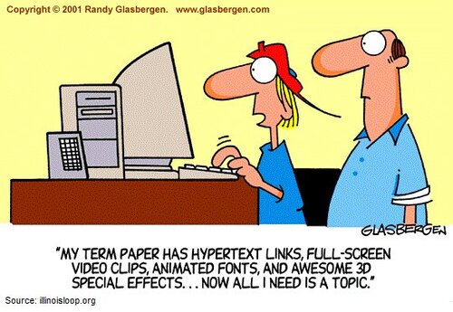
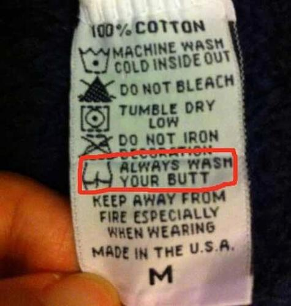

Z okazji zbliżających się Mikołajek mamy dla Was coś z przymrużeniem oka. W
pierwszym półroczu pisaliśmy o
[dokumentalistach w kulturze masowej](http://techwriter.pl/dokumentalisci-w-kulturze-masowej/).
Dzisiaj po części kontynuujemy ten wątek, jednak postanowiliśmy poszerzyć trochę
zakres poszukiwań. Tym razem skupiliśmy się na wątku dokumentacyjnym w wydaniu
humorystycznym w jakiejkolwiek formie.

<!--truncate-->

### Coś dla fanów humoru rysunkowego

Społeczność
[Adobe Technical Communications Group](https://web.facebook.com/adobetcs/) na
swoim profilu na Facebooku posiada ciekawy
[zbiór krótkich komiksów](https://web.facebook.com/media/set/?set=a.288192837885201.62726.208757605828725&type=3)
przedstawiających naszą profesję w krzywym zwierciadle. Najbardziej spodobała
nam się poniższa historyjka.

_Źródło: https://web.facebook.com/adobetcs/_

Szkoda, że galeria już od dawna nie jest aktualizowana.

### Kilka nietuzinkowych instrukcji

Na blogu [Technical Writing ToolBox](http://technicalwritingtoolbox.com/) w
kategorii [humor](http://technicalwritingtoolbox.com/category/humor/) możecie
znaleźć kolejne śmieszne przykłady związane z dokumentacją. Dla nas numero uno
to zdecydowanie przedstawiona poniżej metka.

_Żródło: http://technicalwritingtoolbox.com/_

### Byle nie przesadzić

Jeśli nie do końca wiecie na jaką ilość humoru może sobie pozwolić pisząc
dokumentację, to polecamy zapoznać się z pracą magisterską pana Davida Robertsa
zatytułowaną
["The Ethos of Humor in Technical Communication"](http://etd.fcla.edu/CF/CFE0004920/David_Roberts_Thesis.pdf).
Jest całkiem "świeża", bo została napisana w 2013 roku. Poniżej przedstawiamy
skrót pracy w wersji oryginalnej.

> Within the realm of technical communication, humor has often been regarded as
> an unnecessary or risky rhetorical device that can negatively impact the
> credibility of a document. While many other professional fields, such as
> medicine, computer technology fields, or business have used humor, and humor
> continues to crop up in “user as producer” documentation, technical writing
> continues to approach humor cautiously and with little theoretical guidance.
> In order to fully understand how humor functions, it is important to
> understand the main theories of humor: superiority, relief, and incongruity.
> It is also important to understand how humor functions, by looking at Meyer’s
> four functions of humor: identification, clarification, enforcement, and
> differentiation. Some primary and secondary manuals have successfully used a
> rhetorical strategy incorporating humor. Google uses a persona and situated
> ethos that projects a sense of fun and humor, and incorporates some humor into
> their documentation. The "For Dummies" series is well known and recognized for
> the situated ethos of providing fun, entertaining direction, while individual
> authors choose a specific invented ethos for each book written. The three
> theories of humor and four functions of humor can be applied to humor used in
> Google and "For Dummies". This demonstration better highlights how humor
> operates and functions in communication, and can provide technical
> communicators with a tool to use when considering the application of humor in
> documentation. The application further highlights the need for greater
> understanding of how humor affects the credibility and success of
> documentation.

### Dokumentaliści - niedocenieni bohaterowie

Temat stary jak dowcipy z
["Klubu Masztalskiego"](http://lubimyczytac.pl/ksiazka/173272/klub-masztalskiego-1000-dowcipow).
Dokumentaliści nigdy nie byli na świeczniku, przeważnie pozostawali w cieniu
swoich kolegów programistów, którzy "spijali śmietankę" z sukcesu odniesionego
przez produkt. Ktoś postanowił zmienić ten stan rzeczy i stworzył swego rodzaju
panegiryk o wdzięcznym tytule
["Technical Writers - the Unsung Heroes"](https://thwack.solarwinds.com/community/solarwinds-community/geek-speak_tht/blog/2013/03/25/technical-writers--the-unsung-heroes).
Najciekawszą rzeczą jakiej można się z niego dowiedzieć jest fakt, że istnieje
pieśń (no dobra, piosnka) pochwalna na cześć dokumentalistów. Enjoy responsibly!

https://youtu.be/WiptajAc3VI

### Instrukcja w stylu Brzechwy

Nie do końca jesteśmy sobie w stanie wyobrazić instrukcję obsługi komputera
napisaną przez autora "Kaczki dziwaczki" z zachowaniem tej samej konwencji. Ale
za to udało nam się znaleźć wiersz napisany ku pamięci
[Dr. Seussa](https://pl.wikipedia.org/wiki/Theodor_Seuss_Geisel), amerykańskiego
autora książek dla dzieci, który nosi tytuł
["What If Dr. Seuss Did Technical Writing?"](http://www.humorbin.com/showitem.asp?item=341).

> If a packet hits a pocket on a socket on a port, And the bus is interrupted as
> a very last resort, And the address of the memory makes your floppy disk
> abort, Then the socket packet pocket has an error to report!   If your cursor
> finds a menu item followed by a dash, And the double-clicking icon puts your
> window in the trash, And your data is corrupted 'cause the index doesn't hash,
> Then your situation's hopeless, and your system's gonna crash!   If the label
> on the cable on the table at your house, Says the network is connected to the
> button on your mouse, But your packets want to tunnel on another protocol,
> That's repeatedly rejected by the printer down the hall, And your screen is
> all distorted by the side effects of gauss So your icons in the window are as
> wavy as a souse, Then you may as well reboot and go out with a bang, 'Cause as
> sure as I'm a poet, the 'puter's gonna hang!   When the copy of your floppy's
> getting sloppy on the disk, And the microcode instructions cause unnecessary
> RISC, Then you have to flash your memory and you'll want to RAM your ROM.
> Quickly turn off the computer and be sure to tell your mom!

Ktoś chętny przełożyć na trzynastozgłoskowca? 😉

### Czym skorupka za młodu...

Pozostajemy w temacie najmłodszych odbiorców. Okazuje się, że nawet bajka o
rodzinie świnek może pokazywać jak ważna jest dokumentacja. W jednym z odcinków
rodzice zamawiają przez internet dla swoich dzieci nową szafkę na zabawki.
Zostaje ona dostarczona do domu świnek w elementach, a w środku nie ma
instrukcji ([link do tego fragmentu](https://youtu.be/yDkGlKWJUM0?t=130)).
Świnki zakładają, że złożenie szafki musi być niezwykle proste, dlatego zapewne
instrukcja nie została dołączona. Jak można przewidzieć, bardzo się pomyliły 😊
Po chwili wraca doręczyciel przesyłki z brakującą instrukcją
([link do tego fragmentu](https://youtu.be/yDkGlKWJUM0?t=202)). Jednak to nie
rozwiązuje problemu, ponieważ jest ona zbyt skomplikowana i świnki nadal nie
mogą sobie poradzić ze złożeniem szafki. Kończy się na tym, że doręczyciel
przesyłki składa szafkę w zamian za herbatę i ciasteczka, ponieważ ma w tym
doświadczenie i potrafi to zrobić bez instrukcji. Jak widać, sporo dobrze
znanych prawd na temat tworzenia dokumentacji zostało przemyconych w tym krótkim
odcinku:

- Produkt bez dokumentacji jest słabo używalny.
- Dokumentacja musi być napisana w sposób zrozumiały dla użytkownika, który nie
  zna produktu.
- Dobra dokumentacja odciąża wsparcie techniczne klienta.

Poniżej możecie obejrzeć cały odcinek bajki. W tym czasie my bierzemy na tapetę
Boba Budowniczego, Listonosza Pata i Hello Kitty. Mamy podejrzenie, że świnki to
tylko wierzchołek góry lodowej 😉

https://www.youtube.com/watch?v=yDkGlKWJUM0

### Promocja przede wszystkim

Materiały wideo zachwalające nowe funkcje oprogramowania to powszechna praktyka
stosowana przed producentów. Ale czy kiedykolwiek widzieliście filmik promujący
nową, ulepszoną wersję dokumentacji? My osobiście nie... aż do wczoraj. Dzięki
uprzejmości naszych czytelników mamy możliwość zaprezentowania Wam jedynego
(jaki znamy) filmiku promującego owoce ciężkiej pracy Tech Writerów. Zapraszamy
na krótki seans - przygotujcie popcorn i colę, włączcie głośniki i usiądźcie
wygodnie. Jest to produkcja raczej niskobudżetowa, dlatego okulary 3D nie będą
potrzebne 😉

https://youtu.be/wMOtjn0OCLk

Mamy nadzieję, że materiał, który udało nam się zebrać dał Wam chwilę
wytchnienia od myślenia nad "kontentem" i że teraz z jeszcze większym zapałem
zabierzecie się do pracy. Jeśli macie w zanadrzu jakieś inne przykłady humoru
dokumentacyjnego, to koniecznie dajcie nam znać.
