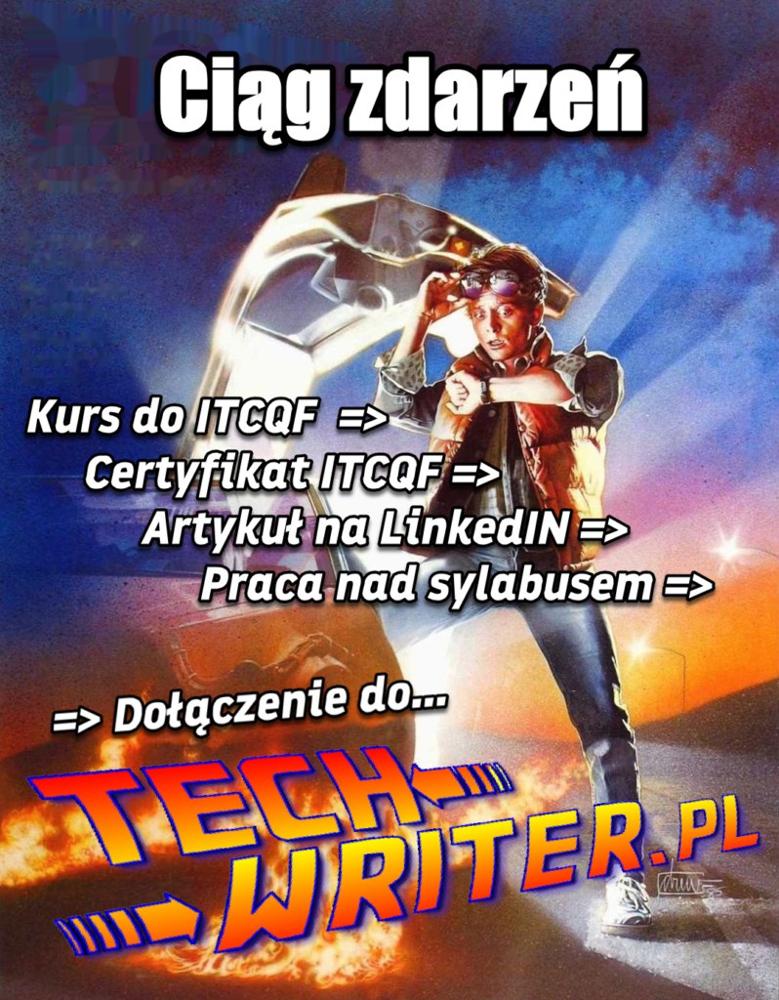

Pozwólcie, że opowiem Wam jak przebiegały początki mojej zawodowej podróży i jak
to się stało, że trajektoria lotu zmieniła się z destynacji „Tłumacz” na
„Technical Writer”. Myślę, że artykuł może być pomocny osobom rozważającym
podobną ścieżkę kariery. Dla reszty: zapraszam do zapoznania się z zapiskami
moich doświadczeń.

<!--truncate-->

# Studia na filologii angielskiej

Bardzo dobrze wspominam studenckie lata – nie żałuję wyboru kierunku. Od dawna
uczenie się języka angielskiego sprawiało mi wielką radość, a same studia
pozwoliły mi zapoznać się z wieloma aspektami tej dziedziny. Spośród
zróżnicowanych tematów zajęć szczególnie ceniłem te, które dotyczyły
translatoryki pisemnej i ustnej.

Byłem pod wielkim wrażeniem wykładowców przybliżających tajniki warsztatu
tłumacza. W idealnym przypadku jest to osoba swobodnie poruszająca się w
kontekstach dwóch kultur, potrafiąca wychwycić istotne niuanse przekazu, która w
kreatywny sposób opracowuje przekład z zachowaniem niezbędnej treści w formie
skrojonej pod odbiorcę końcowego.

Doskonaliłem moje umiejętności, by stać się jak najlepszym tłumaczem - wiązałem
z tym zajęciem duże nadzieje. Na studiach często zadawano nam pytania: „Czy coś
jest przetłumaczalne?”, "Jakie są granice możliwości przekładu?” – odpowiedzi
chciałem odnaleźć w praktyce. Zdecydowałem się specjalizować w tekstach
użytkowych, a nie w literaturze pięknej.

# Projekty

Początkowo wykonywałem rozmaite zadania w ramach wolontariatu dla organizacji
pozarządowych. Nie narzekałem na różnorodność tematów: od tłumaczenia ustnego
podczas warsztatów dla sprzedawców wierteł dentystycznych po przekład tekstu o
ekonomii polskich folwarków z XVII wieku. Nigdy nie zapomnę tłumaczenia ustnego
podczas serii warsztatów gdzie zagraniczni trenerzy prowadzili program
edukacyjny wspierający osoby chorujące psychicznie, ich rodziny i terapeutów.
Było to wzbogacające doświadczenie zarówno z punktu widzenia warsztatowego, jak
i osobistego.

Często otrzymywałem zlecenia na tłumaczenie stron internetowych. Jednak do
najciekawszych wyzwań należała seria książek o treningu siłowym i pływaniu. Był
czas, że na wyrywki znałem łacińskie i angielskie określenia głównych grup
mięśni, bo każda z tych książek zawierała uproszczony atlas anatomiczny. Nie
zapomnę chwili, w której mój wydawca w ostatnim momencie zdecydował się na druk
książki o kulturystyce w bardzo dużym formacie – jak otrzymałem siedem
egzemplarzy po wywiązaniu się z umowy, ciężko to było dźwignąć. Wydało mi się to
ironiczne, biorąc pod uwagę, że były to książki o podnoszeniu ciężarów.

#####  `Pod ciężarem woluminów tej książki` `tłumacz zachwiał się, ale nie runął. Tygodnie tłumaczenia o podnoszeniu ciężarów nie poszły na marne.`

Najciekawszym tytułem przy jakim przyszło mi pracować był podręcznik treningu
siłowego niewymagającego użycia przyrządów o wdzięcznej nazwie _Nagi Wojownik._

Ostatnią książką jaką przetłumaczyłem była encyklopedia zdrowia z której
dowiedziałem się o wielu symptomach i jednostkach chorobowych. Z pomocą lekarza
w rodzinie i Wikipedii jakoś udało się doprowadzić projekt do końca 😉

# Rzeczywistość po dyplomie

Sporym rozczarowaniem było dla mnie to, że zaraz po studiach nie udało mi się
znaleźć stałego i ciekawego zajęcia w roli tłumacza. Otrzymywałem sporadyczne
zlecenia z przeciętną stawką i zwykle w najgorszym możliwym terminie, np.: trzy
dni przed majówką.

Próbując się gdzieś zaczepić na stałe, wykonałem wiele tekstów próbnych dla
różnych agencji tłumaczeniowych. Wymagało to sporego wysiłku a głównym efektem
było to, że dodano mnie do wielu baz danych tłumaczy, co nie przełożyło się na
liczbę zleceń. Konkurując z liczną rzeszą innych osób znających ten język,
ciężko było się wyróżnić. Miałem epizod z nauką narzędzi CAT, które wspierają
tłumaczy, zwłaszcza tych ze specjalności informatycznej. Próbowałem wgryźć się w
dziedzinę IT, ale trafiałem na tak zaawansowane teksty, że bez znajomości
opisywanego narzędzia i tematyki wykonanie zadania zajmowało bardzo dużo czasu.
Moje kontakty ze zleceniodawcą ograniczały się do wymiany maili o zleceniu i
terminie wykonania. Nie odpowiadał mi brak relacji z współpracownikami. Po
wykonaniu jednego zadania przychodził mail o następnym i tak w koło Macieju (w
tym wypadku Andrzeju). Były to słabe warunki do nauczenia się nowych rzeczy. Do
tego doskwierały mi pustelnicze klimaty samotnego przekładacza treści 😊.

Z perspektywy czasu patrząc podejrzewam, że moja strategia poszukiwań mogła być
nieoptymalna, a może zwyczajnie miałem pecha. Tak czy inaczej, nie znalazłem
zadowalającej pracy ani na etat, ani jako wolny strzelec. W pewnym momencie
zmieniłem definicję upragnionej pozycji z "tłumacz" na "stanowisko wymagające
biegłej znajomości języka Szekspira".

Zacząłem szukać ofert pracy bez słowa „tłumacz” w tytule, skupiając się na
rolach wymagających biegłej znajomości języka. Trafiłem na ofertę firmy TomTom i
pomyślałem: „_niezła oferta, pewnie nie przyjmą mnie z racji małego obycia z IT,
ale muszę spróbować!_”. Na tamtym etapie nie słyszałem wcześniej określenia
„tech writer” czy „specjalista ds. dokumentacji”. No i udało się! Postawiłem
pierwsze ekscytujące kroki nie mogąc narzekać na brak kontaktów z ludźmi, bo
dużo współpracowałem z programistami i całym zespołem dokumentacji.

# Co ułatwiło mi przejście?

Pierwsze kroki w dziedzinie geograficznych systemów informatycznych nie należały
do najprostszych. Szczęśliwie, w firmie panowała koleżeńska atmosfera, każdy
kolega programista chętnie pomagał z kwestiami sprzętowymi i instalacyjnymi.
Zacząłem od czytania dostępnej dokumentacji, opisów procesów i prezentacji
przybliżających tematykę tworzenia map.

Na wstępie, moim atutem była znajomość języka. Szybko stałem się adresatem
rozmaitych pytań językowych (co utrzymuje się po dziś dzień 😊). Jest to dobry
sposób na nawiązywanie kontaktów. Ponieważ dobra karma wraca, osoby którym
pomożesz chętnie odwdzięczają się w późniejszym terminie.

Następnym atutem tłumacza, który działał na moją korzyść było to, że byłem
przyzwyczajony ustalać dla kogo piszę, co ten tekst powinien zawierać i w jakim
stylu powinien być napisany. Różnica była tylko taka, że zamiast tłumaczyć
gotowy tekst z jednego języka na drugi, tutaj byłem obecny przy tworzeniu
instrukcji od początku. Materiał opracowywałem na bazie informacji
przekazywanych ustnie przez inżynierów. Było to nie tylko tłumaczenie z
polskiego na angielski, ale też tłumaczenie z przepełnionego żargonem,
hermetycznego „dialektu” programistów na język anglojęzycznych instrukcji,
zrozumiałych nawet dla osób bez wiedzy programistycznej, które najczęściej nie
były „native speakerami” języka angielskiego. W późniejszych latach częściej już
tłumaczyłem z „programistycznego angielskiego” na „angielski zrozumiały dla
użytkownika wewnętrznych narzędzi w firmie”.

Ostatnim aspektem jaki dobrze znałem z tłumaczeń było skupienie na odbiorcy. Tu
również musiałem mieć na uwadze przystępność tekstu dla grupy docelowej. Zarówno
tłumacz, jak i tech writer podejmują dodatkowy wysiłek, by upewnić się, że
odbiorca otrzyma poprawne treści i jego racje będą dobrze reprezentowane. Pisarz
techniczny nie tylko dba o jakość instrukcji – może również wpływać na
doświadczenia użytkownika sugerując ulepszenia interfejsu czy wyłapując błędy w
działaniu aplikacji.

# Różnice między tłumaczeniem a tworzeniem dokumentacji

Jak najbardziej szanuję wysiłki tłumaczy, sam w końcu byłem jednym z nich.
Porównując proces pracy tłumacza (freelancera) i tech writera nasunęły mi się
następujące spostrzeżenia:

|                                                                     | Tradycyjne tłumaczenie pisemne                                                                                              | Tworzenie dokumentacji                                                                                                                                                                                                                                          |
| ------------------------------------------------------------------- | --------------------------------------------------------------------------------------------------------------------------- | --------------------------------------------------------------------------------------------------------------------------------------------------------------------------------------------------------------------------------------------------------------- |
| Kreatywność                                                         | Tłumacz podąża za oryginałem, wykazuje się inwencją atakując problemy tłumaczeniowe na różne sposoby.                       | Tech writer współtworzy treść, definiuje strukturę i użyte środki wyrazu. Skupia się na tworzeniu komunikatywnego przekazu.                                                                                                                                     |
| Współpraca z autorem materiału źródłowego                           | Najczęściej brak                                                                                                            | Współpraca z ekspertem, współtworzenie treści.                                                                                                                                                                                                                  |
| Niejasności w materiale źródłowym                                   | Tłumacz musi sam odpowiedzieć na pytanie „Co autor miał na myśli?”.                                                         | Nie dotyczy, bo tekst jest tworzony od zera.                                                                                                                                                                                                                    |
| Znajomość kontekstu                                                 | Czasem jest niewystarczająca, szczególnie gdy tłumaczysz pojedyncze słowa i ciągi wyrazów używane w witrynie czy aplikacji. | Kontekst projektu jest znany wśród uczestników procesu. Może wystąpić problem z klarownością wymagań.                                                                                                                                                           |
| Kontakt z odbiorcą końcowym                                         | Brak                                                                                                                        | Często jest to niemożliwe, choć zdarzają się projekty, gdzie odbiorca końcowy dzieli się uwagami o materiale lub bezpośrednio współpracuje z tech writerem.                                                                                                     |
| Nieprzewidziane wydarzenia w procesie wpływające na pracę           | Proces jest stabilny i przewidywalny.                                                                                       | W świecie metodyk zwinnych, tech writer wykazuje się elastycznością.                                                                                                                                                                                            |
| Potrzeba dokładnego planowania i synchronizowania się z organizacją | Tłumacz odpowiada za terminowe wykonanie własnej pracy. W mniejszym stopniu związany jest z innymi uczestnikami procesu.    | Tech writer dostosowuje się do szerszego planu rozwoju produktu i jego wdrożenia. Sytuacja bywa dynamiczna. Zdarzenia na różnych etapach procesu potrafią zaburzyć plany dotyczące dokumentacji. Praca tech writera mocno zależy od innych uczestników procesu. |

Posługuję się tu uproszczeniami na bazie własnych doświadczeń i nie twierdzę, że
każdy tłumacz czy technical writer pracuje w opisany sposób.

Podsumowując, dla mnie dużym plusem jest to, że w optymalnym wariancie "techno
skryba" jest zaangażowany w proces twórczy już na wczesnym etapie, podczas gdy
tłumacz wkracza dopiero po stworzeniu oryginału. Tech writer jest bliżej centrum
wydarzeń i jest współautorem tworzonego materiału, zazwyczaj nie musi stosować
się do z góry narzuconej formy. Choć posługuje się szablonami, ma dużą autonomię
w zakresie projektowania materiału. Wyzwaniem dla tech writera może być
wpasowanie się w tryby machiny, w ramach której tworzona jest dokumentacja, co
na początku może być stresujące. Z drugiej strony, jest to okazja dowiedzenia
się czegoś o zarządzaniu projektami.

# Czego musiałem się nauczyć?

Podczas rozmowy rekrutacyjnej wskazano mi obszar, który potrzebowałem zgłębić:
zdolność do myślenia w kategoriach procesu. Chodzi o to, by być w stanie rozbić
ciąg czynności na poszczególne kroki, zdefiniować ich wykonawców, wyrysować
ścieżki, jakimi proces może podążać, uwzględnić bramki decyzyjne, itp.
Potrzebowałem też zagłębić się w domenę, poznać proces tworzenia elektronicznych
map, żeby odnieść opisywane narzędzie do całości rozbudowanego procesu.

Z pomocą mentorów poznałem podstawy rzemiosła: z jakich elementów składa się
podręcznik użytkownika (_tool manual_), jakie informacje powinny tam trafić i
jaki powinien być ich poziom szczegółowości, jak opracować odpowiednią strukturę
i czym różni się taki dokument od prezentacji e-learning.

Musiałem dostosować styl w jakim tworzyłem materiały. Na studiach pisałem
akademickie elaboraty z rozbudowanymi zdaniami i wyrafinowanym słownictwem. W
nowym kontekście potrzebowałem pisać proste komunikaty z precyzyjnie użytą
terminologią, wspierając to odpowiednimi ilustracjami. Od jednej z mentorek
językowych nauczyłem się rozbijania zdań na krótsze. Owa mentorka otrzymała
kiedyś od jednego ze swoich uczniów statuetkę złotej siekierki - atrybutu kogoś
kto bezbłędnie dzieli zdania na krótsze 😉.

Oprócz tego, ważna jest znajomość procesu tworzenia dokumentacji - od otrzymania
wymagań lub zlecenia po wydanie gotowej treści. Każdy zespół ma swoją
metodologię, narzędzia i repozytoria, które należy poznać. Bardzo ważnym
elementem jest recenzowanie materiału zarówno pod względem poprawności
technicznej, jak i językowej. Po dziś dzień mam nawyk pokazywania wszystkiego co
napiszę drugiej parze oczu.

Wskazana była też nauka asertywności i dobrej komunikacji, bo zdarzały się
przypadki, że nie otrzymywałem obiecanej informacji zwrotnej od programistów, a
kwestia wsparcia dokumentacji była odkładana na później. Prosząc o recenzję
materiału lub odpowiedź na pytanie techniczne, zacząłem podawać terminy w jakich
potrzebuję reakcji. Egzekwowanie tych dat zaczęło przynosić rezultaty, a
współpracownicy też nauczyli się uwzględniać czas na wspieranie dokumentacji w
swoim harmonogramie.

# Ciąg dalszy

W przeciągu dalszych lat nie narzekałem na brak wyzwań na nowym poletku, m.in.:

- Przejście od centralnego zespołu dokumentacyjnego do przypisania technical
  writera do konkretnej grupy tematów.
- Wdrażanie nowych członków zespołu.
- Duże zmiany w opisywanych systemach.
- Tworzenie specyfikacji dla map stosowanych w pojazdach autonomicznych.
- Praca zdalna z powodu pandemii.

Na liście osiągnięć nie może zabraknąć uzyskania certyfikatu z wiedzy o ITCQF -
standardzie w dziedzinie dokumentacji technicznej. Po ukończeniu szkolenia i
zdaniu egzaminu napisałem mój pierwszy, anglojęzyczny artykuł na LinkedIN
([ITCQF certification: was it worth it?](https://www.linkedin.com/pulse/itcqf-certification-worth-andrzej-niewiarowski)),
który zwrócił uwagę Darka - współtwórcy tego standardu i redaktora naczelnego
Techwriter.pl. Darek zauważył moje zainteresowanie ITCQF (załączam link do
mojego artykułu:
[Perły z Sylabusa ITCQF](http://techwriter.pl/perly-z-sylabusa-itcqf/)) i chęć
do przelewania myśli na papier. W rezultacie, przyczyniłem się do uładzenia
kilku kwestii językowych w sylabusie do kursu przygotowawczego i dołączyłem do
sympatycznej redakcji Techwriter.pl, podejmując wyzwanie pisania w tym jakże
trudnym języku, jakim jest polski. Teraz wymieniam uwagi z utalentowanymi
ludźmi, trzymam rękę na pulsie branży, moja świadomość tej społeczności stale
się poszerza i mam okazję brać udział w ciekawych inicjatywach.

##### `Gdyby nie to jedno zdarzenie, nie byłoby mnie tu gdzie teraz jestem. Sprawdź dokąd certyfikat ITCQF doprowadzi w przyszłości Ciebie.`

Krótko mówiąc, wybór kursu do ITCQF był brzemienny w skutkach. Nie tylko
zdobyłem użyteczną wiedzę ale i zyskałem możliwość poszerzenia sieci kontaktów,
mam też przestrzeń do kreatywnej ekspresji. Gdyby nie ta jedna decyzja,
ominęłoby mnie wiele dobrych rzeczy 😊

# Podsumowanie

W międzyczasie, wciąż zdarza mi się przyjmować zlecenia tłumaczeniowe i w głębi
duszy nadal czuję się tłumaczem. Esencją mojej pracy pozostaje budowanie
porozumienia między twórcami produktu i jego odbiorcami. Różnicę stanowią tylko
kontekst i specyficzne kompetencje jakie dodatkowo musiałem posiąść.

Często z nostalgią wspominam czasy, kiedy intensywnie tłumaczyłem. Ciekaw jestem
jak bardzo zmieniła się dziedzina tłumaczeń i lokalizacji od czasu, w którym
postanowiłem poszukać swej ścieżki gdzie indziej.

Jestem przekonany, że świat tłumaczeń i tworzenia dokumentacji, z którą jestem
zawodowo związany, mocno się zazębiają. Wskazuje na to ankieta jaką
przeprowadziłem kiedyś na łamach LinkedIN:

W wielu przypadkach ta sama osoba może przygotowywać instrukcje i samodzielnie
przeprowadzać ich lokalizację lub przygotowywać je pod tłumaczenie maszynowe.
Dla wielu produktów tłumaczenie instrukcji i etykiet w interfejsie jest
nierozerwalnie splecione z procesem rozwijania i wydawania produktu.

Wniosek z tego jest taki, że osoba specjalizująca się w tłumaczeniach może z
powodzeniem odnaleźć się w tworzeniu dokumentacji, czego jestem żywym
przykładem. Gdyby ktoś na studiach zapytał mnie o zainteresowanie pisarstwem
technicznym to raczej nie miałbym zdania, bo miałem wtedy niewielką świadomość
tej dziedziny.

Życie pisze zaskakujące scenariusze. Choć nie zostałem tłumaczem, nie żałuję, że
moja kariera poszła nieco innym torem. Miałem okazję pracować przy nowych
technologiach w dynamicznych, międzynarodowych zespołach, rozwijając wiele
ciekawych kompetencji i kreatywnie rozwiązując napotkane problemy. Nie
przekreśla to moich wcześniejszych dokonań tłumaczeniowych, z których pozostaję
dumny.

Jeśli intryguje Cię podobny manewr, zapraszam do kontaktu, chętnie odpowiem na
Twoje pytania.

Być może działasz już jakiś czas w tłumaczeniach i masz ochotę poznać nowy
rewir. Znajdź dobrego mentora, poznaj podstawy Scrum i Agile, dowiedz się czegoś
na temat rozwoju oprogramowania i pracy programisty. Sprawdź co świat technical
writingu ma do zaoferowania dla Ciebie 😊
