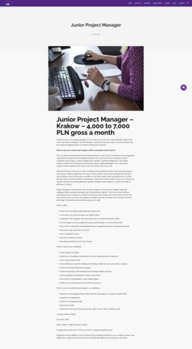

Wakacje dobiegają końca, a może ktoś myśli o zmianie pracy? Tym razem ogłoszenie
znowu z Krakowa.

<!--truncate-->

[3di Polska](http://3di.com.pl/) poszukuje osoby na stanowisko Junior PM na
dwuletni kontrakt. Poszukiwana jest osoba z doświadczeniem w komunikacji
technicznej lub tłumaczeniach.

Szczegółowe informacje dotyczące oferty pracy znajdziecie poniżej (kliknijcie w
obrazek, żeby go wyświetlić w pełnej rozdzielczości)
albo [bezpośrednio u źródła](http://3di.com.pl/junior-project-manager/) (w
pełnej krasie graficznej i z przyciskiem do aplikowania). Aplikować możecie też
poprzez wysłanie swojego CV na adres
[employment@3di.com.pl](mailto:employment@3di.com.pl).

Powodzenia!

