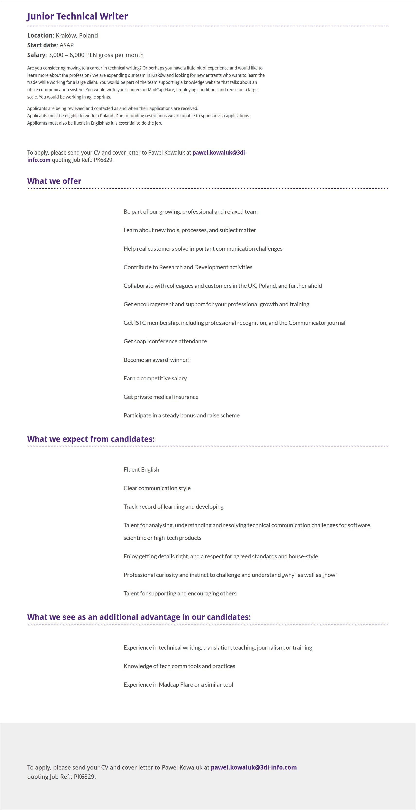

Tym razem oferta w Krakowie, dla osób rozpoczynających przygodę z pisaniem dokumentacji.

Krakowski oddział [3di](http://3di.com.pl/) powiększa się, w związku z tym firma poszukuje Junior Technical Writera. Oferta skierowana jest do osób z niewielkim doświadczeniem w tworzeniu dokumentacji lub takich, które dopiero chcą rozpocząć swoją przygodę z komunikacją techniczną. Warto wspomnieć, że w ogłoszeniu znajdziecie widełki płacowe, co nadal jest rzadkością w naszym kraju.

Szczegółowe informacje dotyczące tej oferty znajdziecie poniżej (kliknijcie w obrazek, żeby go wyświetlić w pełnej rozdzielczości) albo [bezpośrednio u źródła](http://3di.com.pl/junior-technical-writer/) (w pełnej krasie graficznej i z informacją jak aplikować).

Aplikować można poprzez wysłanie CV i listu motywacyjnego w języku angielskim na adres: **[pawel.kowaluk(at)3di-info.com](mailto:pawel.kowaluk@3di-info.com)**.

Powodzenia!

