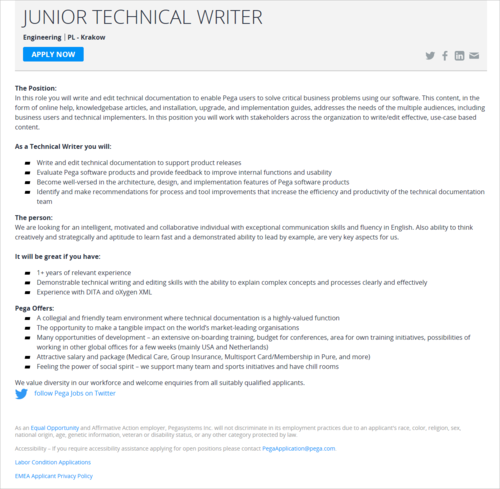

Firma [Pegasystems](https://www.pega.com/), tworząca strategiczne aplikacje dla sprzedaży, marketingu i usług, ma dla Was ciekawą ofertę.

Tym razem, do krakowskiego zespołu writerskiego poszukiwany jest Junior Technical Writer. Jest to oferta pracy na roczne zastępstwo. Pozycja będzie dostępna od grudnia 2017/stycznia 2018.

Oferta skierowana jest do osób z niewielkim doświadczeniem w tworzeniu dokumentacji lub tłumaczeniach, dlatego jest to dobra okazja, żeby rozpocząć swoją karierę w komunikacji technicznej.

Szczegółowe informacje dotyczące tej oferty znajdziecie poniżej (kliknijcie obrazek, żeby go wyświetlić w pełnej rozdzielczości) albo [bezpośrednio u źródła](https://www.pega.com/about/careers/engineering/junior-technical-writer) (w pełnej krasie graficznej i z przyciskiem do aplikowania).

Jeśli potrzebujecie więcej szczegółów, swoje pytania kierujcie na adres: [Piotr.Sroka@pega.com](mailto:Piotr.Sroka@pega.com).

