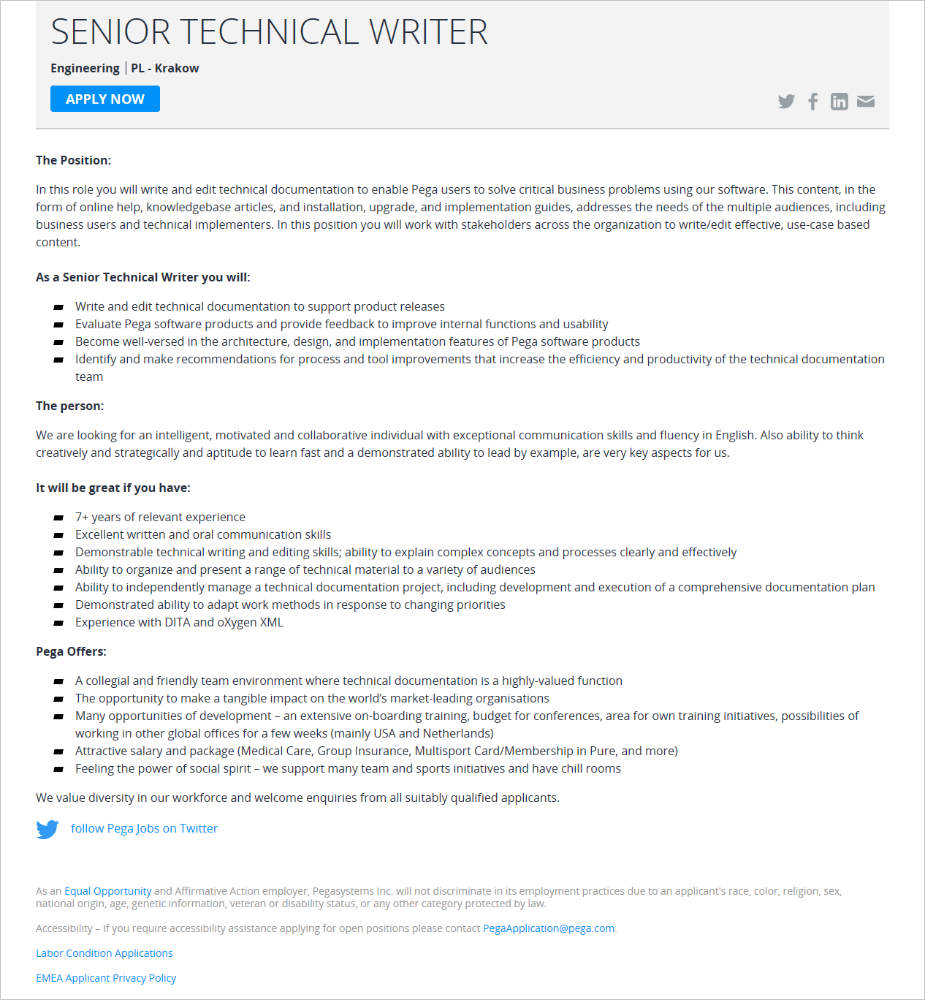

Firma [Pegasystems](https://www.pega.com/), tworząca strategiczne aplikacje dla
sprzedaży, marketingu i usług, ma dla Was kolejną ofertę.

Tym razem, do krakowskiego zespołu dokumentacyjnego poszukiwany jest Senior
Technical Writer. Oferta skierowana jest do osób z kilkuletnim doświadczeniem w
komunikacji technicznej, które znają standard DITA i oprogramowanie oXygen XML.

Szczegółowe informacje dotyczące tej oferty znajdziecie poniżej (kliknijcie
obrazek, żeby go wyświetlić w pełnej rozdzielczości)
albo [bezpośrednio u źródła](https://www.pega.com/about/careers/engineering/senior-technical-writer) (w
pełnej krasie graficznej i z przyciskiem do aplikowania).

Jeśli potrzebujecie więcej szczegółów, możecie pisać na
adres **[Piotr.Sroka@pega.com](mailto:Piotr.Sroka@pega.com)** lub dzwonić na
numer **516 182 504**.

