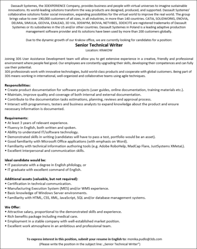

Zespół dokumentalistów krakowskiego oddziału [Dassault Systemes](http://www.3ds.com/pl-pl/) poszukuje kolejnego wzmocnienia. Tym razem oferta skierowana jest do doświadczonych Tech Writerów, którzy poza wyśmienitą znajomością języka angielskiego mogą również pochwalić się dobrze rozwiniętymi umiejętnościami w zakresie obsługi poczciwego Worda oraz narzędzi typu [HAT](https://en.wikipedia.org/wiki/Help_authoring_tool), takich jak [Adobe RoboHelp](https://en.wikipedia.org/wiki/Adobe_RoboHelp) czy [MadCap Flare](https://en.wikipedia.org/wiki/MadCap_Software).

Po raz kolejny z czystym sumieniem polecamy tego pracodawcę ze względu na komfortowe warunki pracy oraz przyjazną atmosferę.

Szczegółowe informacje znajdziecie poniżej (kliknijcie w obrazek, żeby go wyświetlić w pełnej rozdzielczości).

Aplikować można poprzez wysłanie CV w języku angielskim na adres: **monika.pudlo(at)3ds.com**. W temacie wiadomości należy podać nazwę stanowiska. Powodzenia!

