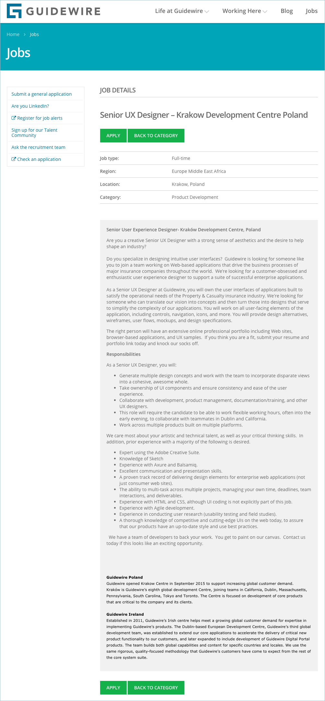

Jeśli chcecie zmienić trochę kierunek, ale nadal pozostać w branży komunikacji
technicznej to mamy dla Was ciekawą ofertę.

<!--truncate-->

[Guidewire Software](https://www.guidewire.com/), firma dostarczająca
oprogramowanie do obsługi ubezpieczeń majątkowych i wypadkowych, poszukuje
Senior UX Designera do swojego biura w Krakowie.

Jest to oferta dla doświadczonych designerów z ekspercką wiedzą w zakresie Adobe
Creative Suite oraz znajomością narzędzi Sketch, Axure i Balsamiq.

Szczegółowe informacje dotyczące tej oferty znajdziecie poniżej (kliknijcie
obrazek, żeby go wyświetlić w pełnej rozdzielczości)
albo [bezpośrednio u źródła](https://careers.guidewire.com/jobs/view/oiH55fwT/senior-ux-designer-krakow-development-centre-poland) (w
pełnej krasie graficznej i z przyciskiem do aplikowania).

Powodzenia!

