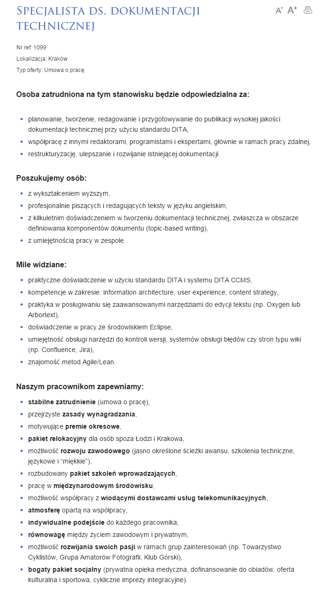

Końcówka roku nie oznacza spowolnienia na rynku pracy dla dokumentalistów.
[Ericpol](http://www.ericpol.pl/) poszukuje do swojego oddziału w Krakowie
doświadczonego specjalisty do opracowywania dokumentacji technicznej, najlepiej
ze znajomością standardu DITA.

<!--truncate-->

Jest to firma inżynierska działająca od 1991 r. na międzynarodowym rynku ICT.
Świadczy usługi outsourcingu, consultingu, dostarcza rozwiązania dedykowane w
obszarach telekomunikacji, komunikacji M2M (machine to machine), IoT (Internet
of Things), aplikacji dla sektora medycznego, finansów i bankowości oraz
rozwiązań dla biznesu.

Szczegółowe informacje dotyczące oferty pracy znajdziecie poniżej (kliknijcie w
obrazek, żeby go wyświetlić w pełnej rozdzielczości) albo bezpośrednio u źródła
(w pełnej krasie graficznej i z przyciskiem do aplikowania):
[http://www.ericpol.pl/kariera/oferty-pracy/oferta/?id=154](http://www.ericpol.pl/kariera/oferty-pracy/oferta/?id=154)

W razie problemów możecie skorzystać z bezpośredniego linku do formularza
aplikacyjnego: [https://praca.ericpol.com/1099](https://praca.ericpol.com/1099)

Powodzenia!

