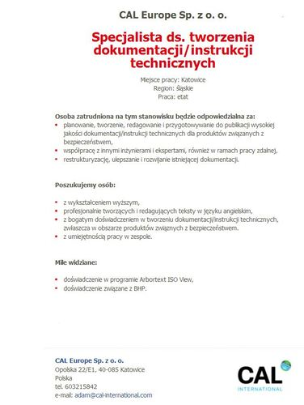

---
title:
  'Oferta pracy: Specjalista ds. tworzenia dokumentacji/instrukcji technicznych'
authors: admin
date: '2017-07-25'
tags:
  - 'oferty-pracy'
  - 'praca'
  - 'kariera'
  - 'praca'
coverImage: 'CAL_logo.jpg'
---

Tym razem oferta z Katowic, i to od razu dla dwóch osób!

<!--truncate-->

Firma CAL International oferuje usługi inżynieryjne obejmujące wszystkie etapy
rozwoju produktu od tzw. szkicu do wyprodukowania go lub wprowadzenia do
produkcji seryjnej. Swoim klientom oferuje współpracę w całym projekcie lub na
poszczególnych etapach gdzie to wsparcie jest wymagane. W tej chwili trwają
poszukiwania jednej lub dwóch osób chętnych podjąć pracę na pełen etat w
rozwijającym się dziale Technical Writerów. Pierwsze projekty będą obejmowały
prace dla firmy związanej z bezpieczeństwem, działającej w UK oraz w USA (bardzo
duża i znana firma).

Szczegóły ogłoszenia wraz z adresem mailowym na który można wysłać swoje CV
znajdziecie poniżej (po kliknięciu na obrazek otworzy się
[strona z ogłoszeniem](http://cad.pl/component/jobs/pokaz/28318-specjalista-ds-tworzenia-dokumentacjiinstrukcji-technicznych.html)):

Powodzenia!
