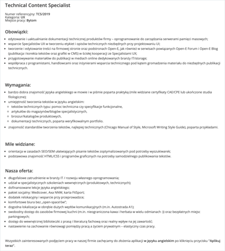

Województwo śląskie potrzebuje kolejnego specjalisty tech comm.

Firma [Open-E](https://www.open-e.com), międzynarodowa firma dostarczająca oprogramowanie na rynek pamięci masowych, poszukuje osoby na stanowisko Technical Content Specialist do swojego biura w Bytomiu. Główne wymagania to bardzo dobra znajomość języka angielskiego oraz lekkie pióro. Mile widziana jest znajomość HTML i CSS oraz zasad SEO/SEM pod kątem tworzenia tekstów.

Więcej szczegółów znajdziecie poniżej albo w [ogłoszeniu na stronie pracodawcy](https://www.open-e.com/about-us/career/poland/technical-content-specialist/) (gdzie znajdziecie również link do aplikowania).

Powodzenia!

