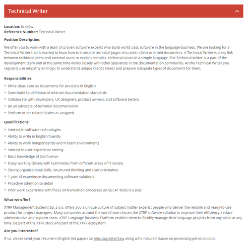

Liczba ofert pracy dla dokumentalistów rośnie w oczach. Dzisiaj mamy dla Was
kolejną propozycję.

Firma [XTRF](https://www.xtrf.eu/), zajmująca się tworzeniem narzędzi do
zarządzania procesami w branży tłumaczeniowej i lokalizacyjnej, poszukuje do
swojego oddziału w Krakowie Tech Writera. Oferta skierowana jest do osób z
biegłą znajomością języka angielskiego, podstawową znajomością obsługi narzędzia
[Confluence](https://www.atlassian.com/software/confluence) oraz minimum rocznym
doświadczeniem w tworzeniu dokumentacji.

Szczegółowe informacje znajdziecie poniżej (kliknijcie w obrazek, żeby go
wyświetlić w pełnej rozdzielczości) albo bezpośrednio u źródła:
[http://www.xtrf.eu/career](http://www.xtrf.eu/career).

Aplikować można poprzez wysłanie CV (format A4) w języku angielskim na adres:
**rekrutacja(at)xtrf.eu**.

Powodzenia!

