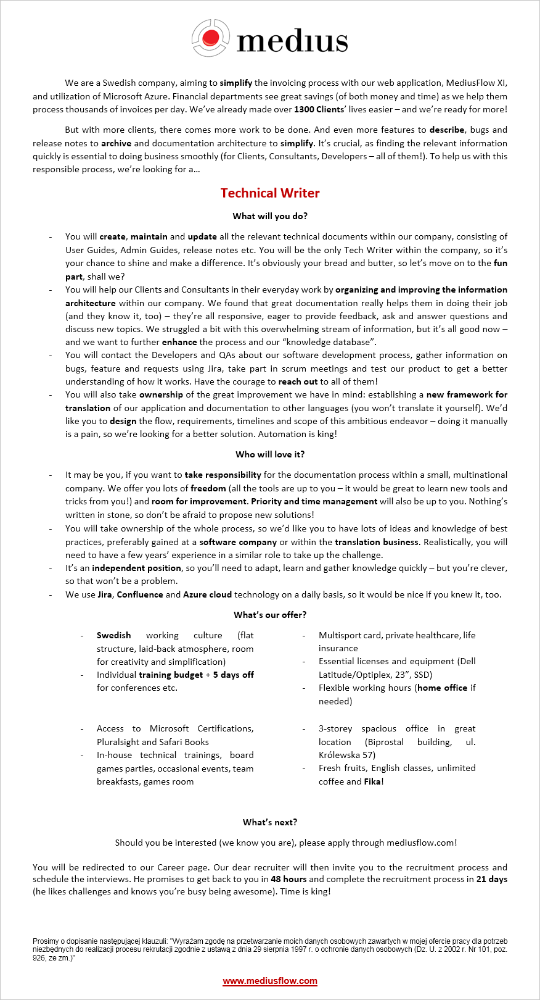

Rynek pracy dla dokumentalistów nabiera coraz większego rozpędu.

<!--truncate-->

W tym roku, to już szósty wpis z ofertą pracy, a pierwszy kwartał jeszcze się
nie skończył. Dla porównania w całym zeszłym roku opublikowaliśmy 10 wpisów w
tej kategorii.

Dzisiaj mamy dla Was kolejną ofertę z Krakowa. Niewielka, szwedzka firma
[Medius](http://www.mediusflow.com/en), która tworzy aplikację webową
automatyzującą proces obsługi faktur, poszukuje doświadczonego Tech Writera,
który zajmie się dokumentacją i zaprojektuje od podstaw proces tłumaczeń
tworzonego oprogramowania na inne języki. W zamian firma oferuje płaską
strukturę, mnóstwo miejsca na własne pomysły, wygodne biuro i splendor,
wynikający z bycia jedynym Tech Writerem w firmie 😉

Zachęcające jest również swego rodzaju zobowiązanie dotyczące procesu rekrutacji
zamieszczone na końcu ogłoszenia. Firma obiecuje, że osoba zajmująca się
rekrutacją przeprowadzi cały proces w ciągu maksymalnie 21 dni (udało nam się
ustalić, że chodzi o dni kalendarzowe).

Szczegółowe informacje dotyczące oferty pracy znajdziecie poniżej (kliknijcie w
obrazek, żeby go wyświetlić w pełnej rozdzielczości) albo bezpośrednio u źródła
(w pełnej krasie graficznej i z przyciskiem do aplikowania):
[link do ogłoszenia](http://web103.reachmee.com/ext/I019/823/job?site=7&lang=UK&validator=1280ac4b74bad3ddc86c5d1a23ddf24c&ihelper=http%3A%2F%2Fwww.mediusflow.com%2Fsv-SE%2FJobb&job_id=140).

Aplikować można również poprzez wysłanie CV w języku angielskim na adres:
**krzysztof.gaudyn(at)medius-group.pl**.

Powodzenia!

