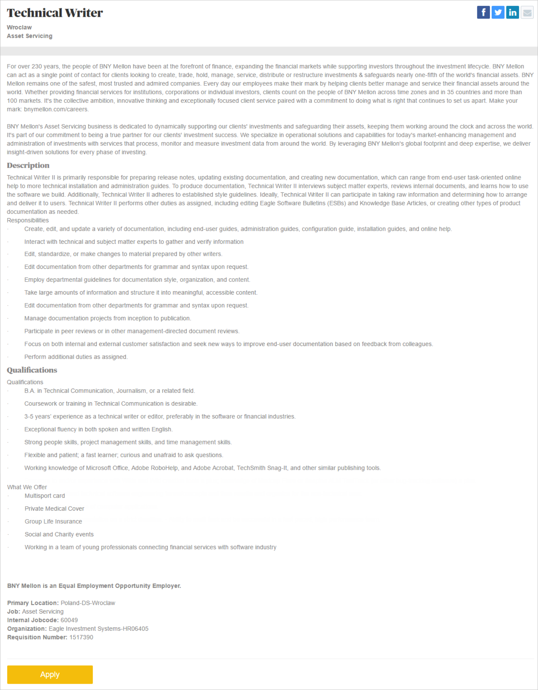

Po krótkim pobycie na wybrzeżu, przenosimy się do południowo-zachodniej Polski.

Tym razem mamy dla Was coś z Wrocławia. Firma [BNY Mellon](https://www.bnymellon.com/emea/en/home.jsp), globalny lider w dziedzinie usług inwestycyjnych i zarządzania inwestycjami, poszukuje dwóch Technical Writerów do zespołu Eagle Investment Systems ([www.eagleinvsys.com](http://www.eagleinvsys.com/)). Kandydaci na to stanowisko powinni mieć kilkuletnie doświadczenie w tworzeniu dokumentacji, najlepiej w sektorze IT lub finansów, i znać dobrze takie narzędzia jak MS Office i Adobe RoboHelp.

Szczegółowe informacje dotyczące oferty pracy znajdziecie poniżej (kliknijcie w obrazek, żeby go wyświetlić w pełnej rozdzielczości) albo [bezpośrednio u źródła](https://jobs.bnymellon.com/jobs/1517390/Wroclaw-Technical-Writer?lang=en-US) (w pełnej krasie graficznej i z przyciskiem do aplikowania).

Powodzenia!

