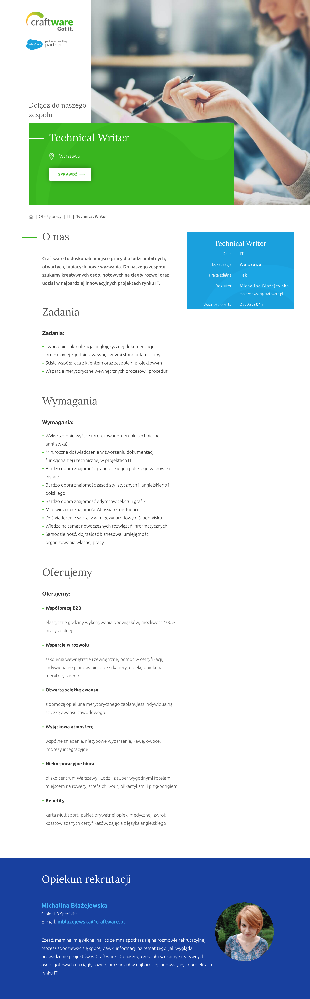

Nie zwalniamy tempa. Tym razem oferta ze stolicy.

<!--truncate-->

[Craftware](https://craftware.pl/), konsultingowy software house i platynowy
partner Salesforce, poszukuje Technical Writera. Oferta skierowana jest do osób
z minimum rocznym doświadczeniem w tworzeniu dokumentacji funkcjonalnej i
technicznej w projektach IT. Biuro firmy zlokalizowane jest w Warszawie, ale
możliwa jest całkowita praca zdalna.

Szczegółowe informacje dotyczące tej oferty znajdziecie poniżej (kliknijcie
obrazek, żeby go wyświetlić w pełnej rozdzielczości)
albo [bezpośrednio u źródła](https://craftware.pl/work-offers/technical-writer-4/) (w
pełnej krasie graficznej i z przyciskiem do aplikowania).

Aplikować można również pisząc na
adres **[arosa@craftware.biz](mailto:arosa@craftware.biz)**.

