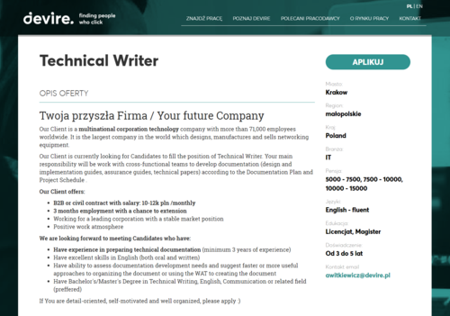

Firma rekrutacyjna Devire szuka kandydatów dla swojego klienta w branży Telco.

Przyszły pracodawca to największy na świecie producent sprzętu łączności sieciowej. Poszukują osób, które będą pracowały jako Technical Writer w zespołach wielozadaniowych. Dokumentacja ta jest opisana w samym ogłoszeniu jako "design and implementation guides, assurance guides, technical papers".

Oferta skierowana jest do osób, które mają **co najmniej 3 lata doświadczenia** w tworzeniu dokumentacji. Podano też widełki płacowe: 10-12 tys. miesięcznie, przy czym możliwe są różne typy umowy.

Szczegółowe informacje dotyczące tej oferty znajdziecie poniżej (kliknijcie obrazek, żeby go wyświetlić w pełnej rozdzielczości) albo [bezpośrednio u źródła](http://www.devire.pl/pojedyncza-oferta/?oferta=1665) (w pełnej krasie graficznej i z przyciskiem do aplikowania).

Aplikować można przez stronę lub pisząc na adres [awitkiewicz@devire.pl](mailto:awitkiewicz@devire.pl).

