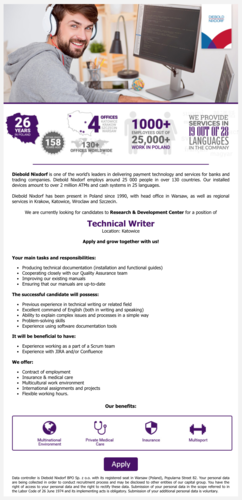

Wygląda na to, że rynek ofert pracy dla Technical Writerów ma się całkiem
dobrze. Dzisiaj mamy dla Was kolejną ciekawą propozycję, tym razem z Górnego
Śląska.

Firma [Diebold Nixdorf](https://www.dieboldnixdorf.com/en-us), czołowy producent
bankomatów i systemów obsługi płatności w Europie i na świecie, poszukuje
doświadczonego Technical Writera do swojego katowickiego oddziału. Mile widziana
jest znajomość aplikacji Jira i Confluence.

Szczegółowe informacje dotyczące tej oferty znajdziecie poniżej (kliknijcie
obrazek, żeby go wyświetlić w pełnej rozdzielczości)
albo [bezpośrednio u źródła](https://www.pracuj.pl/praca/technical-writer-katowice%2Coferta%2C5821467) (w
pełnej krasie graficznej i z przyciskiem do aplikowania).

