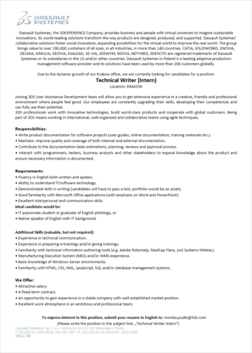

Właśnie startuje kolejna rekrutacja do krakowskiego oddziału
[Dassault Systemes](http://www.3ds.com/pl-pl/).

<!--truncate-->

Firma poszukuje stażysty, który zasili szeregi zespołu zajmującego się
dokumentacją. W zeszłym roku publikowaliśmy podobne ogłoszenie, dlatego
postanowiliśmy trochę "powęszyć" jak potoczyły się losy osoby, która ostatnim
razem otrzymała to stanowisko. Nasze zaufane źródła donoszą, że historia
zakończyła się szczęśliwie i staż przerodził się w stałe zatrudnienie.

Od ostatniego czasu nic się nie zmieniło, firma nadal oferuje staż w
komfortowych warunkach w nowoczesnym biurowcu z udogodnieniami dla rowerzystów i
chillout roomem oraz atrakcyjne warunki finansowe. Jeśli znasz biegle język
angielski, masz zacięcie techniczne i chcesz rozpocząć swoją przygodę z
Technical Writingiem to jest to oferta godna polecenia. Szczegółowe informacje
znajdziecie poniżej (kliknijcie w obrazek, żeby go wyświetlić w pełnej
rozdzielczości)

Aplikować można poprzez wysłanie CV w języku angielskim na adres:
**monika.pudlo(at)3ds.com**.

