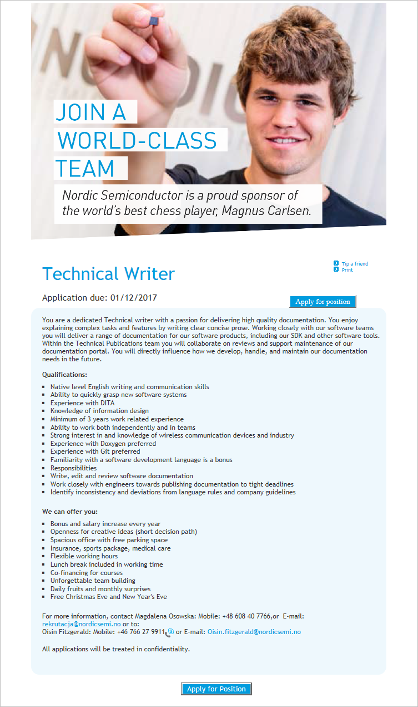

Nordic Semiconductor Poland, oddział norweskiej firmy projektującej i
produkującej układy półprzewodnikowe dla niskomocowych sieci bezprzewodowych,
poszukuje Technical Writera.

<!--truncate-->

Wymagane jest minimum 3-letnie doświadczenie w komunikacji technicznej oraz
znajomość DITA.

Szczegółowe informacje znajdziecie poniżej (kliknijcie obrazek, żeby go
wyświetlić w pełnej rozdzielczości)
albo [bezpośrednio u źródła](https://candidate.hr-manager.net/ApplicationInit.aspx?cid=278&ProjectId=175649&MediaId=5) (w
pełnej krasie graficznej i z przyciskiem do aplikowania).

