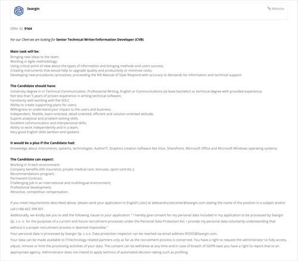

Firma [Seargin](https://seargin.com/pl/), specjalizująca się w dostarczaniu
swoim klientom profesjonalnych zespołów IT w oparciu o różne modele współpracy,
poszukuje kandydatów na stanowisko Technical Writer do Katowic.

Klientem końcowym jest globalna firma z branży automotive. Zatrudnienie na umowę
o pracę. Wynagrodzenie w zależności od doświadczenia.

Więcej szczegółów na temat oferty znajdziecie poniżej albo
w [ogłoszeniu na stronie pracodawcy](https://seargin.com/en/job/digital-it-senior-technical-writer-information-developer-cvb-2/) (gdzie
znajdziecie również link do aplikowania). Aplikować możecie też poprzez wysłanie
maila na
adres [aleksandra.kieczmer@seargin.com](mailto:aleksandra.kieczmer@seargin.com) z
CV w języku angielskim, propozycją stawki miesięcznej brutto oraz informacją o
swojej dostępności (okresie
wypowiedzenia).
