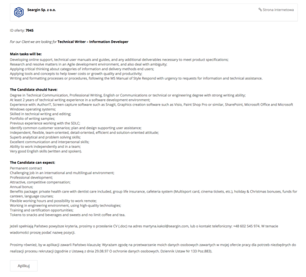

Firma [Seargin](https://seargin.com/pl/), specjalizująca się w dostarczaniu
swoim klientom profesjonalnych zespołów IT w oparciu o różne modele współpracy,
poszukuje kandydatów na stanowisko Technical Writer do Katowic.

<!--truncate-->

Klientem końcowym jest globalna firma z branży automotive. Widełki przewidziane
dla tego stanowiska to 5000-8000 brutto w zależności od doświadczenia.

Szczegółowe informacje dotyczące tej oferty znajdziecie poniżej (kliknijcie
obrazek, żeby go wyświetlić w pełnej rozdzielczości)
albo [bezpośrednio u źródła](https://seargin.com/pl/job/it-technical-writer-information-developer/) (w
pełnej krasie graficznej i z przyciskiem do aplikowania).

Aby wziąć udział w procesie rekrutacyjnym należy wysłać CV w języku angielskim,
zaproponować stawkę miesięczną brutto oraz poinformować o swojej dostępności
(okresie wypowiedzenia).

Powodzenia!

