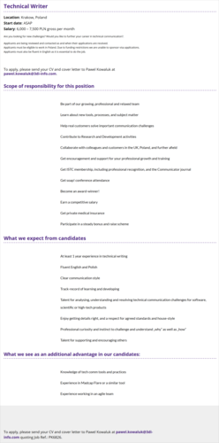

Koniec roku to nie koniec ofert.

Krakowski oddział [3di](http://3di.com.pl/) znów się powiększa. W związku z tym, firma poszukuje dwóch Technical Writerów z co najmniej rocznym doświadczeniem w branży. Proponowane widełki płacowe to 6000-7500 zł brutto.

Szczegółowe informacje dotyczące tej oferty znajdziecie poniżej (kliknijcie w obrazek, żeby go wyświetlić w pełnej rozdzielczości) albo [bezpośrednio u źródła](http://3di.com.pl/technical-writer/).

Aplikować można poprzez wysłanie CV i listu motywacyjnego w języku angielskim na adres: **[pawel.kowaluk(at)3di-info.com](mailto:pawel.kowaluk@3di-info.com)**.

