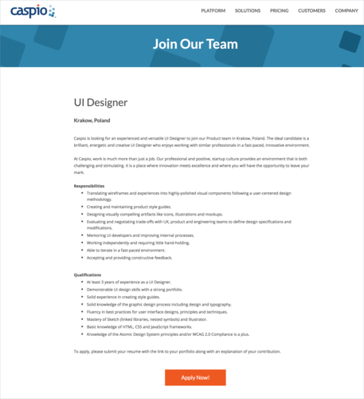

Mogło umknąć Waszej uwadze, że w 2017 roku na krakowskim rynku pojawiła się
firma [Caspio](https://www.caspio.com/), która dostarcza platformę do tworzenia
aplikacji bez kodowania.

<!--truncate-->

Firma stopniowo buduje nowe zespoły i obecnie poszukuje doświadczonego UI
Designera. Osoba ta będzie częścią zespołu produktowego, w którym znajdują się
już menedżerowie produktu, UX designerzy i specjaliści od dokumentacji
technicznej. Nowe biuro, nowi ludzie, nowe projekty to dobra okazja, żeby
realnie wpłynąć na to jak będzie wyglądało nasze przyszłe miejsce pracy. Nasi
tajni informatorzy donoszą, że jest to oferta godna polecenia, dlatego zachęcamy
do aplikowania 😊

Więcej szczegółów znajdziecie poniżej albo
w [ogłoszeniu na stronie pracodawcy](https://www.caspio.com/job-position-details/?Position_ID=548&Job_Title=UI%20Designer) (gdzie
znajdziecie również link do aplikowania). Jeśli zdecydujecie się spróbować
swoich sił, dopiszcie w aplikacji, że ogłoszenie znaleźliście na naszym portalu.
Z góry dzięki i powodzenia!

