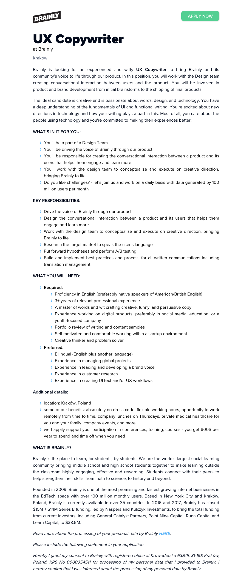

Dzisiaj mamy dla Was nietuzinkową ofertę.

<!--truncate-->

[Brainly.pl](https://brainly.pl/), edukacyjny serwis społecznościowy typu Q&A,
służący do wzajemnej pomocy uczniowskiej, poszukuje UX Copywritera do swojego
biura w Krakowie. Jeśli termin "UX copywriting" brzmi intrygująco i
chcielibyście się dowiedzieć więcej na ten temat, to rzućcie okiem na
[ten artykuł](https://mariepierrochon.com/what-is-ux-copywriting/).

Więcej szczegółów na temat oferty znajdziecie poniżej albo
w [ogłoszeniu na stronie pracodawcy](https://boards.greenhouse.io/brainly/jobs/1532736)
(gdzie znajdziecie również link do aplikowania).

