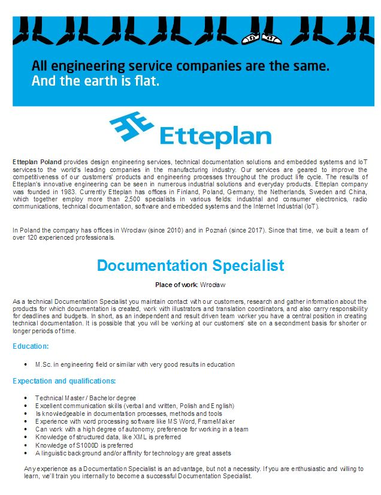

Witajcie po świątecznej przerwie! Jak brzuchy? Dziś dwie oferty pracy, od zająca
😉. Z Wrocławia.

<!--truncate-->

Firma Etteplan nie pierwszy raz poszukuje pracowników. Tym razem na dwa różne
stanowiska. Szczegóły poniżej.

Przypominamy, że te i inne ogłoszenia możecie również znaleźć (oraz samodzielnie
zamieszczać) na grupie
["Tworzenie dokumentacji" na FB](https://www.facebook.com/groups/342747819400007/?fref=ts).
Często nawet wcześniej niż u nas, oraz z dodatkową informacją o wynagrodzeniu.

Więcej szczegółów na temat oferty firmy Etteplan po kliknięciu w obrazki lub
linki pod nimi:

[http://www.etteplaniot.com/documents/10182/35008/170323_Documentation_Specialist_Etteplan.pdf/28552179-32f3-4e3a-a663-bd50762cac28](http://www.etteplaniot.com/documents/10182/35008/170323_Documentation_Specialist_Etteplan.pdf/28552179-32f3-4e3a-a663-bd50762cac28)

[http://www.etteplaniot.com/documents/10182/35008/170328_Technical_Illustrator_Etteplan.pdf/42655e68-40cf-48f0-a58a-b44e25ead3ca](http://www.etteplaniot.com/documents/10182/35008/170328_Technical_Illustrator_Etteplan.pdf/42655e68-40cf-48f0-a58a-b44e25ead3ca)

Powodzenia!
